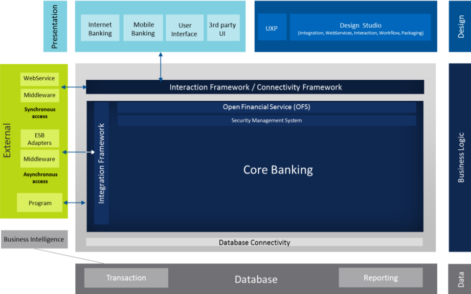

<!--  ----------------------------------------------------------------------  -->
<!-- the source is: [http://uni-t.temenos.com/teams/Technical_BSG/Technical%20BSG%20documents/1-%20Core%20Banking/Appendixes%20and%20Technology%20Overview/Temenos%20Core%20Banking%20Technology%20Overview_v8.pdf#search=core%20banking%20presentation](http://uni-t.temenos.com/teams/Technical_BSG/Technical%20BSG%20documents/1-%20Core%20Banking/Appendixes%20and%20Technology%20Overview/Temenos%20Core%20Banking%20Technology%20Overview_v8.pdf#search=core%20banking%20presentation)-- >
<!--  ----------------------------------------------------------------------  -->

Temenos Core Banking solution combines rich functionality with cutting-edge technology in an easily upgradable application. Its customers benefit from real-time embedded analytics, a sophisticated product builder and technology that allows for easy integration and infinite scalability, in turn enabling them to significantly outperform their peers.

### Tools used:

 - **Design Studio (DS)**
   - Design Studio is a graphical tool, based on Eclipse technologies such as the Integrated Development 
Environment (IDE) and Eclipse Modeling Framework (EMF). 
 - **Interaction Framework**
  - The Temenos’ Interaction Framework separates the transaction processors from the user interface and makes interactive channels and devices easy to deliver.
 - **Integration Framework** 
  - Based on an event driven architecture (EDA), the Integration Framework enables the Core Banking to easily 
exchange business events with other systems and so facilitate integration into an overall information system. 
  - The Integration Framework enables the use of market standard middleware and Enterprise Service Buses 
(ESB).
  - Temenos WebService Composer (TWS) is a tooling exposing the Core Banking service landscapes as WS-I (Web Services Interoperability) compliant Web APIs. 
  - Any business functionality can be easily exposed as web services using the TWS Composer tooling. TWS Composer exposes Core Banking web services via SOAP / XML language thus being platform and programming language independent. 

### Architecture Overview

Temenos Core Banking architecture consists mainly of the following tiers: 

 - Presentation and Design
 - Business Logic
 - Data

- **The Presentation Tier:**
  - It refers to all supported channels into the system. This includes both internal bank users who access the system through a highly functional web-browser based interface as well as external customers accessing the system via the Internet and mobile devices.
- **The Business Logic Tier:**
  - The Core Banking is considered an Online Transaction Processing Engin  (OLTP) whereby all business transactions are executed autonomously against a centralised data store. Because of this design and support of JEE Application Server, the Core Banking application can scale without the need of 3rd party cluster-ware allowing individual nodes to be applied, or removed, from the cluster without the need for global configuration or system downtime. 
- **Data Tier:**
  - The Core Banking is rendered database independent by use of standard JDBC java data access technology. 
  - Note that it makes no use of database utilities such as triggers or stored procedures nor utilities or features specific to the operating platform upon which the database is deployed. The Core Banking simply issues requests to the database to read or write data. 

