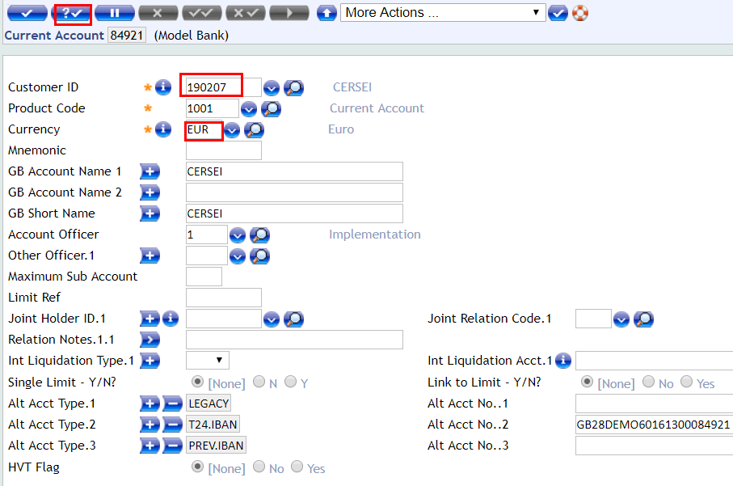
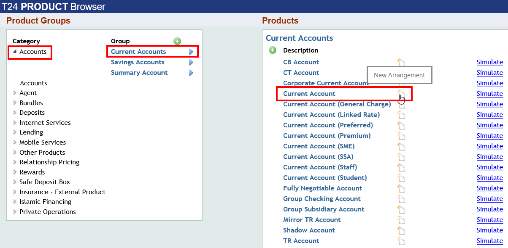
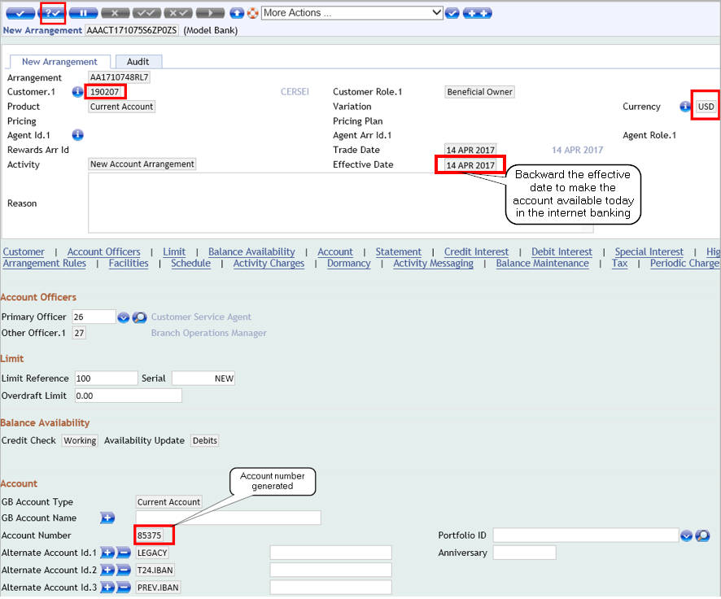
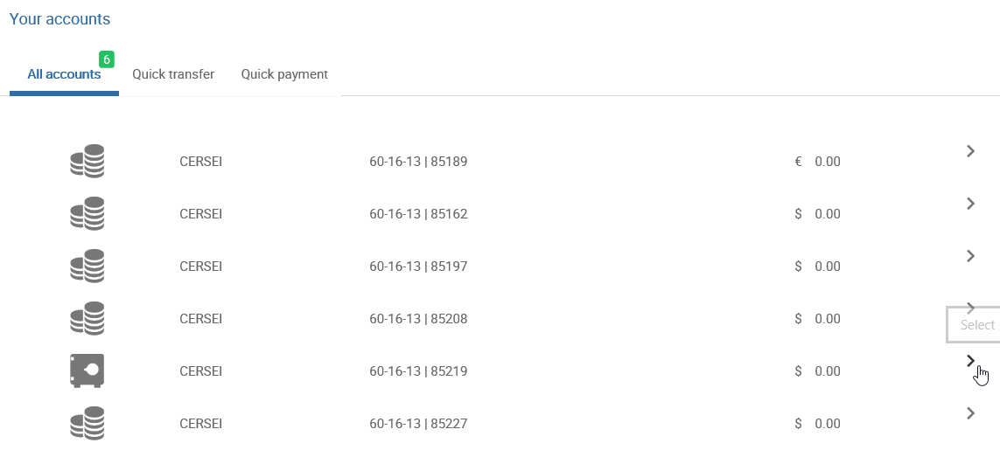

# ACCOUNTS

> [!Note] 
> 
>  In order to create an account for which you want to give Internet access to the customer, please follow [<ins>**below section**</ins>](./accounts.md#create-online-banking-arrangement-for-an-account) of current user guide.

## Current Account

To create an account for your new customer:

 - Go to User Menu > Account. Click Open Current Account 
 - A new window is diplayed with an account number automatically generated
 - Insert the Customer Id and the currency that you want (It is possible to see company's currency automatically filled, but you can choose a different one)
 - When you press validate button, Account Name, Short Name will be automatically filled based on Customer Id. Also, the field Alternative Account No. 2 will be completed with a generated IBAN number

To authorize the account created:

 - Login with a different user 
 - Under User Menu go to Authorise/ Delete 
 - In the new screen will be displayed the list of unauthorized accounts
 - Authorize the account you created

## Savings Account

The steps to create a savings account are similar to the ones for a current account creation:

 - Go to User Menu > Account. Click either Open Savings Account 
 - A new window is diplayed with an account number automatically generated
 - Insert the Customer Id and the currency that you want 
 - When you press validate button, Account Name, Short Name will be automatically filled based on Customer Id

To authorize the account created:

 - Login with a different user 
 - Under User Menu go to Authorise/ Delete 
 - In the new screen will be displayed the list of unauthorized accounts
 - Authorize the account you created

## Create Online Banking Arrangement for an Account

 - Log into T24 BrowserWeb
 - Go to User Menu > Product Catalog 
 - Under Product Groups select Accounts > Current Accounts and then select the account type required
   - Both the TCIB and TCMB products are arranged under the Product Groups and Products

 - In the new window, insert the customer id, the currency of the new account and backward the effective date with one business day by clicking the calendar button. (**Note**: this change of date is required if you want the customer's account to be available in the same day into the internet banking application. **If left as default, the account will be visible only next day**). 
 -  Press validate
 - The screen will extend (a newly created arrangement is displayed) and you can see several default attributions. You can add more or change these configurations based on your requirements
 - The new account number appears under 'Account' section

> [!Note]
> Customer number is an Id from the T24 Customer List (In the Menu bar, type 'CUSTOMER' > Press enter > Go to List Live File > Choose Id or **use the Id of a customer you created before**)

> - User is advised to take note of the **Customer ID** and **Arrangement ID** to use them during the upcoming configuration 

**Note down the Arrangement Id. This is needed for authorization step**

- **Commit** the deal
- A warning message is displayed regarding the Account Opening Agreement > Choose 'RECEIVED' and press again **Commit** button
- In case the arrangement currency is different from charge currency, an override message will pop-up > Click Accept Overrides > Transaction is complete

 - Log out and login again with a different user in order to authorise the arrangement
 - In the command line type AA.ARRANGEMENT.ACTIVITY A *AAACT171074H9N7MSQ* (**AA.ARRANGEMENT.ACTIVITY A** *+ the arrangement id*)
 - Press enter and then authorize the transaction (double tick button) 
 - Transaction is complete

> [!Note]
> You can create different account types with different currencies by using the same steps as above

 - Login to TCIB application with User Id and password 123456
 - Please **note** that the account created will be visible after a few minutes.

## Deposit Funds via Teller

Please follow [<ins>**this user guide**</ins>](./teller.md) to see how you can do a cash deposit to a newly created account. 
