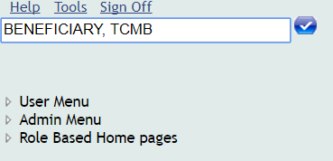
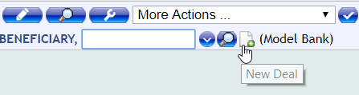
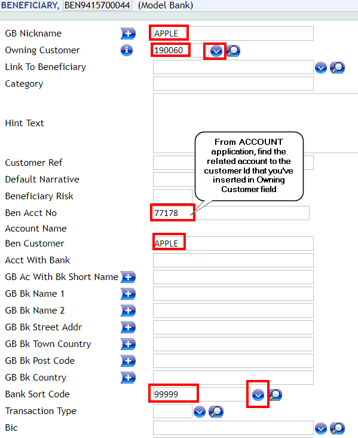

## Create payee ##

In order to add payees in the mobile application, first they must be available in T24.

For this, log in T24 BrowserWeb, type BENEFICIARY, TCMB into the command line and press enter:

 
Go to **More Actions**, then **List Live File**.

Here you will be able to see the entire list of beneficiaries, from which you can add payees in TCMB application.

Also, new beneficiary can be created.

Press New Deal button.

From the new screen, at Owning Customer field, select from the drill down button the customer you want to add as beneficiary: 

Press commit.

Note: If a warning appears, example: Beneficiary Bank details not provided, then Accept Overrides.

Now, the beneficiary with the Id BEN9415700044 and nickname APPLE is available in the list of TCMB beneficiaries.
