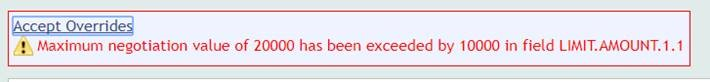

# Increase Daily Limit #

T24 allows changing the daily limit for accounts transactions through AA application (Arrangement Architecture).

Below steps show how to modify this limit for a specific customer.
	

1. **Sign in** T24 BrowserWeb

2. From **Admin Menu** go to **External User Administration**, then **Manage External Users**

3. Type EXTERNAL.USER.ID for the customer for which you want to change the arrangement. Click **Find**

 

4. Click on **View /Modify Arrangement**

  
 

5. Go to **New Activity**, change the value of **Limit Amount** and press commit button

 

6. Notification will appear, click **Accept Overrides**

  

7. **Sign off** and **Login** in again with a different user in order to authorize this change

8. Go to the same Menu **Manage External User**

  
 

9. Repeat steps 3 and 4

10. Authorize the change

   

  

Daily limit for the Arrangement has been changed. 

