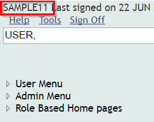
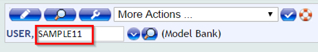
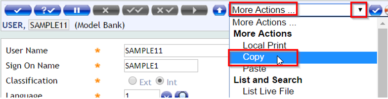
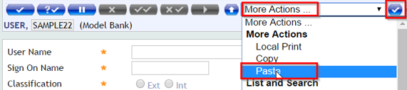

# Users

There are two types of users in T24: 
 - Internal user = Bank stuff
 - External user = Bank customer 

Please see below what is the process of User creation for both types.

## Internal Users

There are different types of internal users with different capabilities and admin rights based on their roles such as: Customer Service Agent, Account Office, Customer Relation Manager, Supervisor etc

Usually, for testing and demo purposes, you will need two simple users. You can have one user to create, modify records, effect transactions, inquire the database and other operations and a second user to authorize any changes that you do.

> [!Note]
>  - Once you have been provided access to Temenos Sandbox, you will automatically receive two specific users along with a standard password, which you can change first time when you login.
> 
>  - The necessity to create more users comes in case you might block one user or you need to see different tests done by different users.

**How to create:**

 - If you are MarketPlace Provider, check your Temenos Sandbox product and get the BrowserWeb url to login in T24.

         e.g. http://127.0.0.1:8080/BrowserWeb
 - Get the T24 User Name and Password provided by MarketPlace team and click on Sign in.
 - Log into the BrowserWeb.
 - Once you login, please keep in mind the user that appears on the left corner. See example below: 
 - In the Menu bar, type “**USER,**” (the **comma** from the end is important in order to skip the authorization step)

**Copy details of an existing User**

The easiest way to create a new user is to copy the details from an existing one and use them to a new user Id.

 - In the new screen, type the user name (ealier identified) as shown below:

- Press enter and a new window is open
- Go to “**More Actions…**” and choose from there “**Copy**” as shown below:

 - Click on validate button (next right to "More Actions"

 - A message is displayed "*Deal copied to your T24 clipboard as: application USER Version ,*"

You can close this message window and the User Profile window

**Create the new user**

 - Choose a similar name (for easier use). Here, we will call it SAMPLE22
 - In USER, (don't forget **comma**), type the user ID (*SAMPLE22*) as shown in the picture below and press enter
 - Go to “**More Action…**” and choose from there “**Paste**” and click “**Go**” (or Validate) button

 - The record is automatically populated with the values copied from previous user
 - Update the “**User Name**”, the “**Sign On Name**”, the "**Start Date**" (to be TODAY date) and the "**End Date**". Press commit button
 
> [!Warning]
> 
> User Name must be different than Sign On name. Sign On name is the one you use when you login. For each **Sign On** name there is a related **User Name**

Transaction is complete.

 - Now sign off and log again into the BrowserWeb with SAMPLE2 user (your newly created user - Sign On Name)

Just type a random password and then press enter.

 - A new screen is displayed asking to set a new password
 - After doing this step you will be logged to T24 with your new credentials

## External Users

The user creation process involves the following steps: 

 - Create Online Banking Arrangement 
 - Create Group Permission  
 - Create External User
 - Authorise the Channel User 
 - Manage External User 

Please check [Users](http://developer.temenos.com/banking/retail/users.html) guide to see how to create an external user.