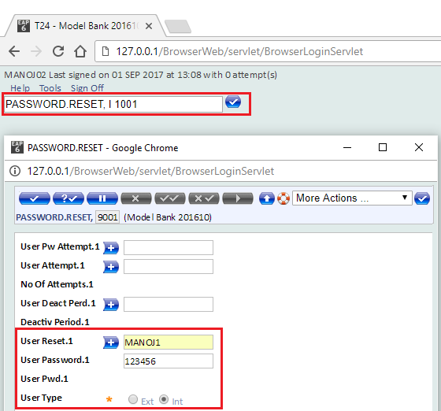

# Reset The T24 [USER](./users.md) Password

> [!Note]
> To reset a user password you need to have access to the system through another user.

**To avoid the situation in which you may block two users, it is advisable to create an additional user, which you can use to unblock the others. In order to create another user, please check [USERS](./users.md)**

# Login to BrowserWeb

Log into the BrowserWeb with an user for which you know the password

In order to determine the ID of the user of which password you want to reset:

# Reset the password

Launch the PASSWORD.RESET application from T24 Command Line

*	Type below command and enter

    PASSWORD.RESET, I 1001

> **NOTE**: Instead of 1001 you can use any four digit number.

*	You need to fill the following mandatory information in above form

	*	**User Reset.1**: User Id you want to change the password
	*	**User Password.1**: Default password so user can login first time
	*	**User Type**: User type internal or external. Click here to learn more about user type

*	After filling the information you need to commit the transaction

*	Logout from current user and login again with changed password user

*	At first login T24 will ask you to reset the password.

