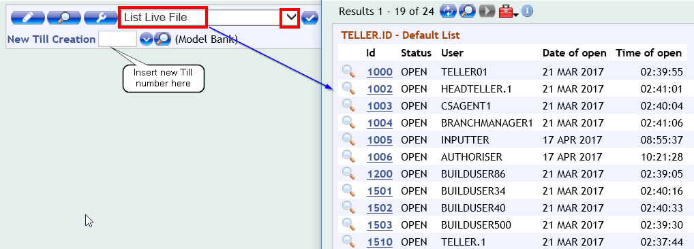
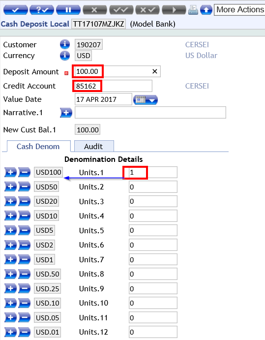
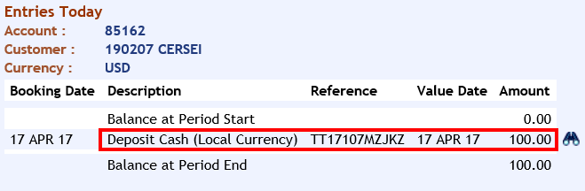

# TELLER

In order to **deposit** funds to a new account, you can choose to do a Cash deposit operation through Teller application.

You will need first to open a Till and then deposit funds.

## Open a Till

 - Go to User Menu > Retail Operation > Account Transactions > Teller > Head Teller Operations > Till Administration > Create New Till

 - Check first the list of open tills and make sure you choose a different ID than the ones listed here.

 - Insert a 4 digit number for the new teller in New Till Creation box and then press enter.

 - In the new screen, Till Status should be checked as **open** and Teller should be **your user Id**, which you can select from the dropdown list.

 - Press commit button > Your till is now open and you are able to deposit funds for your customer as below.

## Cash Deposit 

 - Go to User Menu > Retail Operation > Account Transactions > Teller > Teller Operations > Teller Cash > Cash Deposit Local
 
(**Note**: if you want to credit an account which has a different currency than local one, choose Cash Deposit Foreign)

 - Insert the amount you want to deposit and the account you wish to credit
 - Under Cash denomination table, make sure you choose correct number of units related to the amount inserted
 - Press commit > Transaction is completed

 - You can now check the customer's account balance:
 - Go to User Menu > Account > Account Entries > Entries for Today 
   - Insert the account number and click Find

 

