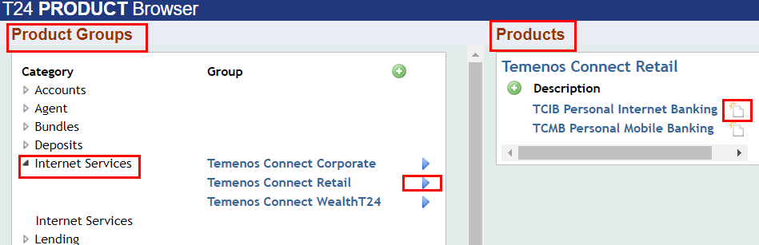
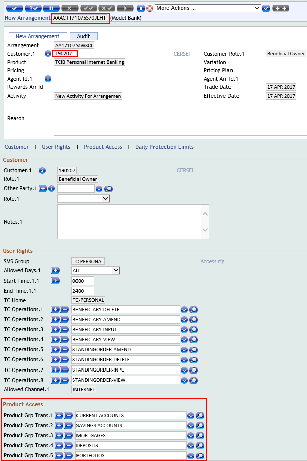
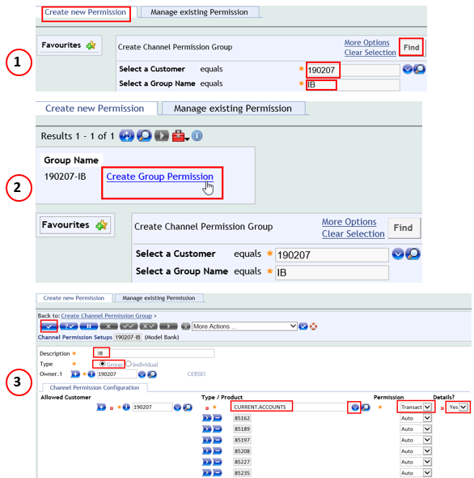
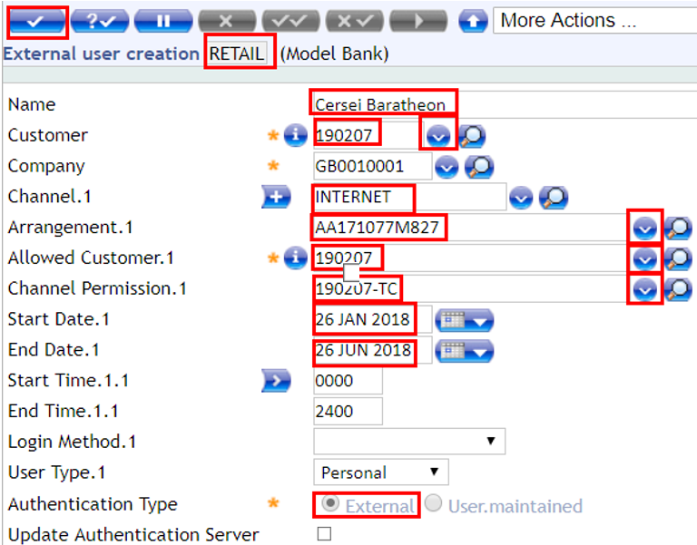
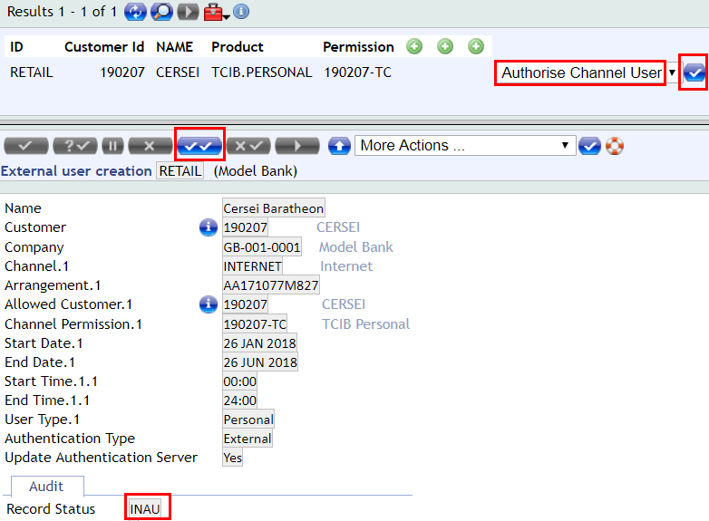

# Users

There are two types of users in T24: 
 - Internal user = Bank stuff
 - External user = Bank customer 

Please see below more details about internal user and what is the process of creation of an external user.

## Internal Users

There are different types of internal users with different capabilities and admin rights based on their roles such as: Customer Service Agent, Account Office, Customer Relation Manager, Supervisor etc.

Usually, for testing and demo purposes, you will need two simple users. You can have one user to create, modify records, effect transactions, inquire the database and other operations and a second user to authorize any changes that you do.

> [!Note]
>  - Once you have been provided access to Temenos Sandbox, you will automatically receive two specific users along with a standard password, which you can change first time when you login.

## External Users

> [!Note]
>  Each External User is related to:
>  -  a **customer** (i.e., the person who enters the system through an External User)
>  -  an **internet service arrangement**
>  -  **channel permissions**

The external user creation process involves the following steps: 

 - Create a Customer in T24
 - Create an Internet Service Arrangement
 - Authorise the Internet Service Arrangement
 - Create a Channel Permission
 - Create the External User
 - Authorise the Channel User 
 - Activate External User 

### Create a Customer in T24

Please follow [<ins>**this user guide**</ins>](./customer.md) to see more details about a T24 customer and how to create one.

### Create an Internet Service Arrangement

An Internet Service Arrangement is an instance of a certain product that is linked to a specific customer. 

This arrangement is a personalized instance of a Internet Banking product that defines what the user gets to view when they access the system. When creating the arrangement, some default settings are included.

 - Go to User Menu > Product Catalog > Create Online Banking Arrangement
 - From Category list (under Product Groups) select > Internet Services > Temenos Connect Retail > TCIB Personal Internet Banking, which will create a new arrangement:

 

- A new window is displayed > Insert the Customer ID (for the client you want to provide Internet access) and click validate button > An internet service arrangement is created with default settings
   - **Note down the arrangement Id**

### Authorise the Internet Service Arrangement

 - Log out and login again with a different user in order to authorise the arrangement
 - In the command line type AA.ARRANGEMENT.ACTIVITY A *AAACT171073FPYW1YK* **(AA.ARRANGEMENT.ACTIVITY A** *+ the arrangement id***)**
 - Press enter and then authorize the transaction (double tick button) 
 - Transaction is complete

### Create a Channel Permission

 - Under Admin Menu > click External User Administration > Create/Manage Online Banking Access > Manage Permissions 

1. Click Create New Permission > Insert your customer Id > Give a Group Name (at your choice), for example IB (Internet Banking) > Click Find
2. Window expands > Click Create Group Permission 
3. Window expands with Channel Permission:
        - insert Description (at your choice)
        - select Type (click on the field, if you want to see its definition and rules)
        - from Dropdown List, select the types of Products you want to give permission for
        - select the Permission type (for example, if you want to allow the external user to do transactions, choose 'Transact', if you want to give him only view rights, select 'See' etc)
        - click Commit button
        - transaction is complete > there is no need to authorise this phase

> [!Note] 
> **Important!** 
>
> When creating the Group Permission, the products created previously (for example current accounts) will not show up in this menu and will NOT be available in the Internet Banking application.
> 
>  In order to create an account for which you want to give Internet access to the customer, please follow [<ins>**this section**</ins>](./accounts.md#create-online-banking-arrangement-for-an-account) of Accounts user guide.
>  
>  After creating the account arrangement, the new account will be automatically available into Products list from Group Permission (see below example, image 3) and also into the Internet Banking application.

### Create the External User

 - Under Admin Menu > click External User Administration > Create/ Manage Online Banking Access > Create External User
- In the new screen displayed, type the following:
  - External User Creation (*RETAIL*): *type a name that the customer will use to login*
  - Name (*Cersei Baratheon*): *customer's system name*
  - Channel (*INTERNET*): *click scroll down button*
  - Arrangement (*AA171077M827*): *click scroll down button*
  - Allowed Customer (*190207*): *click scroll down button*
  - Channel Permission (*190207-TC*): *click scroll down button*
  - Start Date (*26 JAN 2018*): *use calendar and choose today's date*
  - End Date (*26 JUN 2018*): *use calendar and choose user's availability date*
  - Authentication Type (*External*): *make sure 'External' is checked*

### Authorise the Channel User 

 - Logout and login with a different user
 - Go to Admin Menu > External User Administration > Authorise Online Banking Access > Authorise Channel User 
 - At this moment Record status appears as 'INAU' = unauthorised > Commit the record

### Activate External User 

 - You can log back with previous user
 - Go to Admin Menu > External User Administration > Create/Manage Online Banking Access > Manage External Users        - a search screen is displayed > enter customer id and click find
        - from scroll button on the right, select Modify Channel User > press enter
        - change **status** from 'Initiated' into 'Active'
 - Commit the deal (no need for authorization at this step)
 - External user is created
 - You can now insert User ID and password 123456 to login to TCIB application

