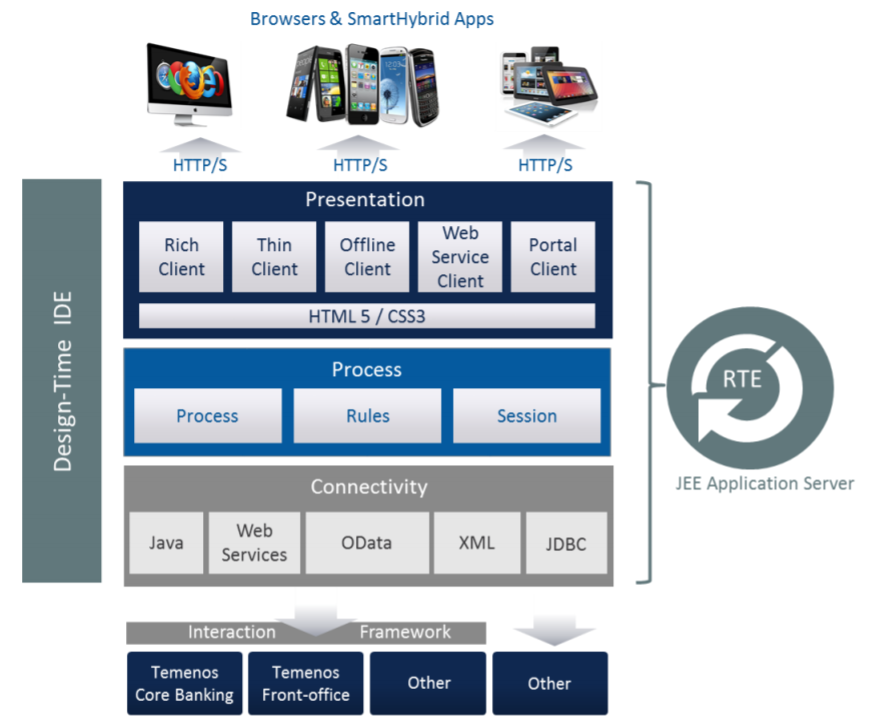

**Temenos UXP Architecture**

**The platform has the following key elements:**

# Integrated Development Environment (IDE)

- The Integrated Development Environment (**IDE**) for the Design-Time is a powerful cross platform desktop application (written in  Java) that enables the rapid development, visualisation and maintenance of the digital business solutions. The IDE may be used by a single business user or by multiple users, with each addressing separate aspects of the development.
- The IDE consists of a series of editors (Presentation Editor, Process Editor and Integration Editor) which allow the user to define the components of a business solution:
  - **The Presentation Editor** - It is used to create and manage the look and feel of the UI solution. Multiple presentations can be created and applied to processes without limit.
  - **The Process Editor** - It is used to create and  visualise business processes. A process is made of multiple phases, which  may consist of text, data entry fields, rules, buttons and even online help to guide end users. The IDE's powerful rules engine provides an extensive range of configurable rules to enable the dynamic behaviour (workflow, validation, business service calls) of the UI solution to be specified without writing code.
  - **The Integration Editor** - It supports open interfaces for integration to Temenos solutions, in-house systems, 3rd party software or middleware, WebServices, [OData](../glossary.md#odata), XML, relational databases via [JDBC](../glossary.md#jdbc), Microsoft [COM](../glossary.md#com) or custom connectivity via Java classes as well.
- Other features:
  - **Components** - allow to create re-usable screens or collection of rules to reduce development effort and create consistency of common screens.
  - **Widget Framework** - Temenos UXP provides a rich palette of advanced controls (widgets) which can be used without scripting. 
  - **DataSets** - Temenos UXP allows to create test data to drive dynamic behaviour in an application. This is a powerful capability that can greatly improve iterative prototyping and assist in demonstrations of an application when applications data sources are unavailable.

# Run-Time Engine (RTE)
 - The runtime environment interprets and presents the business solution developed within the IDE. It controls the
flow of the process; stores data captured by the solution and can integrate with external systems.
 - RTE is the server platform that renders a completed application for end users. It is a multi-presentation engine that provides high performance, scalability and security with support for open standards.

# Administration and Deployment

UXP platform also comprises the UXP Administrator, UXP Deployment Manager and pre-built applications and 
modules available for specific vertical markets.

 - **UXP Administrator** - provides release management and version control facilities to co-ordinate multi-developer teams through an administrator interface.
 - **UXP Deployment Manager** - manages the deployment of releases and associated configuration files, and installs to the RTE.

