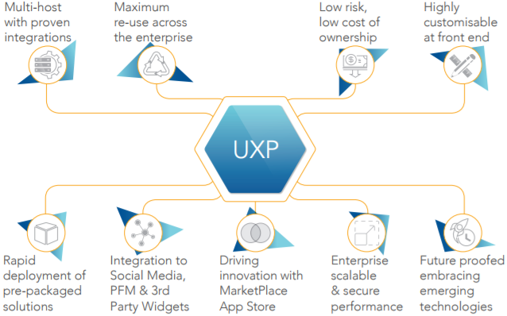
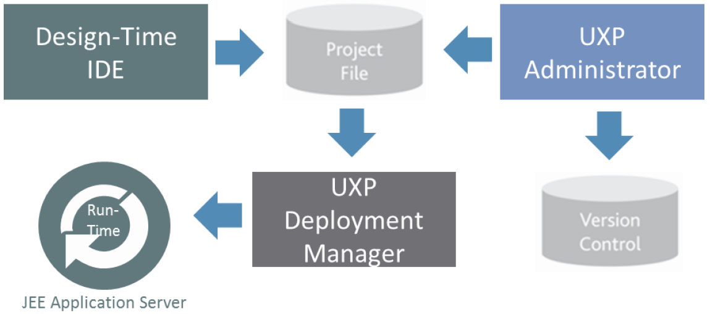

#	Temenos User Experience Platform

Temenos UXP is a graphical development tool which enables you to build browser based business solutions. It allows you to develop solutions without any knowledge of the technology used to deliver them. Once built, complete solutions or parts of solutions can be easily reused and re-branded, allowing rapid development of new solutions.

Used by major financial institutions and blue-chip systems integration companies, it is the only platform that allows the Financial Institution to create multiple presentation experiences from a single application process definition.
 
This powerful capability means that you can support contextual applications for different user types, deliver to multiple delivery channels and support different languages and brands without duplicating effort. Additionally, Temenos UXP supports different presentation experiences, including: online (rich client and thin client – typically used for disability access and mobile devices), offline, portal or composite clients. Team of users are able to create these experiences by configuration only with the need for code minimised (coding needed only for specific extensions like widgets or complex rules). The Temenos UXP provides a complete suite of tools to build, deploy and maintain business solutions.

> [!Note]
> A brief description of the UXP platform can be found here: [Architecture](../uxp/architecture.md)

# Benefits of UXP

The underlying UXP (user experience platform) across all Channel solutions (Core and Front Office Banking Applications) is Temenos’ key unique differentiator. The UXP will provide you with a wide range of business benefits including significant improved productivity, operational efficiencies and reduced cost of ownership.

# Basic Concepts

In order to use UXP, you will need to be familiar with the basic terminology used to describe a business problem, which will help to build a simple UXP application.

 - **Process**
  - A process in UXP captures client data. At its simplest, a process encapsulates a business solution. A process can become more complicated in ways which will be described later in this document.
 - **Phase**
  - UXP also allows questions to be grouped into a number of sections. Each section forms a logical group and is known as a phase. 
  - A process will consist of one or more phases. For example, one phase would collect the client’s personal details and another phase their account details. 
  - Dividing a solution into phases introduces points in the solution, between phases, where processing based on the information entered by the user can be carried out. This allows more complex business logic to be added to the solution. In more complex solutions, business processing may also be associated with individual questions.
  - In order to move from one phase to the next, the user must click buttons or links which are specified within UXP for each phase. This process is known as navigation between phases.
 - **Data**
  - **Data Item** 
    +  In order to make use of the data entered by the user during the process, the answer to each question is stored in a data item. 
    + Data items are defined by the UXP user.
  - **Data Type**
    +  Each data item has a data type.
    +  There are pre-defined data types within UXP e.g. decimal, date, text. 
    +  When a data item is created, a data type must be associated with it.
  - **Data Group**
    +  Related data items can be organized together as a data group. For example, the client’s address can be organized as a data group called “address” which contains the data items “house number”,” street”, “town” and “postcode”.
    +  A data group allows related data items to be manipulated more easily. 
    +  The complete set of data items and groups are collectively known as the data store.
    +  If more than one address needs to be captured, for example the client’s previous addresses, the address data group can occur more than once. Each occurrence is known as an instance. This allows re-use of data groups and simplifies the data store.
 - **List**
  - The answers to certain questions within a process can sometimes be limited to a pre-defined choice of several answers. The range of possible answers is defined within a list. For example, the answer to a question regarding your marital status may be limited to the answers “married”, “single”, “divorced” or “other”.

#	User Guide
 - **Rules**
  - In order to increase the functionality of the process, operations can be performed on the data contained within the data items. These operations are known as rules. The most common rules perform validation and control the flow of the process. Rules can be executed between phases or within a phase when the value of a specific question changes.
 - **Presentation**
  - Once the questions have been added and the rules defined, the process is complete. A presentation is a way of defining how the process will appear to the end user. More than one presentation can be applied to a single process in order to deliver the business solution to different channels. For example, a different user experience may be required for call centre users compared to that of the general public.

**Presentations will automatically be applied to all processes.**

 - **Integration**
  - The process can be enhanced further by allowing the data captured to be processed by third party software. Integration, via UXP, allows the data held in the data items to be passed to and from the third party software. A common form of integration is saving the data captured to a database. In our example, if the credit details are captured, an immediate credit check is possible by integrating to a third party to perform the credit check.
 - **Project**
  - The data store, processes, presentations and any integration definitions together constitute the project.

#	Technical Concepts
 - **ifp**
  - When a project is saved a file is created which is known as an ifp. The name of the ifp file will be the project name chosen when a new project is created and the file extension will be *.ifp.
 - **xml**
  - XML stands for eXtensible Markup Language. This is an industry standard language and is the format used to store the structure of the project within the **ifp** file.
 - **Deployment**
  - Deployment is the process by which the project is made available to end users. For example, the project may be deployed to a web server enabling users to see the project within a web browser.

# Design-Time IDE

 - The Design-Time Integrated Development Environment has the ability to separate the presentation (branding, language, behaviour and experience type) from the business process (content of the UI (User Interface), workflow between its elements and validation) and from connectivity/ integration. 
 - This separation allows individual users to capitalise on the strength of their knowledge, ensuring ‘right first-time’ delivery. For example: 
  -  Business users can visualise application screens, process logic and validation. 
  - IT/technical users can integrate the developed solution to legacy and third-party systems.
  - Marketing users or designers can add the look-and-feel of the business process.
 - This unique separation ensures that each interested party has the maximum influence on the part of the business process where they have the most knowledge and direct involvement. 

Temenos UXP creates this true separation of process, integration and presentation in the IDE with **three key editors:**

  - **Presentation Editor**
   - It is used to create and manage the look and feel of the UI solution. 
   - Multiple presentations can be created and applied to processes without limit. 
   - Even though a process might be associated with separate presentations for different brands, audiences or channels, a single change in the process will automatically replicate across all presentations. 
   - A separate Theme editor is also provided to create re-usable look and feel designs to achieve consistency throughout all applications without duplicating effort. 
   - In addition to supporting multiple presentations for different look and feel, Temenos UXP allows the Bank to deploy each presentation in a chosen presentation type without additional effort.
  - **Process Editor**
   - It is used to create and visualise business processes.
     +  A process is made of multiple phases, which may consist of text, data entry fields, rules, buttons and even online help to guide end users.
   - The IDE's powerful rules engine provides an extensive range of configurable rules to enable the dynamic behaviour (workflow, validation, business service calls) of the UI solution to be specified without writing code.
  - **Integration Editor**
   - It supports open interfaces for integration to Temenos solutions, in-house systems, 3rd party software or middleware, WebServices, OData, XML, relational databases via JDBC, Microsoft COM or custom connectivity via Java classes as well.

- **Other features:**
   - **Components**: As organisations standardise their user interfaces on browser based technology the sheer scale and number of screens deployed will increase greatly. Components in Temenos UXP allows to create re-usable screens to reduce development effort and create consistency of common screens. These components adopt the applications look and feel so that they blend into applications naturally Components can be complete screens, parts of a screen or just logic or integration so provide great flexibility to maximise re-use.
   - **Widgets Framework** - Temenos UXP provides a rich palette of advanced controls (widgets) which can be used without scripting. These include AJAX Auto Complete text boxes, transferable lists, and date pickers. However Temenos UXP is not constrained to its own controls and has a powerful “widget framework” that supports the use of 3rd party widget libraries such as Bootstrap, Dojo and JQuery providing limitless capability to utilise rich controls. The framework enables the use of these 3 rd party controls without the need for scripting meaning that non-developers can create highly dynamic rich applications.
   - **DataSets** - Temenos UXP allows to create test data to drive dynamic behaviour in an application. This is a powerful capability that can greatly improve iterative prototyping and assist in demonstrations of an application when applications data sources are unavailable.

# Runtime Environment

The Run-Time Engine (RTE) is platform, database, and language independent, and provides maximum flexibility with its multi-presentation engine. It requires an application container, which can be any of the following JEE Application Server:

 - Oracle WebLogic
 - IBM WebSphere
 - RedHat JBoss

### RTE Technical Features: ###

**Powerful scalability** 

The RTE supports the development of applications that serve thousands of users simultaneously by  employing the following components and techniques: 

  - Application server delegation – The RTE delegates session management to the application server. This ensures that the RTE can be installed behind multiple application servers, taking advantage of any resilience built into the application server  architecture (e.g. load balancing, clustering and/or multi-processor hardware, fail-over recovery, replicated sessions). This delegated model allows Temenos UXP to scale, perform and persist through proven industry standard platforms. 

  - Multi-threading – Because the RTE is multi-threaded, it can be used in conjunction with multi-processor 
servers. Harnessing the power of these servers allows the operating system of the server to spread 
workload to optimise performance. This feature, along with the Application Server Delegation, ensures 
that the RTE can be scaled within a single server or by multiple servers to handle large user volumes.
 
  - Database  pooling  – The RTE provides configurable database pooling, allowing controlled access to  corporate databases. Simultaneously, it also enables maximum performance for heavy usage. Alternatively Temenos UXP gives you the option of using database pooling provided by the application server. 

  - Performance configuration – The RTE allows two methods of operation for performance configuration:
   * Agility – Temenos UXP can be configured at first to make live changes as soon as they are available 
without having to re-start the RTE.
   * Speed – Once the application is settled, by caching business processes in memory the most optimal 
performance can be achieved.

**Delivering an open standards platform** 

Temenos UXP is committed to providing an open standards platform to future-proof Bank’s investment and 
ensure maximum integration flexibility. 

It performs on any hardware and operating system that supports a Java runtime and run on JEE application 
servers. It integrates with OData, Web services, XML interfaces, any SQL database via JDBC, and Java 
components (classes and EJB). 

**Enabling security** 

Because the RTE is integrated with the JEE Application Server of your choice, standards-based SSL can be  leveraged to ensure data is securely delivered. Additionally, the RTE has an open interface with third-party security systems, such as RSA secure-id token keys, LDAP or Active Directory-based authentication. 

The RTE also has configurable security settings for validating the integrity of data coming back from an 
application to eliminate hacking threats. A wide range of techniques are deployed including checks for the 
OWASP top ten security threats. Having these checks in the server removes the risk of developers not 
incorporating security features into every screen created.

**Cross Browser Support**

Temenos UXP renders screen in standard HTML that is cross browser compliant. No additional plug-ins are 
required which maximises the reach of users on the web and makes deployment simple.

# Management and Deployment

**UXP Administrator**

Temenos UXP provides release management and version control facilities to co-ordinate multi-developer teams through an administrator interface. The UXP Administrator includes: 

 - Roles and permissions for development participants to control access to projects. 
 - Release cycle definition, to manage releases through a user defined lifecycle, such as develop, test and live.
 - Release management, to manage the promotion/relegation of project files through the lifecycle. 
 - A version control server to manage and track changes. This ensures that multi-developer teams do not overwrite one another’s work, and that developers can only modify what they have been given permission for. 
 - A complete audit history of who made what changes.

**UXP Deployer**

 - Temenos UXP’s Deployer manages the deployment of releases and associated configuration files, and installs to the RTE. It packages solutions for deployment to an application server. Once a project is complete, a deployment package is generated for the project which can then be installed on a:
  - Web Application Server 
  - Target machine (offline) 
  - Mobile device (hybrid) 
 - The Deployer Manager allows generating a deployment package for a selected project. A project consists of a  number of different elements e.g. images, html which together form the completed solution. The deployment process collates these files, along with the RTE libraries, to form a complete package. 
 - The package can be generated as a single Web Archive (WAR) file or as a structured directory. The deployed 
project can then be taken in the appropriate format, and installed on a standard JEE Application Server.
 - The UXP Deployment Manager allows to: 
  - Manage configuration settings for projects. 
  - Configure  “environment” parameters without changing project files (e.g. database sources, which may differ between development, testing and deployment). 
  - Package associated libraries, such as JavaScript, HTML and image files.  
  - Configure portlets and Web services. 
  - Build a deployment package that can be installed on a web application server. 

