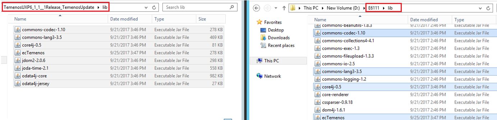
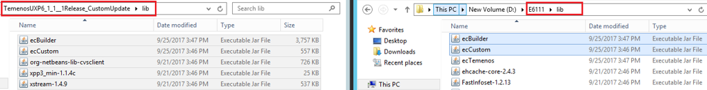
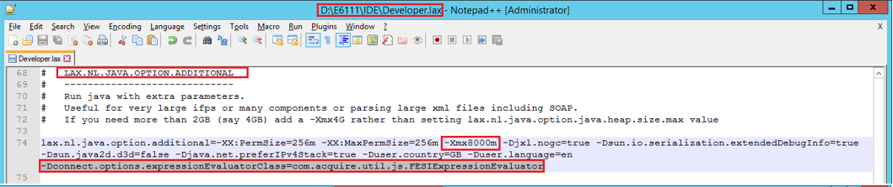
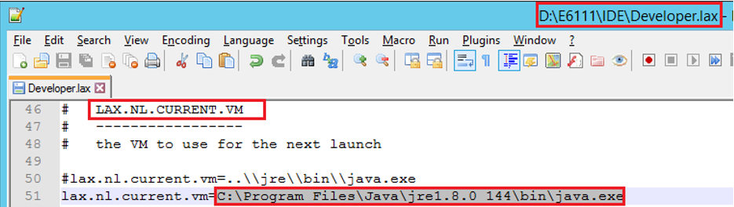
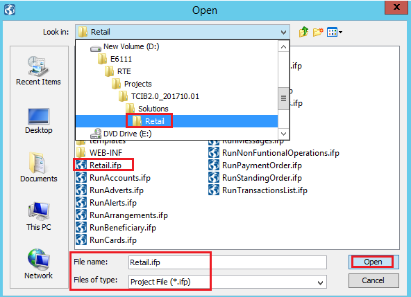
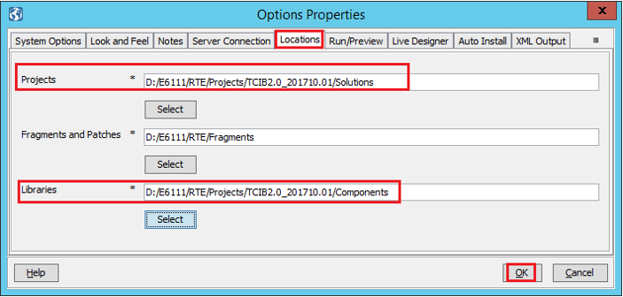
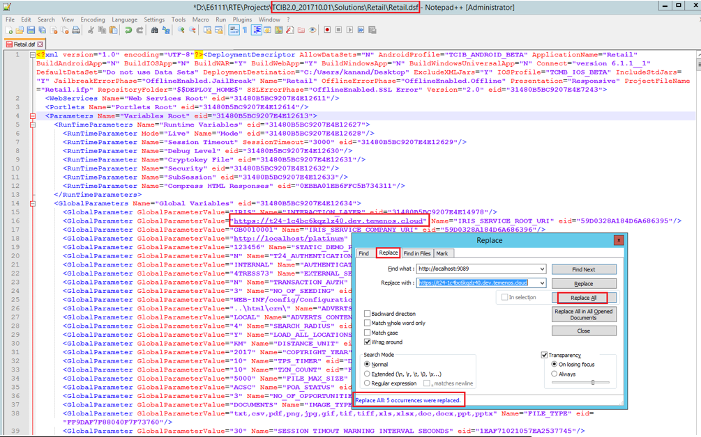
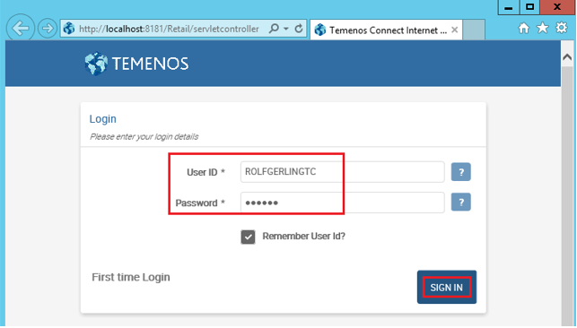

This user guide shows how to install Temenos User Experience in order to be able to use Temenos Mobile Banking application.

# Pre-requisites

 - Download JDK from following [link](http://www.oracle.com/technetwork/java/javase/downloads/index.html "JDK") and install the application

# Installation Steps

 - Create a folder where Temenos UXP should be installed

>[!Note]
>:bulb: In order to avoid Windows problems, please use short paths.

**Example**: For the purpose of this document, a folder called E6111 is created directly on D partion.

 - **Unzip** Temenos UXP folder and **launch** UXP installation (double click on appropriate install.exe file - example: TemenosUXP6_1_1__1_x64Windows)
 - UXP installation starts (*InstallAnywhere is preparing to install...*)
 - Click next to pass through installation steps. 
 - On License Agreement, accept Terms and Agreements
 - On Install Set, you can also check 'Hybrid Master' and 'Hybrid Android Slave' if you need it (in this case, Install Set will automatically change to 'Custom')
 - On Install Folder, **do not leave default path**. Instead, **select** the folder you created before (for UXP installation)
 - Choose UXP shortcut location:
 *example: "In a new Program Group"*
- Choose a JDK version 1.8 (select the path where you previously installed Java Development Kit)

 - Set the address and the port:
  - Hybrid Master address: *localhost*
  - Hybrid Master port: *9022*
- See all information in pre-installation summary and press install button

- Wait for installation to be completed. 

>[!Note]
> Send license request attaching InstallKey.txt to any of our MarketPlace team members. (InstallKey.txt is in IDE folder).

> You will receive one or two license files, which must be placed in the same folder (IDE)

 - Install TemenosUpdate.zip file

   a.	Unzip the **TemenosUXP6_1_1__1Release_TemenosUpdate.zip** archive received.

   b.	Copy the **jars** from the archive into the **lib** folder of Temenos UXP (*in current case E6111 - in your case, the folder you created to install Temenos UXP*).

   c.	Update **Developer.lax** file (*from IDE folder*) in order to add the jars copied in above step. Click right on developer.lax file, go to "lax.class.path=" and add the new jars as follows: 

      ;../lib/commons-codec-1.10.jar;../lib/commons-lang3-3.5.jar;../lib/core4j-0.5.jar;../lib/ecTemenos.jar;../lib/jdom2-2.0.6.jar;../lib/joda-time-2.1.jar;../lib/odata4j-core.jar;../lib/odata4j-jersey.jar

>[!Note]
> Based on the version you're using, you might have other jars to copy.

 - Install CustomUpdate.zip file

   a.	Unzip the **TemenosUXP6_1_1__1Release_CustomUpdate.zip** archive received.

   b.	Copy the **jars** from the archive into the **lib** folder of Temenos UXP.

   c.	Update **Developer.lax** file in order to add the jars copied in above step. See information from previous step.

      ;../lib/ecBuilder.jar;../lib/ecCustom.jar;../lib/org-netbeans-lib-cvsclient.jar;../lib/xpp3_min-1.1.4c.jar;../lib/xstream-1.4.9.jar

 - Update the java extra parameters in Developer.lax:

   a.	LAX.NL.JAVA.OPTION.ADDITIONAL

   +	Please add below line:

     -Dconnect.options.expressionEvaluatorClass=com.acquire.util.js.FESIExpressionEvaluator

   +	Please increase memory in order to avoid out of memory error. Add the following: 

      -Xmx8000m

   b.	LAX.NL.CURRENT.VM

•	Please set JAVA 8 with the correspondent path:

 - Open the Developer.exe 

# Import TCIB2.0 Retail project

- Copy TCIB2.0 folder into *Your Folder* > RTE > Projects

- Copy Retail jars from TCIB2.0\Solutions\Retail\WEB-INF\lib to **lib** folder of your Temenos UXP folder

- Update **Developer.lax** file in order to add the jars from the Retail\WEB-INF\lib:

       ;../RTE/Projects/TCIB2.0_201710.01/Solutions/Retail/WEB-INF/lib/tcsecurity.jar;../RTE/Projects/TCIB2.0_201710.01/Solutions/Retail/WEB-INF/lib/tcommonjms.jar;../RTE/Projects/TCIB2.0_201710.01/Solutions/Retail/WEB-INF/lib/tcommonjdbc.jar;../RTE/Projects/TCIB2.0_201710.01/Solutions/Retail/WEB-INF/lib/tcommon.jar;../RTE/Projects/TCIB2.0_201710.01/Solutions/Retail/WEB-INF/lib/TC-Logging.jar;../RTE/Projects/TCIB2.0_201710.01/Solutions/Retail/WEB-INF/lib/TC-Hooks.jar;../RTE/Projects/TCIB2.0_201710.01/Solutions/Retail/WEB-INF/lib/TC-Custom.jar;../RTE/Projects/TCIB2.0_201710.01/Solutions/Retail/WEB-INF/lib/tcclient.jar;../RTE/Projects/TCIB2.0_201710.01/Solutions/Retail/WEB-INF/lib/tbrowser.jar;../RTE/Projects/TCIB2.0_201710.01/Solutions/Retail/WEB-INF/lib/ofsml.jar;../RTE/Projects/TCIB2.0_201710.01/Solutions/Retail/WEB-INF/lib/log4j-1.2.9.jar;../RTE/Projects/TCIB2.0_201710.01/Solutions/Retail/WEB-INF/lib/jmimemagic-0.1.4.jar;../RTE/Projects/TCIB2.0_201710.01/Solutions/Retail/WEB-INF/lib/cryptoIntegration.jar;../RTE/Projects/TCIB2.0_201710.01/Solutions/Retail/WEB-INF/lib/channels.jar;../RTE/Projects/TCIB2.0_201710.01/Solutions/Retail/WEB-INF/lib/autoform-search-4.2.0.jar;../RTE/Projects/TCIB2.0_201710.01/Solutions/Retail/WEB-INF/lib/autoform-download-4.2.0.jar;../RTE/Projects/TCIB2.0_201710.01/Solutions/Retail/WEB-INF/lib/apache-jakarta-oro.jar

 - Now go to File > Open
 - Select the location of Retail.ipf file

 - A warning will appear > Accept language setup
 - Open Process Builder:
  - On top bar, click on "No Perspective" and select "Process Builder" (this will open UXP editors)

 - Set file location and server connection

   a.	On top bar, go to Tools > Options

   b.	Select the appropriate file locations:

   c.	Go and update Retail.dsf file in order to replace "*http://localhost:9089*" with your own correspondent url. 

*(There are 5 places to be replaced.)*

   d.	Select the appropriate server details (Go to Tools > Options > "Server Connection" tag):

Server Address: *your own url*

Server Port: *your port* 

- Close and open again the Developer.exe
- Run TCIB2.0 Retail from IDE:
  - go to Presentation Editor
  - click right on Responsive > Run
- Login to TCIB

- Agree to Terms and Conditions and press continue.
