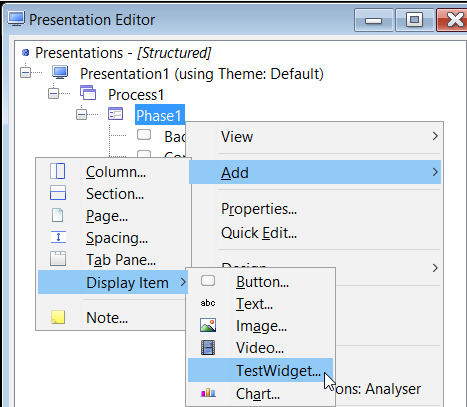

# Prerequisites 

 - This user guide provides all steps required for a simple widget creation. 

 - To develop more complex applications, some knowledge of javascript, jquery and css would be useful.

# Create a Widget

 - Create a folder on D partition. 
  - For this user guide, we defined a folder called 'UXPProjects'
 - We will create a new Project called 'TestProject':
  - Go to File > New > New Solution Project
  - Add Project Name (*TestWgt*)
  - Select Project Location (*D:/UXPProjects*)
  - Click OK > A new project is created
- Now, in the new screen go to Process Editor > click right on Processes > Add Process
  - Give a Process Name (*Process1*) and click OK
- Click right on *Process1* > Add Phase
  - Give a Phase Name (*Phase1*) and click OK
- Now, go to Presentation Editor > Click right on Presentations > Add Presentation Type 
  - Give a Presentation Name (*Presentation1*) and select Type > Rich HTML > click OK
- Go to Menu bar > Tools > Edit Widgets for Projects
  - Click right on Widgets > Add > Widget
  - An empty list of attributes is displayed. 
  - In this list, only **Name** and **Type** are mandatory. You can also add any other attributes
     + Name*: *TestWidget*
*(The widget name is used in the drop down list of display types in the Presentation Editor when you select a
display type for an element.)*
     + Type*: *Display Item*
*(The type specifies the type of element the widget can be applied to.)*
   - Click save
 - Go to the folder created for this project (*D:/UXPProjects*) and then to Templates folder
   - In Templates folder, create a new folder. The name of this folder is the widget name. Suppose you have a MarketPlace widget, you can name it something like: *com.temenos.test*
   - Inside this folder, create a head.wgt (optional) and body.wgt (mandatory) file. Create a txt document and change its extension to 'wgt'

 - Go back to Tools > Edit Widgets for Project
 - Now we can add the Head and the Body of the widget
 - Click on Source Template and in Value field, select as source 'body.wgt' from the template location 

- Add another template (this will be automatically recognized as a Header Template)
- Click right on the Widget (*TestWidget*) > Add > Template
- Click on Header Template and in Value field, select as header 'header.wgt' from the template location
- Save 

Above steps represent the basics for creating a widget. 

Now learn how to use the widget:

# Use the Widget 

 - Go to Presentation editor, expand the buttons, click on Phase1 > Add > Display Item > TestWidget: 

 - Give a name in the Item Name field. (We named this project '*FirstTestWidget*')
 - Click OK.

Now we have added a widget which has currently no functionality.

 - To add a functionality to it, go to Tools > Edit Widgets for Project > Click right on Widget (TestWidget) > Add > Custom Attributes
   - Under Custom Attributes > click on Attribute and fill the field Name which is mandatory, then click Save. 

> [!Note]
> This field is very important and we must be careful when choosing the name of the attribute, because it will be called in the code. For example, if we want a 'Hello World' kind of attribute, we can name it as *Message* 

 - To check what has been created, go to Presentation Editor > Double click on FirstTestWidget [TestWidget] > Go to Widget Details tab 
   - In the Message field, you can type *'Hello World'* (*any message you want to use*) and click OK.
 -  To run the project, go to Presentation Editor > Click right on Presentation Editor > Run

The new screen will not display anything related to the widget built before. In order to see the changes, modify Body and Header content:

## Body Template Content

 - To be able to see 'Hello World' message, go to Templates folder in order to modify body.wgt file. 
 - Edit body.wgt with the below HTML command, in order to acces the Custom Attribute previously added:

         

         $$ITEM.Message$
         

 - Save the change into body.wgt file and run again the Presentation Editor. 
  - You will see now displayed 'Hello World' message.

## Header Template Content

> [!TIP] 
> 
>  - You need to include any external javascript libraries/files e.g. jquery and external css files in the header template. 
> 
>  - You should also add javascipt/css used by the widget. 
> 
>  - You should try to include any script required by the widget in the header file if possible as each header is only included once in the page regardless of how many times the widget is used in the page.

Add jQuery script version on head.wgt

 -  Go on [http://code.jquery.com/](http://code.jquery.com/) > jQuery 1.x > minified version > download it on your local machine
 -  Copy the script into head.wgt

        

- Go back to body.wgt and edited according to the changes you need to make. Here is a small example:

         

         $$ITEM.Message$
         

         

Now, when you refresh the screen (in our [example](http://localhost:8181/TestWgt/servletcontroller)), you will see the Hello World message in red.

> [!Note]
> For more features regarding Widgets, please check Widgets Developers Guide available in the UXP package. 
