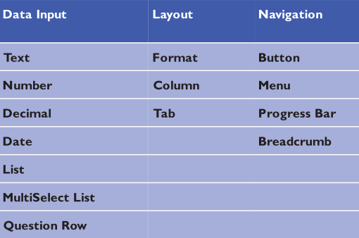

# What is a Widget?

Temenos UXP Widgets are complex, customisable UI controls you can use in your solution. Some commonly used widgets are provided with the UXP installation. However, you can also create your own widgets, use third party widgets or customise existing widgets. They are built using the Widget Editor provided in the UXP IDE (Integrated Development Environment). You can modify them to be configured by the user either at build or runtime. At runtime, the widget source is used to generate HTML which is then inserted into the destination HTML.

# Type of Widgets

A Widget is an add-on User Interface oriented control (such as a new Display Item) that you can add to Presentation Editor and then use to construct your solution. 

There are three types of Widgets:

- **Layout Widget**: 
  - A Layout Widget is a Container that groups together other controls (acts as containers for other elements in the page).
- **Data Capture Widget**: 
  - A Data Capture Widget allows a user to enter data.
- **Navigation Widget**: 
  - A Navigation Widget allows a user to navigate from Phase to Phase. It controls the movement within the solution.

Each widget type has a different function and there are different considerations when creating each of these types, although their general set up and use is similar.

# Using Widgets

You use a widget by specifying it as the display type for the element you wish to apply it to. This can either be an answer or the entire question row. The display type is set in the Presentation Editor of the UXP IDE. You can only use widgets that have already been added to your project and it must be of a display type that is the same as the element you wish to use it for e.g. a slider widget can only be used for data capture not for layout.

The Edit Widgets for Project Editor allows you to Add Widgets to your solution and Remove Widgets from your 
solution. 

To add/ copy/ delete a Widget, go to:

  -  Tools > Edit Widgets for Project > Right click Widgets root node > Add > Widget
           - respectively, instead of 'add' choose 'copy' or 'delete' an existing Widget

After installing UXP, you can check [**here**](./widget-development.md) how to build a simple Widget. *(basic steps)*
