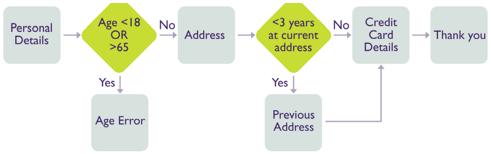
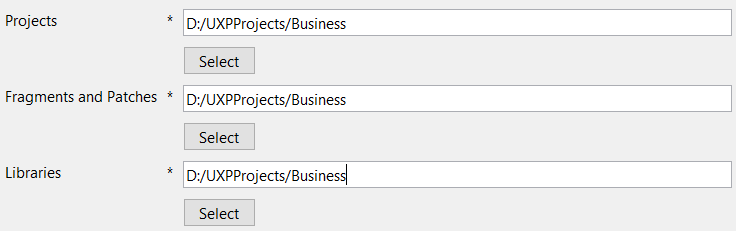
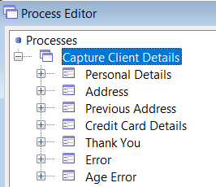
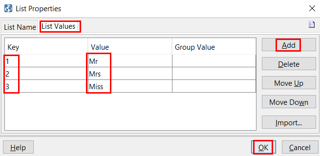
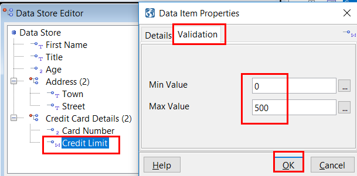
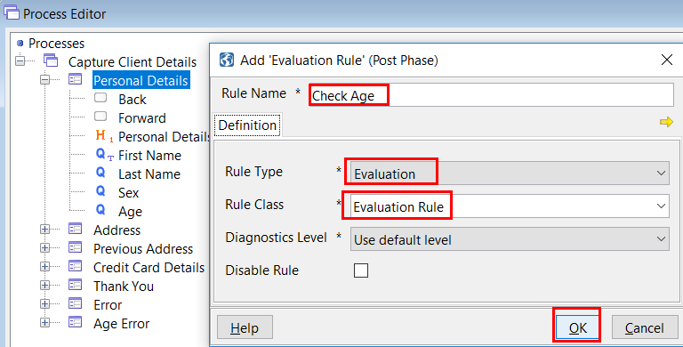
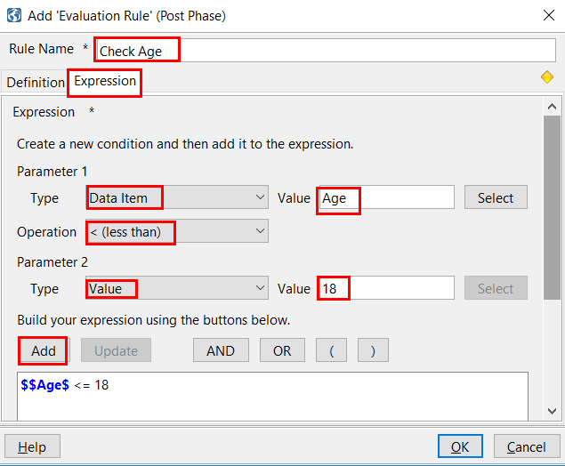
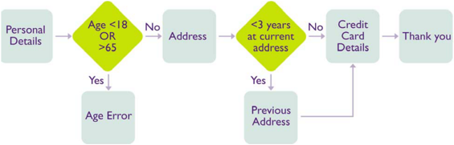
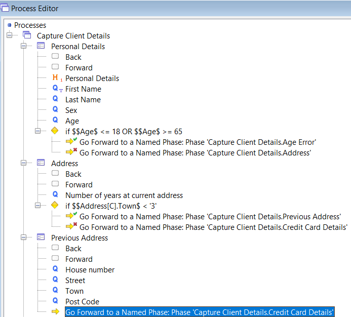
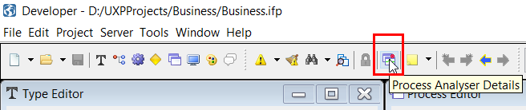

# Introduction

To have an overview and familiarize with UXP concepts, please also check this [Widgets 3 Minute Guide](widgets-3-minute.md).

To see the installation steps, please check following [UXP setup guide](uxp-setup.md).

You can see more details related to the steps above in the UXP User Guide that comes in the downloadable package. 

# Create a Business Solution with UXP

## Typical Business Problem
A car part supplier needs to capture client data for billing purposes. If the client wishes to pay by account, the supplier also needs to capture and check the clients’ credit details. This data needs to be collected either by call centre staff or by company representatives on sales visits. The clients themselves may also supply this data via the supplier’s website.

Click on **Terminology** to see what terms are used to describe the business solution constructed within the UXP tool.

  

    

      <h0 class="panel-title">
        <a data-toggle="collapse" href="#collapse1">Terminology</a>
      </h0>
    

    

    
 - **Process** - In order to capture the clients’ details, the supplier asks a series of questions and the client provides the answers. This is known as a process within UXP. At its simplest, a process encapsulates a business solution. A process can become morecomplicated in ways which will be described later in this document.

    
 - **Phase** - UXP also allows questions to be grouped into a number of sections. Each section forms a logical group and is known as a phase. A process will consist of one or more phases. In our example, one phase would collect the client’s personal details and another phase their account details. Dividing a solution into phases introduces points in the solution, between phases, where processing based on the information entered by the user can be carried out. This allows more complex business logic to be added to the solution. In more complex solutions, business processing may also be associated with individual questions. In order to move from one phase to the next, the user must click buttons or links which are specified within UXP for each phase. This process is known as navigation between phases.

    
 - **Data Item** In order to make use of the data entered by the user during the process, the answer to each question is stored in a data item. Data items are defined by the UXP user.

    
 - **Data Type** Each data item has a data type. There are pre-defined data types within UXP e.g. decimal, date, text. When a data item is created, a data type must be associated with it.

    
 - **Data Group** Related data items can be organized together as a data group. For example, the client’s address can be organized as a data group called “address” which contains the data items “house number”,” street”, “town” and “postcode”.   A data group allows related data items to be manipulated more easily.  The complete set of data items and groups are collectively known as the data store.UXP v5.0 User Guide 12. If more than one address needs to be captured, for example the client’s previous addresses, the address data group can occur more than once.  Each occurrence is known as an instance. This allows re-use of data groups and simplifies the data store.

    
 - **List** The answers to certain questions within a process can sometimes be limited to a pre-defined choice of several answers. The range of possible answers is defined within a list. For example, the answer to a question regarding your marital status may be limited to the answers “married”, “single”, “divorced” or “other”.

    
 - **Rules** In order to increase the functionality of the process, operations can be performed on the data contained within the data items. These operations are known as rules.  The most common rules perform validation and control the flow of the process. Rules can be executed between phases or within a phase when the value of a specific question changes.

    
 - **Presentation** Once the questions have been added and the rules defined, the process is complete.  A presentation is a way of defining how the process will appear to the end user. More than one presentation can be applied to a single process in order to deliver the business solution to different channels.  For example, a different user experience may be required for call centre users compared to that of the general public. Presentations will automatically be applied to all processes.

    
 - **Integration** The process can be enhanced further by allowing the data captured to be processed by third party software. Integration, via UXP, allows the data held in the data items to be passed to and from the third party software.  A common form of integration is saving the data captured to a database.  In our example, if the credit details are captured, an immediate credit check is possible by integrating to a third party to perform the credit check.

    
 - **Project** The  data  store,  processes,  presentations  and  any  integration  definitions  together  constitute the  project.

    

  

## Business Flow 
This user guide will describe the creation of a simple UXP project which will enable you to capture a client’s details including their name, address and credit card details. 

The flow diagram below shows the outline of the phases which form the process you will create. You will also create an error phase which will be displayed automatically if an error occurs at any stage.

If the client’s age is less than 18 or greater than 65, a specific error page will be displayed to inform the client of that fact and they will be unable to continue further with the application form.

The “Previous Address” phase will only be shown if the client has spent less than three years at their current address. A rule will be defined which will test this condition. At the end of the process, an informational phase will be displayed thanking the client for completing the form.

## Start Creating the Solution

### Create a Project
 - Go to File > New > New Solution Project
  - Add Project Name (*Business*)
  - Select Project Location (*D:/UXPProjects*)
  - Click OK > A new project is created (*A project folder will be created in the location selected*)

The project will act as a repository for the components we will be building that make up the business solution. 

It is good practice to have a single folder in which to store projects and UXP allows you to set the default file location to this folder.

To set the default file location:

 - Click Tools on the standard IDE menu bar
 - Click Options on the drop down menu
  - The Options dialog is displayed
 - Click the Locations tab
 - Click Select to set the location for Projects
 - Click OK

When a new project is created, the project location will default to the preferred project location set by the user. If this has not been set, the default location is set to the /RTE/Projects directory of the UXP install location.

### Create a Process

Add a process to a project:

 - Click Window on the standard IDE toolbar
 - Click Process Editor on the drop down menu
  - The Process Editor window is displayed
 - Right click the tree control root icon
 - Select Add Process
  - The Process tab of the Add Process dialog is displayed
 - Enter information about the process you are creating in the appropriate text boxes
 - Process Name: *Capture Client Details*
 - Click OK

The process created will be seen in the Process editor.

### Create a Phase

There will be five phases in our final solution in which we will capture the personal details, address and credit card details of the client. In this section we will create the first phase “Personal Details”.

Add a phase to a process:

 - In the Process Editor, right click the process which has just been created
 - Select Add from the dropdown menu displayed
 - Click Phase from the dropdown menu displayed
  - The Add Phase Dialog is displayed.
 - Enter information about the phase in the text box provided
 - Phase Name: *Personal Details*
 - Click OK

The name of the new phase can be seen below the name of the process just created.

Add the remaining phases the same as described above:

 - Address
 - Previous Address
 - Credit Card Details
 - Thank You

> [!Note]
> Although the phases are shown in the order in which they are added and in this case in which they will appear in the process, this order does in no way affect the order in which the phases will be displayed. This must be specified later.

### Error Phases

If an error occurs at any time during the execution of a solution, an error page is displayed. This is defined as another phase. At least one error phase must be defined so that it can be used as the default error page if no other action has been specified for a particular error. Error phases are created in the same way as all other phases, however they are usually only informational and the user is unable to navigate forwards or backwards from the phase.

Add a default error phase to the Client Details process as per the other five phases. In our example, an error occurs if the client’s age is less than 18 or over 65. In this case, a more specific error message is required so that the client is made aware of the error and is unable to continue with the application form.

Add a specific error phase to the Client Details process for this error.

The seven phases added in this section are listed below the Client Details Process in the Process Editor.

> [!Note]
> Expanding the phase will display the items contained within the phase. When a phase is created, a back and forward button are created by default and they are displayed within the Address phase as shown below. Using these navigation buttons will be explained in a later section.

### Adding Questions to a Phase

The questions added to a phase will allow the capture of individual pieces of information about the client’s details e.g. house number, street, postcode, etc. In this section you will add questions to capture the personal details of the client.

 - Go to Process Editor > Click on Personal Details > Add > Questions
  - The Add Question dialog is displayed.
  - Enter the question and any associated help text or hint text in the text boxes provided:
     + Display Text: *First Name*  (Note: *you can put here your text*)
     + Help Text: *Enter your first given name as it appears on your birthday certificate*
     + Hint Text: *Your first given name*
  - Click OK

> [!Note]
> Help text will appear if the user clicks the help icon which is displayed next to the question. Hint text will appear when the mouse moves over the answer text box.

  - The question is added to the phase which had just been created.
  - Repeat this process to add all the questions required to capture the client’s personal details. Each new question is added to the bottom of all the other items in the phase. The questions will appear in the solution in the order they are shown within the phase.

 - The Back and Forward buttons, added by default when the phase is created, can be seen as the first items in the phase. This is not always desirable and the order of the elements within the phase can be changed by:
 
• Right clicking on the question and clicking **Move Up** or **Move Down** on the drop down menu.

• Holding down the **Ctrl** button and using the **Up** or **Down** arrows on the keyboard.

• **Clicking** the question and **dragging** it to the appropriate position.

• Multiple items can be moved simultaneously by highlighting the desired items to be moved.

### Adding Headings to a Phase

Headings are used to clarify sections within phases or to add small amounts of text. They are purely for display purposes. In this section you will add a heading to the Personal Details phase.

 - In the Process Editor > right click on the Title question in the Personal Details phase > Insert > Heading
 - The Insert Heading dialog is displayed > Enter the heading *Personal Details* > click OK

Larger amounts of text can be added by including a separate html document within the presentation or by using
a different header for the phase. This is described within the online help.

### Adding/ Removing Buttons to a Phase

 - Buttons are used to move from one phase of the process to the next. Buttons are added to a phase in the same way as questions and headings.
 - Forward and Back buttons are added by default when a phase is created. However, the back button is not required in the first phase of a process. 
 - To remove the Back button from the Personal Details phase, in the Process editor > right click the back button > Delete

### Editing a Phase using Quick Edit

Double clicking an element within a phase will display the details of that element so that it can be changed. However, it is also possible to view all the elements within a phase at the same time and make any changes using quick edit.
 - To quick edit, in the Process Editor > click right on a Phase *(example: on Personal Details phase)*
 - The contents of the phase are displayed.
 - New phase elements can be added and exiting ones moved or deleted. The data item associated with a question can be changed and whether it is mandatory or read only can be changed.

### Specifying the Initial and Error Phase

The order in which the phases are to be displayed must be specified. Although they appear within the Process Editor in a particular order, this does not define the order in which the phases are displayed when the solution is executed and so you must specify the order. 

Two special cases are the first phase to be displayed, the “Initial Phase” and the phase to be displayed should an unexpected error occur, the “default Error Phase”.

The Initial Phase is the first phase to be displayed when the process is executed. This needs to be defined
within the IDE.

**- Specify Initial Phase**

 - Go to Process Editor > Double Click on "Capture Client Details" > Click Start tab > Click Select for Initial Phase 
  - The Phase Chooser dialog is displayed.
 - Expand the “Capture Client Details” process
 - Click “Personal Details” phase 
 - Click OK

 **- Specify Error Phase**

The default error phase is displayed when an error occurs in the process and no specific processing has been defined to handle the error. You need to define which phase you wish to be displayed if this should occur. In our
case it will be the phase named “Error” which will display a general error message to the user.

 - Open the Process Editor > Double click the process “Capture Client Details” > Click Start tab > Click Select for Error Phase
  - The Phase Chooser dialog is displayed.
 - Expand the “Capture Client Details” process
 - Click “Error” phase
 - Click OK

### Reviewing the Phase

You can see how the phases will appear on screen by reviewing the work you have done so far:

 - In the Process Editor right click the “Personal Details” phase > Select Preview

A browser window will appear which gives an idea of how the questions in the phase will appear when the solution is completed. This can be used for more complicated layouts to check how the questions will be displayed.

## Enabling Session Management

So far, you have created an application to capture a client’s personal details. However, in order to do anything useful with the data captured, you will need to store it, manipulate it and make decisions based on it.

Learn how to:

 - define a data store
 - create and use lists
 - use the data store to store session data

### Creating a Data Store 

To add a data store to a project:

 - Click Window on the IDE standard toolbar > Data Store Editor on the dropdown menu
  - The Data Store Editor window is displayed.
 
Now add a data item to a data store:

 - In the Data Store Editor, click right on Data Store root icon > Add > Data Item
  - The Add Data Item dialog is displayed.
 - Enter the name of the data item *(First Name, Last Name, Date of Birth, Sex, Marital Status etc)* and leave the type as “Text”
 - Click OK

### Creating a Data Group

In larger processes, a considerable number of data items are added and if added as single data items a large flat structure is created. In order to make the data store more manageable, it is advisable to organize the data items into data groups thereby creating a hierarchical structure.

**To add a data group to a data store:**

 - In the Data Store Editor right click on the root icon > Add > Data Group
  - The Add Data Group dialog is displayed.
 - Enter the name of the data group (*Address*) 
 - Maximum Instances: 2
 - Click OK

The number of instances defines the number of times a data group can occur and be stored separately. In current example you may wish to record the client’s current address and their previous address if they’ve lived at their current address for less than 3 years. As both these addresses will have the same data structure, rather than defining them twice you can specify that the Address data group will occur twice. If you do not wish to specify the number of instances, **uncheck** the Set Maximum Instances checkbox. This will enable dynamic instances, which means the data group can hold an unlimited number of instances.

  - The data group “Address” is added to the data store.

**To add data items to a data group:**

 - In the Data Store Editor right click on the data group “Address” > Add > Data Item
  - Define the data item belonging to the group as described above *(for example, everything related to Address: House Number, Street, Town etc)*
 - To do any change, you can use Quick edit  (Click right on the Data Group that you want to modify) 
 - The structure of the data store can be changed at anytime during development.

### Creating Lists

The answers to certain questions within a process can sometimes be limited to a pre-defined choice of several answers. The range of possible answers is defined within a list. Lists form part of the data store.

To create a dropdown list:

 - Click Window on the standard IDE toolbar
 - Click Type Editor on the drop down menu
  - The Type Editor window is displayed.
 - Right click Lists > Add >  Enter List Name “*Title*”
 - Click List Values tab > Add (add the values as shown below) > OK

 - Add all the lists required and applicable for Personal Details phase (which can be predefined with choices, such as Marital status: single, married, divorced, widowed)

### Capturing Data Entered

In order for the data entered by the user to be stored as each phase is completed, each question is associated with a data item in the data store in which the data entered is held.

Associate the questions in the “Personal Details” phase with the appropriate items in the data store:

 - In the Process Editor expand the “Personal Details” phase > Right click on the first question > Properties
  - As an alternative, you can also double click on the question, which will open same screen
 - Click Answer tab > Select
  - The data item chooser is displayed.
 - Click the “Title” data item > OK
 - Associate the remaining questions in the phase with the appropriate data items in the data store.

> [!Note]
> A new question can quickly be created by dragging a data item and dropping it on the required phase. The question text will default to the name of the data item. In addition, you can associate a data item with a question by dragging the data item onto the question in the Process Editor. To complete the solution, all the questions in the remaining phases must also be associated with an appropriate data item.

### Adding Business Logic

**Create Rules:**

The following types of validation are available within UXP:

• automatic validation associated with the type of data item

• validation associated with the definition of a data item

• business rules applied to the data captured

Data Item Level Validation:

When a data item is created a data type must be associated with it. The data type defines what sort of data will be stored in the data item and UXP will automatically validate any data entered into the field such that it conforms to the definition of the data type.

There are six data types predefined within UXP: text, number, decimal, date, file and email.

**To change the data type of a data item:**

 - Open the Data Store Editor > Open the Properties dialog for the “Age” data item > Select 
  - The Data Type Chooser is displayed
 -  Select the Number data type 
 - Click OK in Type chooser
 - Click OK in Data Item Properties
Continue and change the data types of all required data items.

**To enter maximum and minimum values for a data item:**

 - Open the Data Store Editor > Open the Properties dialog for the “Credit Limit” data item > Click the Validation tab
  - Enter “0” in the Min Value box and “500” in the Max Value box > Click OK

> [!Note] 
> For a text data type, there will be the maximum and minimum **length** of the field.

**Question Level Validation**

To make an answer to a question optional > Open the Process Editor > Double click the “Email Address” question > Click the Answer tab of the Question Properties dialog > **Uncheck** the Mandatory checkbox

This will prevent an error message being displayed if the user does not answer the question.

**Phase Level Validation**

To add a rule to a phase:

 - Open the Process Editor > Right click the Personal Details phase > Add > Click Post Phase Rule > Select Evaluation Rule
  - The Add Post Phase Evaluation Rule dialog is displayed.
  - The Expression tab is automatically displayed.
  - Set as in the images below:

**Select **OR** and do the same steps to specify “greater than 65”**

The rule is displayed at the bottom of the questions in the Personal Details phase.

## Adding Navigation to a Process

In order to move from one phase to another we need to add rules which define which phase will be displayed next. These are known as “Goto” rules.

By combining Evaluation rules and Goto rules you can vary the route taken by a client through the application. This combination of rules allows “conditional navigation”.

### Conditional Navigation

We have already defined a rule which evaluates whether the client is under 18 or over 65. Now we need to add rules which define what to do when this condition is true or when it is false.

When the rule is true we need to display the “Age Error” phase and prevent the client from going any further through the application.

**To add a navigation rule to an evaluation rule:**

 - Open the Process Editor and select the Personal Details phase > Right click the evaluation rule just added > Select Add > Click True Rule > Goto Phase Rule
  - A new screen is open showing "Phase Details"
 - Choose Operation Type as: Go Forward to a Named Phase
 - Go to Select button under Phase Name and choose Age Error > following is selected: "Capture Client Details.Age Error" > OK

The rule is added as the true condition of the evaluation rule.

 - You now need to add a **false rule** which will define the flow of the application if the user is within the age range for the application. Add a false rule, in the same way as above, which will go to the next phase i.e. the Address phase. **Don't forget to give a different name to this rule.**

 - You now need to add an **evaluation rule** for the Address phase which tests whether the client has lived at their current address for less than 3 years. If this is true, then add a goto rule to go to the Previous Address phase otherwise goto the Credit Card Details phase.
A goto rule must be added to the Previous Address phases to go to the Credit Card Details phase. This rule can
be copied from the one already created for the false condition defined in the Address phase above.

Below image is an example is how conditional navigation set-up should look:

**Go to the final "Thank you" phase:**

A goto rule must be added to the Credit Card Details phase to go to the final "Thank you" phase. 

This is not conditional on anything and will always be displayed.

 - Click right on Credit Card Details phase > Add > Post Phase Rule > Goto Phase Rule > Give a Rule Name *(ex: Goto Phase Thank You)* > Click on Select button under Phase Name > Double click on "Thank you" > OK > OK

**To review a process:**

 - Open  the  Process  Editor > Right click on the Capture Client Details process > Click Run

A new window will open up in which the first phase of the process will be displayed. The layout of the phase and the validation can be seen and tested. Clicking the navigation buttons on the phase will display the next phase in the process. In this way you can move through the process and check that it appears how you intended.

The application form will appear in its most basic form as no presentation will be applied to it. In order to review the presentation, run must be selected from the **Presentation Editor**.

## Presentation

The Presentation applied to a process will alter how the data capture elements of the solution appear when it is running. Different presentations will alter the look and feel of a process without any change to the data capture elements. In this way branding can rapidly be applied to a solution.

Following steps show how to:

 - Define how the solution will look
 - Change fonts, messages and buttons
 - Add branding
 - Change the page layout
 - Personalise the solution

### Creating a Presentation

In order to deploy the solution you must provide details of how the solution will be displayed. In order to do this you must define a Presentation.

**To create a Presentation:**

 - Click Window on the IDE standard toolbar
 - Select Presentation Editor from the dropdown menu
  - The Presentation Editor is displayed.
 - Right click the tree control root icon
 - Click Add Presentation Type
  - The Add Presentation Type dialog is displayed.
 - Enter the name of the presentation
 - Select Rich HTML presentation type
 - Click OK
  - The presentation appears in the presentation editor.  
  - Expanding the presentation’s node displays the processes and phases within the project.

**Presentation Types**

Five presentation types exist within UXP: Rich HTML, Pure HTML, Accesibility Compliant, Offline, Portlet. If no restrictions exist within the browser environment in which the solution is to be deployed, it is recommended that the Rich HTML presentation type is used. Alternative presentation  types and their application for more restrictive browser environments are listed below.

**Channels**
The use of different Presentations allows the same business solution to be delivered via several different channels without re-work of the data capture element of the process. The limitations of each channel are handled by defining a different presentation type for each channel. For example, the same set of questions can be used to deliver an application to a web browser or a mobile phone, but the limitations of the mobile phone display can be handled by defining a different, simpler presentation for this channel.

### Layout and Appearance

There are two aspects to the look and feel of an UXP solution - layout and appearance. 

 - Layout encompasses where the data capture elements (e.g. questions, textboxes, lists) of the solution appear on the screen and the relationship between the elements e.g. are the elements contained within columns, on separate tabs.
 - Appearance is concerned with what the actual elements look like e.g. the size and colour of the question font, the appearance of buttons,  how a menu is displayed.

The Presentation and Theme Editors are used to control the look and feel of the solution by controlling different aspects of the layout and appearance of the UXP elements included in the solution. In most cases, the layout of elements is defined within the Presentation Editor and the appearance of elements is defined within the Theme Editor. However, the Presentation Editor can also be used for ad hoc appearance changes to individual elements where you wish them to differ from the current Theme settings. We would recommend maximising the use of the Theme Editor as it promotes consistency of look & feel, and provides rapid presentation development through re-use.

**Layout**

It is useful to think of the UXP data capture elements as fitting within a virtual grid. The position of the elements changes depending on which elements are present or absent within a question and what other questions are included within the section. 

Different grid layouts can be applied to different areas of the page by splitting it into Sections and/or Columns.

 - Go to Presentation Editor > Click right on Personal Details > Add > you can choose between Column, Section, Page, Spacing etc.

**Add a Section**

A Section is part of a phase and its extent can be specified within the Presentation Editor. Sections allow a single phase to be broken up and different look and feel to be applied to each part of the phase.

 - Open the Presentation Editor and expand the appropriate phase
 - Select all the elements you wish to include in the section > Right click the selected items > Move into New > Section > OK
 - A Section has been added and the highlighted questions are now part of the section. The section is shown as expanded, however it can be collapsed to simplify the Presentation if required.

Because of the default layout options, it is necessary to specify the width of the columns. In this case, there are two columns and we can specify that each column takes up 50% of the available space. By defining the column width in this way, the columns widths will always be equal regardless of the size of the browser window.

**Columns**

 - Open the Presentation Editor and expand the appropriate phase
 - Select all the elements you wish to include in the section > Right click the selected items > Move into New > Column > OK
 - Click right on Column > Properties > Appearance > Layout > choose Specify as percentage (%) > Enter 50 in Section Width > OK

To **preview**: 
 - Open the Presentation Editor > select the appropriate Phase > Right click on the Phase > Preview

### Appearance

The appearance of an UXP element is controlled by the use of Themes and Designs.

To display the **default** Designs used by the Theme:

 - Go to Window > Theme Editor > right click Default > Properties > Default Designs
   - The default designs used by the default Theme for each element are listed.

**To create a new Design**

Create a new design for a question which requires a currency prefix for the answer:

 - Open the Theme Editor and expand the Theme you wish to add the Design to
 - Expand Item Designs and within this expand Answer
 - Right click Numeric Answer
 - Click Add Design
 - Enter the Name of the Design as Currency Numeric
 - Select Short Numeric from the Based On drop down list
This is the design our new design is most similar to and this allows us to quickly specify certain characteristics as they will default to those specified in the “based on” design.
 - Click the Answer tab, then Display tab
 - Enter $ in the Answer Prefix field
 - Click OK
  - The new design is added to the Theme. (Under Numeric Answer > Currency Numeric)

**Applying Designs to a Solution**

If you wish to alter the look and feel of an element in the solution from the default design, you need override the design to use within the Presentation Editor.

If you were to change the default design for that element to what you require, that would change the appearance of all elements in the solution which used that design and that may not be appropriate.

**To apply a different Design to a question**

 - Open the Presentation Editor and expand the Personal Details Phase which contains the Annual Income question
 - Double click the Annual Income question > Click on Answer tab > Click on Display tab below > Enter $ into Answer Prefix > OK
  - Go to Capture Client Details Phase > Run > The answer to this question will now be displayed with a “$” prefix as previously defined

### Changing Designs

**To change an existing Design:**

We will make the Heading 2 (H2) design italic. In order to do this we need to add the italic attribute as defined in the stylesheet to the existing H2 design.

 - Open the Theme Editor and expand the Theme containing the design you wish to amend
 - Expand Item Designs and within this expand Heading
 - Double click H2
 - Click Appearance tab > The Heading Design Properties dialog is displayed, showing the current design for H2.
 - Click the “more” ("..") icon > The Style Chooser is displayed
 - Expand Default.css and click Italic > Under Appearance tab, you will notice that Heading has changed to "LargeFont Color2 Bold Italic" 
 - Click OK

After checking the Preview (Presentation Editor > Capture Client Detail Phase > Run), you will see that the title related to H2 (level two of heading) will appear in italic.

**Changing Stylesheets**

A default stylesheet is provided by UXP which contains many common styles you may require. This stylesheet is used to define the Designs used in the Default Theme. It is possible to change the characteristics of the styles by changing the Style Properties using the Theme Editor.

**To change the Default Font:**

 - Open the Theme Editor
 - Expand Default.css
 -  Double click GlobalFont
  - The Style Properties dialog is displayed
 - Type Courier as the first item in the list of Font Family and separate it from the next font name with a comma
  - The font is specified as a comma separated list as it is recommended to list several alternatives in case the
specified font does not exist on the user’s machine.
 - Click Save > The font used for all text within the solution will now be changed to Courier. If the Courier font is not available the alternative fonts will be used in the list order.

### Using the Process Analyser

The UXP Process Analyser is part of UXP Developer. When your process is not acting as expected, it allows you to step through the process to determine what is causing the difference.

In order to step through a process you must set a breakpoint. A breakpoint will stop a process executing just before the point at which it is set. You are then able to step through the process, rule by rule, from the breakpoint. Whilst stepping through the process you are able to see the values contained in the data store and other runtime values which provide useful information about how the process is working.

The following features are available within the Process Analyser:

• step indicator: a red line indicates which process/rule will be executed next

• breakpoint setting: a red dot indicates where a breakpoint has been set

• debug and error log output

• viewing and editing of data values during process execution

### Setting and Removing Breakpoints

In order to step through a process, you must first set a breakpoint. The process will run through as normal up to this point and then stop at the rule where the breakpoint is set. From this point, you will be able to step forward through the process or opt to continue to execute normally until the next breakpoint or the end of the process is reached. It is usual to set a breakpoint at a stage in the process where it deviates from the expected behaviour. Breakpoints can only be set on rules.

**- To set a breakpoint in a Process**

 - Right click the rule at which you wish to set a breakpoint *(example: Go Forward to a Named Phase...)* and click Toggle Breakpoint.

A red circle on the rule, shown in the Process Editor, will indicate that a breakpoint has been set. In the example below, a breakpoint has been set on the “go forward to a named phase” rule. The Process Analyser will stop at this breakpoint once the process has been started and it will be possible to step, view data store values or stack  information from this point.

(To remove it, click right on the rule and select again Toggle Breakpoint > you will see it dissapear)

You can set a breakpoint at any stage while you are executing a process and execution will stop at this breakpoint once it is reached.

**To view breakpoints in a process**

 - Open the Process Analyser by clicking the Process Analyser icon in the standard toolbar

 - Click the Break Points tab
  - The breakpoints which have been set are listed within the Process Analyser which shows the rule description and the phase in which they occur. All breakpoints set within all processes within the project will be shown.
 - To remove a breakpoint from the process or all of them, check Remove/ Remove all button

**Starting and Stopping the Process Analyser**

 - Right click the process you wish to debug, select Run with, then click Analyser on the drop down menu.
 - Alternatively, open the Process Analyser from the icon on the toolbar and click theRun/Continue icon on the Analyser toolbar.

> [!Note]
>This icon will only be available if you have selected a process that can be executed within the Process  Editor.

 - The  first  phase of the process will be displayed in a browser window. Additionally, a Process Analyser window will be displayed automatically (if not already open) in the Developer IDE, providing further information regarding the project as it runs.

> [!Note]
> If there are rules executed before the first phase, these will be highlighted first within the Process Editor. Only after these rules have been executed will the first phase of the process be displayed.

 - The current phase or rule which is about to be executed will be highlighted in red in the Process Editor window. 
 - Click the Stop icon in the Process Analyser toolbar to stop debuging.

**Stepping through a Process**

In order to step through a process, you must have set at least one breakpoint in the process and be running the  process using the Process Analyser. Once the process has stopped at the breakpoint, you can step forward from this point.

 - Click Step In icon to execute this rule and stop at the next child rule

or

 - Click the Step Over Icon to execute the rule and any child rules in one step

### Data Store Values

In order to view datastore values you must be running the process using the Process Analyser and have stopped at a breakpoint.

 - Open the Data Store Editor
  - The values contained within the datastore are displayed in bold.

**To change datastore values**

During execution of the process, you may wish to change certain datastore values to test certain  scenarios. This is possible via the datastore editor while executing the process through the Process Analyser.

 - Open the Data Store Editor
 - Select the data item you wish to change
 - Press PF2

The value of the data item can now be changed to the desired value (as long as this is a valid value for the data item type). For example you can modify the Last Name.

**To view datastore values**

Values within the datastore can also be viewed within the Process Analyser. Only data items which have been selected can be viewed and this may be useful if it is important to see when these values change.

 - Open the Process Analyser
 - Select the Watch tab within the Process Analyser
 - Click Select
  - This opens the Data Item Chooser from which you can select the item you wish to Watch.
 - Click the data item you wish to watch
 - Click Select
  - The chosen data item appears in the list of watched items.

The values of datastore items within the Watch tab can be changed by clicking on the item and typing in the new value. Any change to the value will be reflected in the Data Store after tabbing away from the field or clicking enter.

**List Values**

Data store items of the list data type are defined as a series of key/value pairs. The values are displayed to the user within the application as a list of predefined choices. When the user selects a value, the key corresponding to the list value chosen is stored in the data store.
Within the Data Store Editor, the key values chosen by the user from a list are shown within brackets. If no value is shown, then a list value has not been selected by the user.

**Multiple Instances**

When a data group is added, it can be defined as occurring multiple times. The number of instances  defines the number of times a data group can occur and be stored separately. For example you may wish to record the client’s current address and their previous address, if they’ve lived at their current address for less than 3 years. As both these addresses will have the same data structure, rather than defining them twice you can specify that the Address data group will occur twice. You are therefore able to store each address in a different instance of the address data group.

As the process is executed, the instance number of the data group is incremented as appropriate. The current instance  (C) number is shown in square brackets. The maximum number of instances is shown in round brackets next to the data item. In the case shown below, there are 2 instances of Address and the current instance is the first address group.

In order to see values contained within other instances of the data group, it is possible to select the instance you require by selecting the instance number in the drop down list. Clicking on the data store editor window after you have selected the instance will display the values contained within that instance. It is then possible to edit these values if required.

As the process is executed, the current instance will change as the user adds new instance values, removes instance values and rules are executed which parse through instances. The analyzer will always show the values of the instance number selected in the drop down list and this may or may not be the current instance. In order to see the values in the current instance, the number in the drop down list must be the same as the instance number in the square brackets.

**Process Analyser Editor**

The Process Analyser Editor contains a number of tabs which allow you to view the process output logs, produced as the process is executed, as described below, the current phase stack for the process and the current breakpoints which have been set.

**Breakpoints and Watch Tabs**

This tab displays all the breakpoints which have been set and all the data items being watched within a project. Both these functions have been described previously.

**Phase Stack Tab**

The Phase Stack tab displays the phases which have been displayed and the phases which  have  been added to the stack and will be displayed. The phases are displayed in the order in which they are shown in the stack. It also displays the phase in which it was added to the stack.

The phase shown in bold is the current phase which is displayed in the browser window.

If you navigate backwards in the process, phases are only removed from the stack when you navigate back to the phase in which they were added.

Intelligent Process Queuing uses data gathered early on in the process to define all the phases which will be shown to the client during the process i.e. all the possible phases are added at the beginning of the  process. If you navigate backwards in a process designed in this way, all the phases will remain on the phase stack, the current phase being shown in bold. The phases will only be removed from the phase stack if you navigate back to the phase in which they were added.

The Phase Stack is cleared down when the Process Analyser is started.

**Runtime Error Tab**

The Runtime Error tab displays unexpected and serious errors which have occurred e.g. when no “next phase” has been specified or when a connection to the database has failed. These messages are normally displayed in the syserr.log file in the logs folder of the project. While the Process Analyser is running, the output to the system error log is redirected to the Process Analyser and displayed in the Runtime Error tab.

**Runtime Security Tab**

The Runtime Security tab displays any security violations that the Security Layer has detected.

**Runtime Debug Tab**

This tab displays all debug messages which are output as the process executes. While the Process Analyser is running, the output to the debug log is redirected to the Process Analyser and displayed in the Runtime Debug tab. When you have stopped the Process Analyser, the debug messages will continue to be output to the debug log when the process is executed.

The level of debug messages is set to 1 by default and can be altered when the project is deployed. For more information about setting the debug log level, see “Configure Your Deployment” section in the UXP Deployment Guide.

**Runtime Output Tab**

The Runtime Output tab displays internal UXP messages used for information only by UXP IDE developers. These messages will be set within any custom java classes which may be used by the process. In most cases, this window will be blank.

**Rules Reference**

Rules allow more complex business logic to be carried out within the solution. They are grouped into four types which  have roughly similar characteristics and are described in the table below.

| Rule Type  				| Description	|
|-					|-		|
| Action				|	Allows you to manipulate or use the data stored within the data items|
| Evaluation				|	Allows data items to be compared or evaluated and allows rules to be grouped|
| Custom				|	Allows values in the data store to be passed to legacy systems or 3rd party software and for values from these systems to be returned to be used within the UXP business solution|
| Integration				|	Allows data items to be mapped to a database, XML or Polaris for storage or use in further processing|

**Execution Point**

When you wish to add a rule, you must first decide at what point you wish the rule to be executed. Rules can be added to processes, phases or questions.

**Process rules**

Process rules are run for every phase in the process. They can run before or after the pre-phase rules of a phase, or before or after the post-phase rules of a phase.

For example, you may wish to use them for recording audit information that is required for every phase.

**Phase rules**

Phase rules can be executed prior to the phase being displayed (pre-phase rules) or after the phase has been displayed and the user has entered the values requested in that phase (post-phase rules). 

When a phase rule is executed, it uses the values stored in the data store at that particular point. Therefore, it is important to consider what the user has entered up to the point of the rule execution and also what other rules have been executed and what effect they will have had on the values in the data store.

To add a post-phase rule: 

 - Open the Process Editor
 - Right click the process to which the phase will be added > Add > Post Phase Rule > Other
 - Enter the name of the rule
 - Select the Rule Type and Class you wish to add
  - Additional tabs will appear which are appropriate to the type of rule you wish to add. An explanation of the values to enter in these fields is given in the online help for the appropriate rule.
 - Click OK

The process for adding a pre-phase rule is the same as that for a post phase rule, only the execution point will differ. Usually, the rules specified for a process or phase are run one after another in the order in which they are specified. However, it is possible to “break out” of the specified order to do something else and then return to execute the remaining rules. For example, you may wish to show a confirmation message and continue running the rest of the rules depending on the result of the confirmation. This is achieved using the Goto Rule. The Goto Rule allows you to specify what phase will be displayed next within a process. It has several different operation types through which you can control when the remaining rules in the phase are run.

**Question rules**

Question rules are run after the value for a particular question is entered. For example, you may wish to transfer the data entered to a summary area and therefore copy the value entered to another data item.

Care must be taken when using question level rules as they are run again when the phase is completed. When defining question level rules, it must therefore have no detrimental effect on the process if the rule is run twice.

**Action Rules**

| Rule Class  				| Description	|
|-					|-		|
| Audit				|	Adds the appropriate information to the audit log|
| Create Multi List Value				|	Saves the values chosen from a multi-selection list to a single data item|
| Compare Multi List value				|	Used to compare different sets of choices from a multi-selection list|
| Diagnostic				|	Outputs session information to debug log|
| Directory Browser				|	Allows you to list all files found in a directory on the file system|
| End Component				|	Ends the processing of an UXP component and returns control immediately to the caller|
| Expression				|	Allows complex evaluation expressions to be defined|
| Goto Phase				|	Adds the specified phase to the list of phases which will be displayed as part of the solution|
| Import Offline Data				|	Gets data stored by an offline application into an online session|
| Invalidate Data Store				|	Invalidates all the data in the data store, except for specified data items. Invalid data items will not be saved to a database |
|Question in Error 				|	Sets specific questions to Error Status|
|Reset Session Data				|	Clears any session specific data from data store|
|Set Process Item Status 				|Switch an answer(s) to be ready only or editable dynamically	|
|Set Value				|Sets a data item, data group instance or variable to either a fixed value or the value of another data item or variable	|
| Switch Presentation			| Changes to a different Presentation which has already been defined|
| Text Modifier		| Extracts part of the text of an answer|
|Track Changes 		|Identify modified user values |
| Translate QAS Result		| Defines how to allocate parts of an address returned from QAS|

**Evaluation Rules**

| Rule Class  				| Description	|
|-					|-		|
| Add to List				|	Adds values entered at run time to a list|
| Call Component				|	Calls an UXP Component|
| Container				|	Groups rules together under a single rule|
| Evaluation				|	Evaluates a logical expression and returns true if the expression is true, false if the expression is false|
| Generate Document				|	Generates a document which can be viewed via the presentation channel e.g. HTML, pdf|
| Incrementor				|	Increments values in the data store or instance pointer of a data group and returns true if the increment succeeds, false if the increment fails|
| Repeat				|	Runs all the true rules until a false rule is returned, the  runs the false rules|

**Custom Rules**

| Rule Class  				| Description	|
|-					|-		|
| Browse Class				|	Allows a custom written java class containing business logic to be executed|

**Integration Rules**

| Rule Class  				| Description	|
|-					|-		|
| Open Source Connector				|Specifies when to connect with a COM object, database, java class or XML during a process	|
| Pre-built Connectors				|Specifies when to communicate with email, Experian Vehicle Search, QAS, Credit Card Payment (SolveSE)|
|Configurable Connectors 				|Specifies when to communicate with Polaris Integration rule during a process	|

