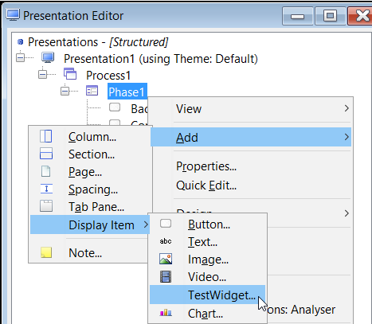

This is a short guide to explain what you can develop through UXP and how to use a simple Widget.

# Development

What you can develop by using UXP solution?

Here's a description of a simple business problem:

A car part supplier needs to capture client data for billing purposes. If the client wishes to pay by account, the supplier also needs to capture and check the clients’ credit details. This data needs to be collected either by call centre staff or by company representatives on sales visits. The clients themselves may also supply this data via the supplier’s website.

> [!Note] 
> The solution can be checked in the User Guide that comes with your package, under Getting started section.
> 
> Also, you can see the entire flow in the [**Widgets 3 Hour Guide**](widgets-3-hour.md). 

## Use a Widget 

 - Go to Presentation editor, expand the buttons, click on Phase1 > Add > Display Item > TestWidget: 

 - Give a name in the Item Name field. (We named this project '*FirstTestWidget*')
 - Click OK.

Now we have added a widget which has currently no functionality.

 - To add a functionality to it, go to Tools > Edit Widgets for Project > Click right on Widget (TestWidget) > Add > Custom Attributes
   - Under Custom Attributes > click on Attribute and fill the field Name which is mandatory, then click Save. 

> [!Note]
> This field is very important and we must be careful when choosing the name of the attribute, because it will be called in the code. For example, if we want a 'Hello World' kind of attribute, we can name it as *Message* 

 - To check what has been created, go to Presentation Editor > Double click on FirstTestWidget [TestWidget] > Go to Widget Details tab 
   - In the Message field, you can type *'Hello World'* (*any message you want to use*) and click OK.
 -  To run the project, go to Presentation Editor > Click right on Presentation Editor > Run

The new screen will not display anything related to the widget built before. In order to see the changes, modify Body and Header content.

### Body Template Content

 - To be able to see 'Hello World' message, go to Templates folder in order to modify ***body.wgt*** file. 
 - Edit ***body.wgt*** with the below HTML command, in order to acces the Custom Attribute previously added:

         

         $$ITEM.Message$
         

 - Save the change into ***body.wgt*** file and run again the Presentation Editor. 
  - You will see now displayed 'Hello World' message.

### Header Template Content

> [!TIP] 
> 
>  - You need to include any external javascript libraries/files e.g. jquery and external css files in the header template. 
> 
>  - You should also add javascipt/css used by the widget. 
> 
>  - You should try to include any script required by the widget in the header file, if possible, as each header is only included once in the page regardless of how many times the widget is used in the page.

Add jQuery script version on ***head.wgt**

        

- Go back to ***body.wgt*** and edited according to the changes you need to make. Here is a small example:

         

         $$ITEM.Message$
         

         

      Address use in current example : http://localhost:8181/TestWgt/servletcontroller
      When the screen is refreshed, Hello World message will appear in red

> [!Note]
> For more features regarding Widgets, please check also [**Widgets 30 minute guide**](widgets-30-minute.md) and Widgets Developers Guide available in the UXP package. 
