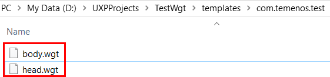
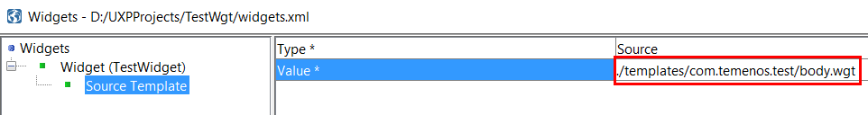
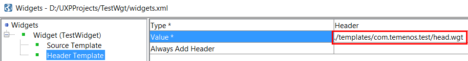

This is a short guide to explain the use of UXP and basic steps for installation and development.

# About UXP

Creating a basic project can be carried out as a series of stages. Once the basic solution has been created, any of the elements can be amended to enhance the solution.

Below are the main phases of the development:

1. Create Project
2. Create Process
3. Create Phase
    - add questions
    - add text
    - add buttons
4. Create Data Store
    - add data items
    - add data groups
    - add lists
5. Associate Data Store with Process
6. Create Rules
    - add validation
    - add business rules
    - add navigation

Although the steps are in the order shown, the order may change depending on your starting point for the process. For example, you may be replacing an existing process for which a database exists. In this case, it may be more convenient to create the data store from the existing database as a first step before creating the process. UXP includes tools which allow you to generate your project from database, web service and XML schema files to help speed up the development process. UXP allows flexibility in approach in order to build the solution in the most efficient way.

# Installation

> [!Note]
> When planning an Enterprise installation, you firstly need to decide who in your organization will perform the above roles as this will determine what UXP components need to be installed on each machine. Although described separately, you can of course allocate all administrative tasks to an individual.

> Once you have defined the roles required, the Enterprise Server components should be installed on the appropriate machine, in the following order:
> 
> • UXP Server

 >• Administrator
>
> • Deployer
> 
> • Developer

 - Download your Temenos UXP Developer Package from Temenos MarketPlace. This Package contains also some useful user guides. 
 - Installation overview:
   - Start installation
   - Choose install options
   - Install
   - Obtain License
   - Install License
   - Complete

Check also [**these steps**](uxp-setup.md) to see installation process.

# Widget Basic Steps Example

 - Below are the steps required for a simple widget creation. 

 - To develop more complex applications, some knowledge of javascript, jquery and css would be useful.

## Create a Widget

 - Create a folder on D partition. 
  - For this user guide, we defined a folder called 'UXPProjects'
 - We will create a new Project called 'TestProject':
  - Go to File > New > New Solution Project
  - Add Project Name (*TestWgt*)
  - Select Project Location (*D:/UXPProjects*)
  - Click OK > A new project is created
- Now, in the new screen go to Process Editor > click right on Processes > Add Process
  - Give a Process Name (*Process1*) and click OK
- Click right on *Process1* > Add Phase
  - Give a Phase Name (*Phase1*) and click OK
- Now, go to Presentation Editor > Click right on Presentations > Add Presentation Type 
  - Give a Presentation Name (*Presentation1*) and select Type > Rich HTML > click OK
- Go to Menu bar > Tools > Edit Widgets for Projects
  - Click right on Widgets > Add > Widget
  - An empty list of attributes is displayed. 
  - In this list, only **Name** and **Type** are mandatory. You can also add any other attributes
     + Name*: *TestWidget*
*(The widget name is used in the drop down list of display types in the Presentation Editor when you select a
display type for an element.)*
     + Type*: *Display Item*
*(The type specifies the type of element the widget can be applied to.)*
   - Click save
 - Go to the folder created for this project (*D:/UXPProjects*) and then to Templates folder
   - In Templates folder, create a new folder. The name of this folder is the widget name. Suppose you have a MarketPlace widget, you can name it something like: *com.temenos.test*
   - Inside this folder, create a ***head.wgt*** (optional) and ***body.wgt*** (mandatory) file. 

 - Go back to Tools > Edit Widgets for Project
 - Now we can add the Head and the Body of the widget
 - Click on Source Template and in Value field, select as source ***body.wgt*** (created in Templates folder)

- Add another template (this will be automatically recognized as a Header Template)
- Click right on the Widget (*TestWidget*) > Add > Template
- Click on Header Template and in Value field, select as header ***header.wgt*** (created in Templates folder)
- Save 

To see how to use a widget, check following [Widgets 3 Minute Guide](widgets-3-minute.md).