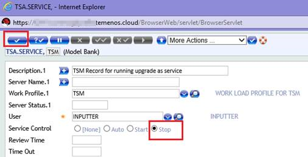

### How to get the XML file generated?

**1. Login to BrowserWeb and put the TSM service to STOP**

 a. Type TS, TSM

  b. Select STOP and press commit button

**2. Delete the F.TSA.STATUS table using DBTools**

 a. Please login to DBTools and clear the content of TSA.STATUS table by typing the JQL command: “CLEAR-FILE F.TSA.STATUS”

**3. Go back to BrowserWeb and put the TSM to START**

 a. Type TS, TSM

 b. Select START and press Commit button

**4. Now go to TAFJEE and start the TSM**

 a. From your organization, click on MONITOR APPLICATION, then click on Execute Servlet and them start TSM as showed below:

