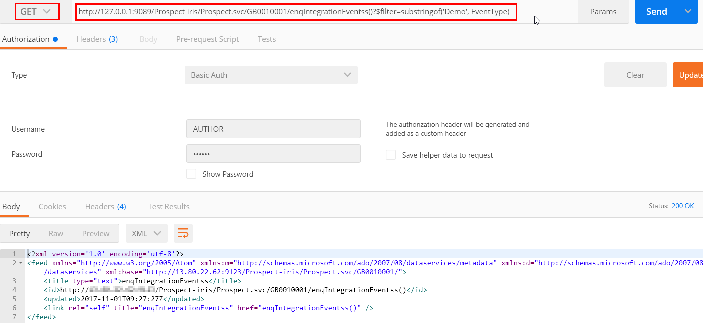
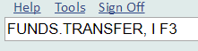
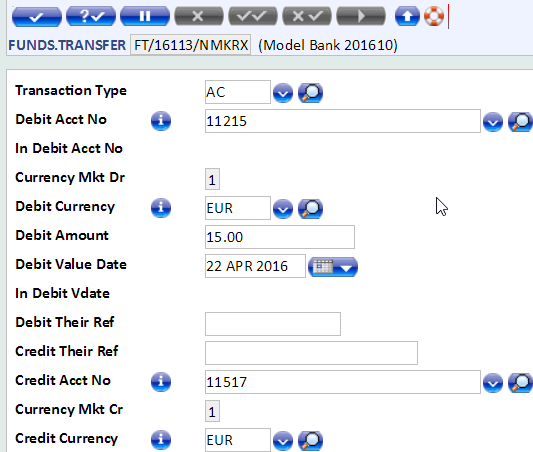
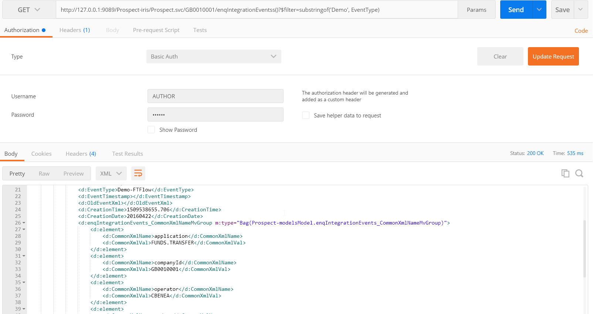

# Integration Events – 3 Minutes Guide #

This is a short guide which will explain how to see the Integration Events in ReST client.

In this example we will fetch the events for FUND TRANSFER. 
We already created an Integration Project and published to T24:

 - Project Name: Demo
 - Event Name: FTDemo.event
 - Event Type: Demo-FTDemo

## Prerequisites ##
-  Temenos Sandbox

- Google Chrome browser – Download from [here](https://www.google.co.uk/chrome/browser/desktop/ "Chrome")

- POSTMAN chrome extension 
  - Either search POSTMAN ReST client on Google OR
  - click this [link](https://chrome.google.com/webstore/detail/postman/fhbjgbiflinjbdggehcddcbncdddomop?hl=en "Postman") 

## Access the Data Service ##

The Temenos Sandbox already has one Data Service that will fetch the events from T24

To learn how to fetch the data from T24 using ReST client, please follow this [3 minutes guide](../interaction/3-minutes.md).

- API Name to access events data: /enqIntegrationEventss()
- Data Service Name: http://127.0.0.1:9089/Prospect-iris/Prospect.svc/GB0010001/
- Filters: ?$filter=substringof(‘Demo’, EventType) or ?$filter=EventType eq ‘Demo-FTDemo’
- Complete URL: http://127.0.0.1:9089/Prospect-iris/Prospect.svc/GB0010001/enqIntegrationEventss()?$filter=substringof('Demo', EventType)

If we don’t provide the filter, it will fetch all the events from T24 and slow down the POSTMAN. Therefore the best practice is to fetch only the events in which you are interested. 

Follow this post if you want to know more about filters – IRIS Data Service & OData Filters

Now we are going to query to T24 for event type Demo-FTDemo by GET method on above mentioned data service:

e.g. /Prospect-iris/Prospect.svc/GB0010001/enqIntegrationEventss()?$filter=EventType eq ‘Demo-FTDemo’

We will GET following Response – This response is empty because there is no transaction after creating this event.

## Initiate FUNDS.TRANSFER ##

Now login to T24, initiate a FUNDS.TRANSFER and commit the deal in T24

> [!Note]
> Don't forget to use **comma**
> 

## See the events data ##

Now follow the same steps done previously in order to fetch the events data. Open POSTMAN and GET request on /enqIntegrationEventss() resource

e.g. GET http://127.0.0.1:9089/Prospect-iris/Prospect.svc/GB0010001/enqIntegrationEventss()?$filter=substringof('Demo', EventType)

Response from above request is the following:

In the response we can see event type and other useful information:

<d:EventType>Demo-FTFlow</d:EventType>

and also the T24 Application name

<d:CommonXmlVal>FUNDS.TRANSFER</d:CommonXmlVal>

