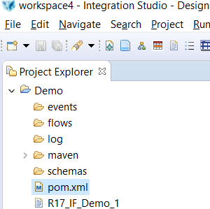
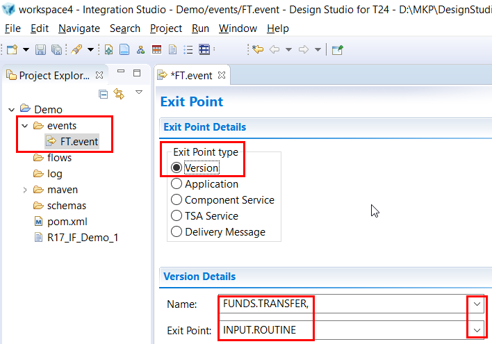
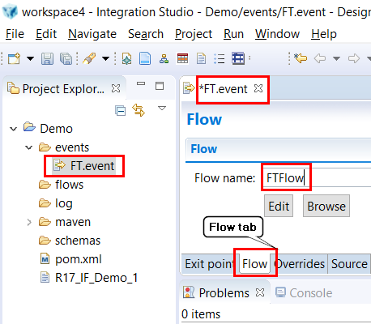
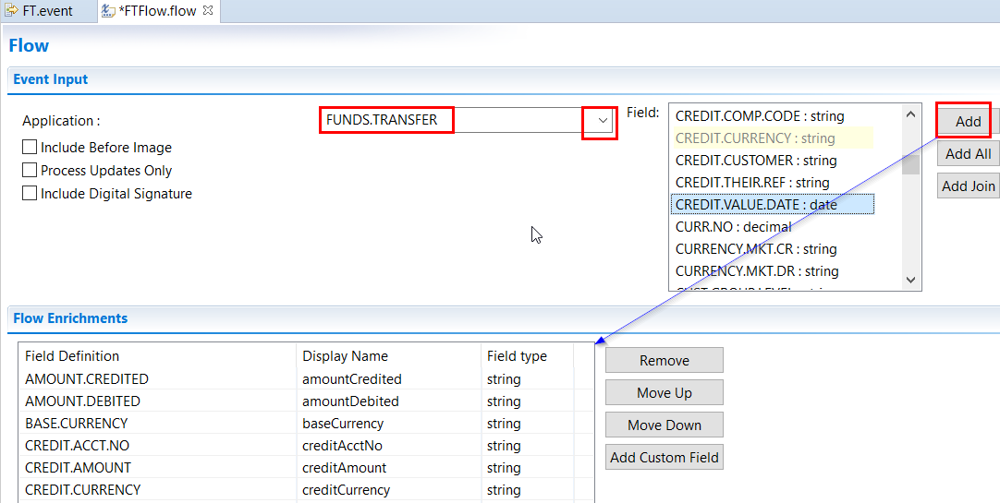
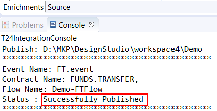
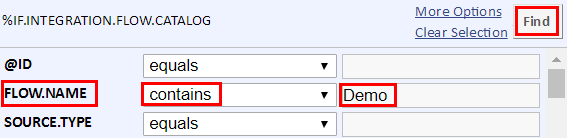
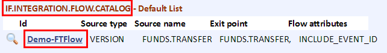
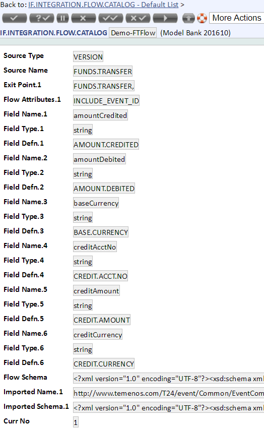

# Integration Events

Integration Framework Service is used by to perform event delivery to a middleware and to perform transformations.

Integration Framework Service handles the following the high-level operations:

*	Transformations
*	Event Delivery through middleware

# Introduction

This guide will help you to deep down into T24 Integration Events. In [3 Minutes Guide](3-minutes.md) we accessed events in POSTMAN using Data Service and in this guide we’ll:

*	Create T24 Integration Project
	*	Create Events
	*	Create Flow
	*	Create Events & Flow Design Studio Package
*	Install the events
*	View event flow in T24
*	Generate the events
*	Event data in REST Client

# Prerequisites

To complete this guide you need:

*	Temenos Sandbox

*	Temenos Design Studio

*	Google Chrome browser – Download from here: [Chrome](https://www.google.co.uk/chrome/browser/desktop/ "Chrome")

*	POSTMAN chrome extension
	*	Either look for POSTMAN ReST client on any search engine OR
	*	Click this [link](https://chrome.google.com/webstore/detail/postman/fhbjgbiflinjbdggehcddcbncdddomop?hl=en "Postman") 

*	Completed following guides:
	*	[What is Temenos Sandbox](../marketplace/sandbox.md)
	*	[Data Service 3 Minutes Guide](../interaction/3-minutes.md)
	*	[Integration Events 3 Minutes Guide](../integration/3-minutes.md)

# Create T24 Integration Project

 - Launch Design Studio 
 - Make sure to select Integration Studio perspective:
  - On top menu bar, go to Window > Perspective > Open Perspective > Other
  - From the list, click on Integration Studio > OK
 - In order to create a new T24 Integration Project go to File > New > T24 Integration Project:
  - Choose a name for your project
  - Check 'Enable project specific settings'
  - Choose Connection Method as Web Service
  - Insert IF Service URL:  http://*localhost:9089*/axis2/   (replace 'localhost:9089' with your sandbox address or use your localhost, then '/axis2/')
  - Insert your T24 User Name and Password

After finishing above steps, you’ll get an empty project in your workspace:

# Create Events

 - In created project, go to Events folder > click right > New > T24 Event Wizard

 - Enter the Event name (File name) e.g. FT.event
 - Click on Finish button. 

## Exit Point

 - Select the Exit Point Type and T24 Version details. In this example we have selected **comma** version of FUNDS.TRANSFER application and exit point INPUT.ROUTINE because we want the event data when user inputs something.

# Create Flow

Now create the Flow for this Event. 

- Click on the Flow tab and enter the Flow name 

 - There are two options:
  -  If you want to use any existing Flow, then click on **Browse** button and **Select** from existing ones:
   - otherwise click on Edit:
 - Select fields of interest:

 - Save the changes: CTRL + S

# Publish Event Flow in T24

- Right click on the project name, go to Integration Studio and click on Publish
- You should get a success message if no problem occurs during publishing the events.

# Check availability of the Flow in T24

 - Login to T24. 
 - Once you login, type IF.INTEGRATION.FLOW.CATALOG L L in command windows and press enter key. 
 - A new window will popup > select List Live File and there > search your Flow as per below example:

 - You can see that the flow created in above steps is available in T24:

 - When clicking on it, it will bring up the details of the Flow designed before:

 - Alternatively you can directly type the name of the flow get it directly from T24 command windows:

e.g.
IF.INTEGRATION.FLOW.CATALOG S IntegrationDemo-FTFlow

# Initiate Transaction and See the Event Data in POSTMAN

Follow [this](../integration/3-minutes.md)  3 Minutes guide to see events data in POSTMAN

