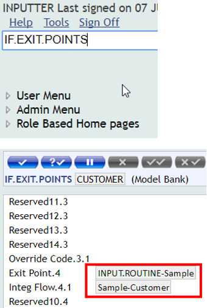

# Create Package

Learn how to create a package with Design Studio by following below steps.

Before generating the package, first you need to verify that the created events and flows are successfully installed in T24 area by publishing the events and flows.

## Publish Project

 - Right click on the name of the project, then select Integration Studio > Publish

 - In the Console screen, status appears as 'Successfully Published':

 - You have now successfully generated events and flows in Design Studio.

## Verify publication to T24

 - When the Event Designer project is published successfully to T24, the following applications are updated:

 - IF.EXIT.POINTS: which holds records that binds the notification [**exit points**](glossary.md#exitPoint) with their integration flows.

  - [**IF.INTEGRATION.FLOW.CATALOG**](glossary.md#catalog): This is a catalog for the Integration Flow records. Integration Flows are created from SOA Studio to be stored in this table at design time. These flows are attached to Exit Points where the notifications are sent out from T24. The flow schema thus created will be stored in the FLOW.SCHEMA field of IF.INTEGRATION.FLOW.CATALOG table.

Example: To see how to create or modify a customer record, please see [Generate Events](http://developer.temenos.com/integration/3-hours.html#generate-events) section.

## Packaging the IF Events and Flows

If the above publication was successful, please follow next steps in order to generate the package: 

 - Right click on the project > Run As > Run Configurations

 - Make sure you have following configurations:
   - Double click on *Maven Build*;
   - Click on *Browse File System* button and select the project created in your workspace for which you want to generate a package;
   - Type 'clean package' in Goals area;
   - Click Run.

 - You should receive a Build success message in the console
 - And you should obtain the **jar** to be installed in the new environment:

 - If the maven build is successful, the artefacts (jar) are stored under the target folder (see above). The .jar file is for TAFJ implementations.

