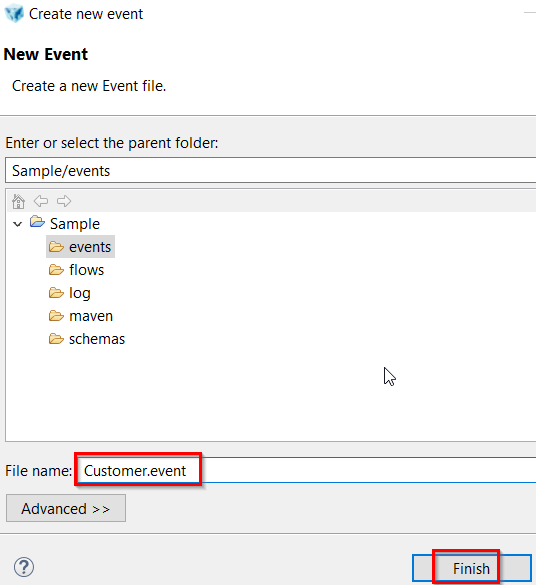
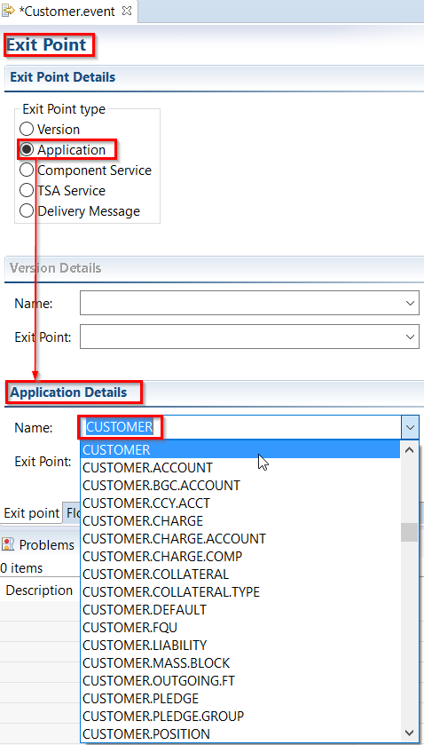
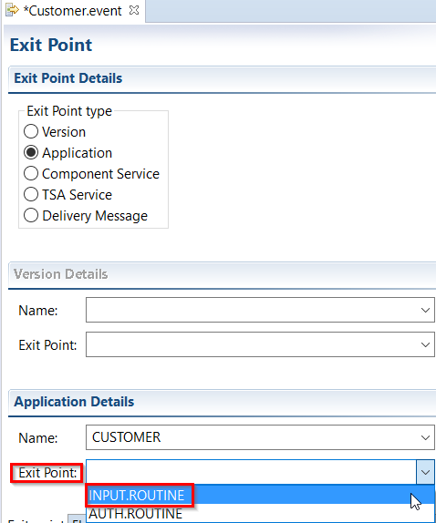
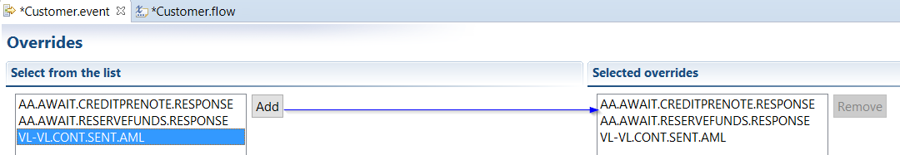

# Events

## What is an Event 

 - A generic term for the notification which T24 emits when a business event occurs. Example: The Events are generated when a transaction happens and for that transaction an Integration Flow is attached.
 - From the transaction and associated applications, the data enrichments are built as defined in the Flow and an XML representation of the Event is generated. 
 - This XML is confirmed to the schema representation (XSD) of the Flow and stored in a T24 events table called IF.EVENTS.INTERFACE.TABLE.

 Bellow steps will show how to create Integration Framework (IF) events in order to package them in a T24 development environment.

## What are the Benefits of Events 

- Events enable messages generated by an application to be managed following a publish model. 
- When events are generated, they are passed through system as XML files and registered event listeners receive the event information as XML.
- Each application view uses an XML schema as metadata to describe the XML data for events. 
- This metadata enables the users to understand the data requirements of any application view event or service.

## Preparing Integration Project 

 - In a workspace created in your Design Studio, set-up Integration Studio Perspective:
  - On top menu bar, go to Window > Perspective > Open Perspective > Other 
  - From the list, click on Integration Studio > OK
 - In order to create a new T24 Integration Project go to File > New > T24 Integration Project:
  - Choose a name for your project
  - Check 'Enable project specific settings'
  - Choose *Connection Method* as Web Service
  - Insert *IF Service URL*:  http://*localhost:9089*/axis2/   (replace 'localhost:9089' with your sandbox address or use your localhost, then '/axis2/')
  - Insert valid T24 *User Name*
  - Insert valid *Password* for the above T24 user
 - The connection with T24 server is validated.
 - Result: You are now connected to T24 and will be able to create events and flows.

## How to Create Events 

 - To create a new event, right click the events folder under the Integration Studio project. 
 - Specify the name of the event. Ensure that the event name has .event extension. 
 - Select 'Events' folder under Integration Studio project (called Sample) created before. 
 - Then choose New > T24 Event Wizard
 - And set a file name

 - When setting the file name, **do not change** the extension ‘.event’

With a T24 Connection available, Integration Designer retrieves the T24 data like: Version, Application, Exit Points, Application Fields etc, and populates the relevant drop down boxes.

 - RESULT: New event created and exit point updated. Exit point is when an T24 event is emitted and triggered. 

 - Define the exit point in the new event. Exit point can be an **input** or **authorization** routine of a Version, an Application, or Component Service operation. A new option TSA.SERVICE is also added to define events for CoB or Service. Currently, the exit point is to inform at which stage the event will be triggered. On selecting the exit point type, the respective section is enabled, such that the exit point and the application/version name can be specified.

 
(INPUT.ROUTINE is selected because we want to see the event data when user inputs something).

 - Save the exit point: CTRL + S

## Create Overrides 
Overrides can be specified using the Overrides tab. This helps in implementing DISPO.PROCESSING, such that a particular user can authorize the record. Only Overrides with DISPO.PROCESSING set to FORCE are available. Overrides tab is enabled only for INPUT.ROUTINE exit point, as override is inappropriate during Authorized stage.
> [!Note]
> Override option is supported only for INPUT.ROUTINE type of exit point for Version and Application.

**Example:**
 - Go to Customer.event tab screen
 - Select Overrides
 - Add overrides:

 

- To save the event changes press CTRL + S. 
