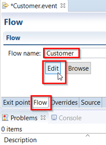
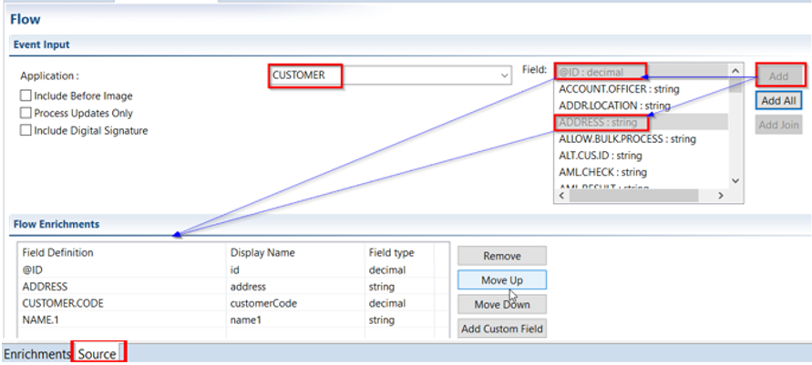
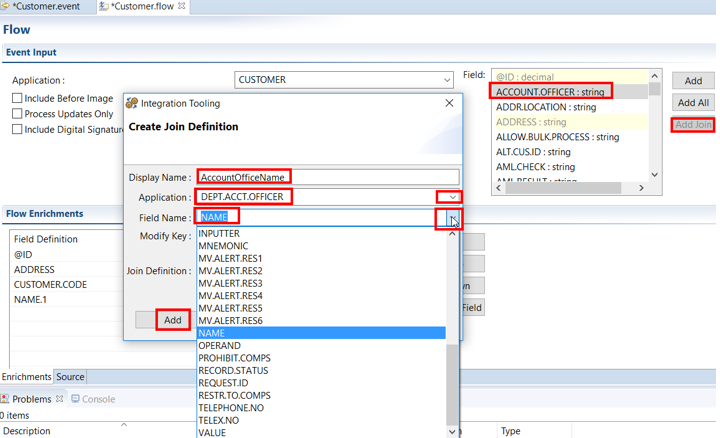
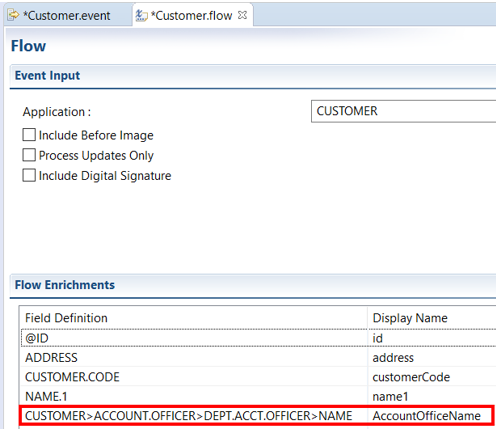

# Flows

## What is a Flow

 - A flow defines the layout of an XML message which will leave T24 when a business [event](../integration/events.md) occurs. 

## What are the Benefits of Flows

- The flow is referenced at run-time in order for an enriched message to be constructed and dispatched.

*(The Run-Time Engine -RTE = system platform, database, and language independent, which provides maximum flexibility with its multi-presentation engine. It supports the development of applications that serve thousands of users simultaneously).*

## Define or Create a Flow

 - Under Customer.event, click Flow tab
 - Enter the flow name (Customer)
 - Click update the Event fields to be added and select the overrides.
 - Click 'Edit' button to launch the Flow editor. 

 - In the next screen, select from 'Field' all the strings required (of interest). 
 - Double click a selection of fields (top right) to **add** them to the **Flow Enrichments** as in the picture below.
 - Application should already be set to **CUSTOMER** (if not, select it now) and the Field control prefilled with all fields available from this application (as available in the connected T24 instance).

(Include for example some name and address fields)

**Additional information:**
  - Fields selected may be reordered or removed.
  - Field control is prefilled with all fields available from this application (as available in the connected T24 instance). 
  - Attach only valid flows to the integrator. For example, attaching a FundsTransfer flow to a Teller version will result in a publish error, as the fields in FundsTransfer are not available in Teller.
  - On Customer.flow tab, check below Source, where you can view the ‘source code’ for the exit point and data flow definitions in the respective source tabs. Both (.event and .flow) are xml and can be integrated to a source control system and versioned.
  - The option ***Event Priority*** is introduced to set the priority for event delivery of the event type that is under design when using integration service. The default priority is 0 and can be edited to a positive integer. This value gets stored in the EVENT.PRIORITY field of [**IF.INTEGRATION.FLOW.CATALOG**](glossary.md#catalog) application.
  - The ***Include before image*** option adds the existing transaction data to the generated event.
  - The ***Process updates only*** option includes only the changed field value for the current transaction to the event and ignores all other fields while generating the event.
  - The ***Include Digital Signature*** option publishes the flow with a new attribute “Include Digital Signature” to the flow. This enables the event messages to be digitally signed. The implementation for digitally signing the message need to be implemented by the user and the details are available in the Inbound Security Service User Guide.
  - The ***Display Name*** column in the Flow Enrichments section is an editable column. Once a T24 field is added to the schema, this column allows to specify a different name to the field only in the flow to make the names more meaningful. This does not change the field name in the underlying application.

> [!Note]
> The options “Include Before Image” and “Process Updates Only” are applicable only for Application, Version and TSA.SERVICE exit points.
> 

### Flow Wizard Join (Optional)

It is possible to add join field in the flow. A join field is a field that is used to retrieve the related information. To build a join field:

**Example:**

•	Select the field through which the join has to be defined. (Here 'ACCOUNT.OFFICER')

•	Click on 'Add Join' button and a popup window as shown below appears.

•	Supply an XML-friendly Display Name (Here 'AccountOfficerName')

•	Select the application from 'Application' drop down box from which the join retrieves the data. (Here 'DEPT.ACCT.OFFICER')

•	Select the field from the 'Field Name' drop down box. This is the field from where the join field gets the value. (Here 'NAME')

•	Click 'Add' button to add to the join definition.

 - You can see Join Definition: e.g. CUSTOMER>ACCOUNT.OFFICER>DEPT.ACCT.OFFICER>NAME
 
 - Repeat step 3-6 till the join field is completed in the 'Join Definition' field.

 - Click **Finish**

 - Observe the new Flow Enrichment:

- Save all the changes: CTRL + S

 