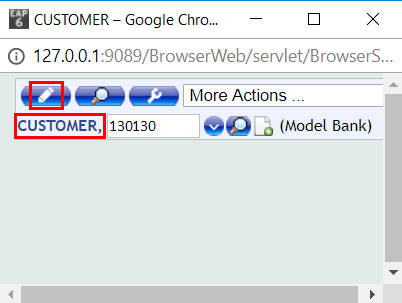

# Generate Events

To see more about what is an event and what are the benefits of it, please check [this user guide](../integration/create-package.md).
> [!Note]
> Any change of records will generate an EVENT.

## Change a record to generate an event

Below example shows a few changes into a customer record:

- Login to T24 Browser and type CUSTOMER, in command line (Use **comma** to create an authorized record)
- Type a customer ID and press enter or edit button

 - Make some changes or add information in the fields displayed and commit the deal (validate by left corner button)

These modifications are generating an event record. 

Next, check View Events section to learn how to identify them.

