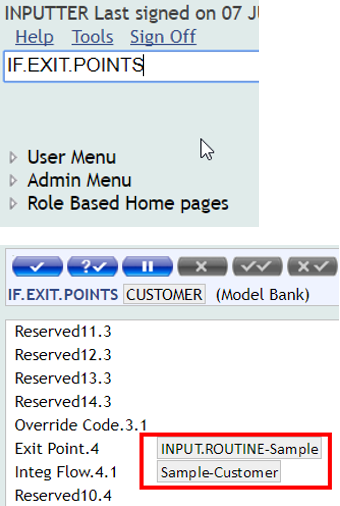
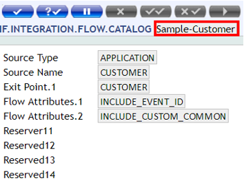

# Install Package

## Overview

 - To deploy a set of model files, they must be packaged using the packager and installed into a T24 area using the installer.
 - The packager is a DS process that builds T24 model bank into one single package that can be installed on remote T24 environment. The packager gathers from your workspace all files to assemble: 
  - Basic files 
  - Data files 
  - All DS generated model files 
Packager supports TAFJ environments, generating one .jar you can deploy. 

## Prerequisites

- Follow [these steps](../integration/create-package.md) in order to create package
- Install [TortoiseGit](https://tortoisegit.org/download/)
- As next step, please refer to [following documentation](http://documentation.temenos.cloud/home/docstore/techguides/use-gitlab-repository.html "GitLab Repository") in order to use GitLab Repository for MarketPlace Sandbox and create a Repository clone

## Steps

 - Trace the 'Target' folder on your local machine is the new jar’s location.

*(e.g. D:\MKP\DesignStudio\workspace1\Sample\target)*

 - Manually copy the JAR, containing compiled basic routines, available inside the JAR from [Project-name]-packager\target folder to the **packages folde**r. 

> [!Note]
> Packages folder refers to the one found in GitLab Repository folder in the environment created by cloning GitLab Repository 

 - Follow [this user guide](http://documentation.temenos.cloud/home/docstore/techguides/t24-development.html#deploy-a-t24-package-to-sandbox) to learn how to deploy a T24 package to the Sandbox by using TortoiseGit commands.

### Verify deployment in the browser

- Type IF.EXIT.POINTS in the command line and search for your application

- Type IF.INTEGRATION.FLOW.CATALOG in the command line and then the name of the flow created

> [!Note]
> After you have validated the changes against T24 development environment, you can create and deploy the package on one or many environments.

