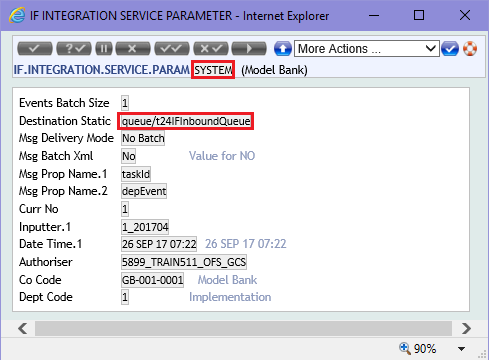

# Event Delivery with Jboss

Integration Service provides the asynchronous [**Event**](glossary.md#event) delivery functionality through a store and forward interface table and a [**TSA**](glossary.md#tsa) Service. 

The Events are generated, for example, when a transaction happens for which an  [**Integration Flow**](glossary.md#flow) is attached. Performing a transaction triggers an event in integration framework and this event will be consumed by [**JMS**](glossary.md#jms) queue or by a middleware, eventually.

From the transaction and associated applications, the data enrichments are built as defined in the Flow and an [**XML**](glossary.md#xml) representation of the Event is generated. This XML would be confirming to the schema representation of the Flow and stored in the IF.EVENTS.INTERFACE.TABLE within T24 into the EVENT.DATA field. The transaction continues and gets completed normally. 

A dedicated TSA Service called INTEGRATION.SERVICE needs to be executed to deliver the events through [**CALLJEE**](glossary.md#calljee) method. When the event delivery happens this data will be transformed to XML value and delivered to JMS Queue. 

# Consuming Events

IF Event messages are delivered always in XML format. By running the INTEGRATION.SERVICE, the XML message is delivered to the application server JMS Queue by having the configurations in Parameter record and JMS queue configurations in the application server. Default parameter record containing the queue name is given below.

And the application server side configurations are already handled for the above default queue.

With this above configuration XML Message can be delivered to the JMS Queue, later this has to be consumed by a listener program. The custom listener program can be built in Java run in the same application server and then the message has to be translated to understandable format for the outside application that will receive them. Before consuming the event, the listener program should check for the JMS message header in order to identify if that event is indeed supposed to be consumed by it or not. For this to happen it must be set the MSG.PROP.NAME field (for example taskId) into the Parameter record and that field to be also defined into the event as a custom field (taskId equal with a value that will be used by listener to search for it into the JMS header). 

> [!Note]
> The MSG.PROP.NAME is a multi value field that defines the list of names to be used to create properties to set in the JMS message header. For each value in this field, a property would be added to the JMS message header with the value obtained from an equivalent field in the event record.

We need to consider the following:
1. Message data can be retrieved by implementing *MessageListener* class and through the method onMessage(Message msg);
2. Retrieved XML message can be parsed and redirected to the outside application by having supporting jar files like json-simple.jar, jdom.jar, etc.;
3. Dependent jars to be mentioned in Maven dependency and Maven build can help us building the classes to a Jar file;
4. Jar has to be deployed in the Application Server.

> [!Note]
> Please refer to next [*IntegrationFrameworkEventMDB*](https://github.com/temenostech/IntegrationFrameworkEventMDB) template project. This is a sample [**MDB**](glossary.md#mdb) for consuming events from Integration Framework Events Queue. This MDB is configured to consume messages from queue/eventQueue and will echo event XML.
