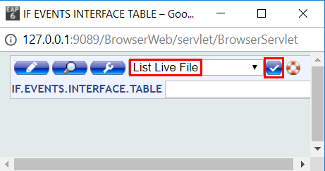
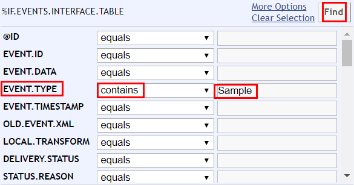
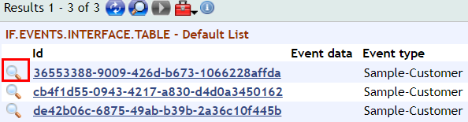

# View Events

To see what triggers an [**event**](glossary.md#event), please check first Generate Events section from above.

## View Event Record

Any change (create/ amend) of a record can be observed as an event record in IF.EVENTS.INTERFACE.TABLE.

The event created in previous example from Generate Events section can be seen as follows:

- Type IF.EVENTS.INTERFACE.TABLE in the command line
- On the new screen, go to List Live File and press validate

- Go to the Selection Screen button (search). Below is an example of one of the options to search the event created before:

To display the event data details, click on the magnifier button:

