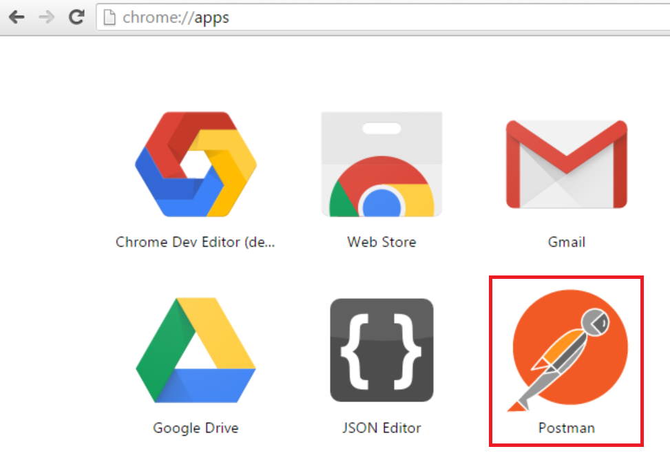
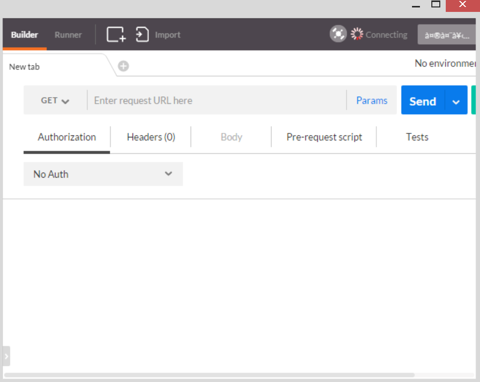
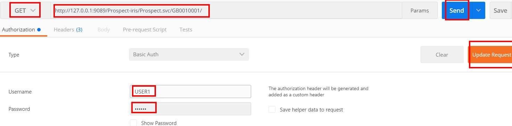
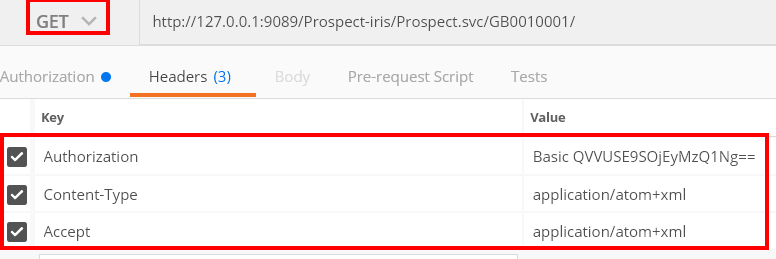
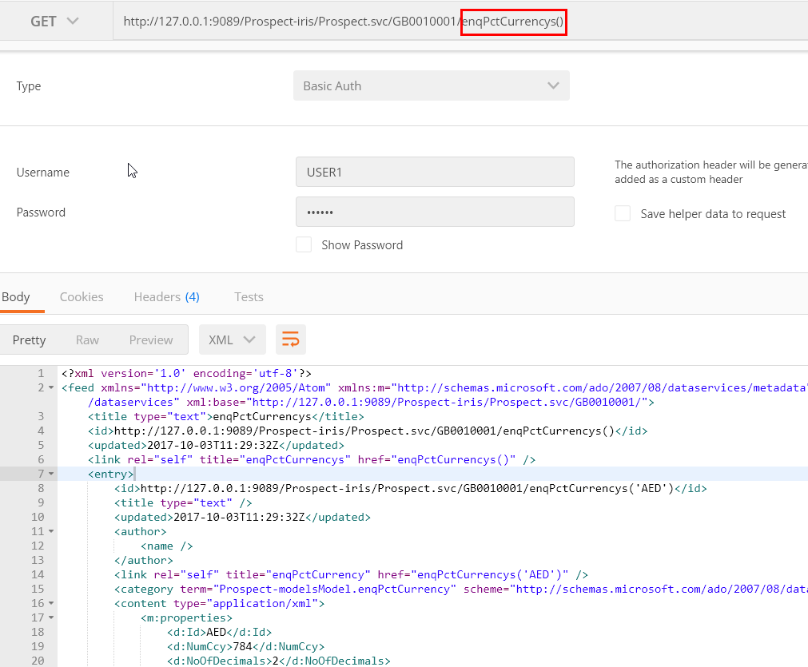

# Temenos API
In next three minutes you'll learn how to access the Temenos Banking API using REST client

##Prerequisites
To access an IRIS data service, you need:

*	Data service URI from [***Temenos Sandbox***](../marketplace/sandbox.md)
*	Credentials (user name and password)
*	Google Chrome browser:
	*	You can download [Chrome Browser](https://www.google.co.uk/chrome/browser/desktop/)
	*	[Postman Chrome extension](https://chrome.google.com/webstore/detail/postman/fhbjgbiflinjbdggehcddcbncdddomop?hl=en) or search for ***Postman REST client*** using Google
	*	You can also type [chrome://apps/](chrome://apps/) in Chrome address bar

> [!TIP]
> You can use any standard ReST client to work with **Temenos API**
> 
> [!NOTE]
> First, Prospect-iris.war file should be deployed into the jboss. 

## Access Temenos API
To access the data service:

*	Launch Google Chrome browser and go to apps
*	If you cannot find My Apps, then type chrome://apps/ in Chrome address bar
*	To launch Postman from [Apps](chrome://apps), click the Postman icon

*	The Postman user interface opens

*	After Postman user interface opens, enter the URL containing you sandbox address and the enquiry that you need to call, provide the authorization detail and click Update request

*	Set the Headers as follows, the method type to **GET** and then click **Send** to run the request

To retrieve an individual resource, type the resource name and click **Send**. Example: enqPctCurrencys() which is returned in XML format

> [!NOTE]
> To find out how this type of APIs can be filtered please check the information mentioned [**here**](iris-data-service-and-odata-filters.md).

# Next Step

Learn how to create new banking API by using Temenos Design Studio. 
[Click here for 30 minutes guide](30-minutes.md) to create new banking API by Temenos Design Studio in easy steps.

----------

