# Create Temenos API
By using Temenos Sandbox and Developer package, you can create your new APIs and publish them on the MarketPlace web site. This document will guide you step-by-step to create an API in 30 minutes.

#	Introduction
[IRIS](glossary.md#iris) is an open source GitHub project and provides Interaction, Reporting and Information Services. This project is developed and maintained by Temenos.

#	Prerequisites
To build an IRIS data service, you need to meet the following requirements:

*	Knowledge of Web technologies
*	Knowledge of [OData](glossary.md#odata) & [RESTful services](glossary.md#rest)
*	Temenos MarketPlace Products
  *	[Temenos Sandbox](../marketplace/sandbox.md)
  *	Temenos Design Studio
*	Microsoft Windows operating system (Windows 7 or higher) & Internet connection
*	Access to [GitHub](https://github.com/temenostech) platform 

Also, please follow this [3 minutes user guide](3-minutes.md).

#	Environment Setup

Download Temenos Design Studio from My Apps section of Temenos MarketPlace and extract files from the Temenos Design Studio (or your current version) to a directory on your computer. Make sure your path does not contain any spaces or special character.

## Download Prospect-IRIS project

*	You need to have GitHub account in order to download the default Prospect project. Click here [Join GitHub](https://github.com/join), if you don't have GitHub account 

*	Install Git on your local machine  - [Git](https://git-scm.com/download)

*	After installation of Git, fork the Prospect-iris, to fork the project go to [https://github.com/temenostech/Prospect-IRIS](https://github.com/temenostech/Prospect-IRIS). 

*	There are 2 options: either fork or **download** Prospect-IRIS

*	Go to clone or download button and choose download

Create a folder inside GitHub folder. In current example is named: Prospect-IRISc. Copy the downloaded and extracted ZIP into the newly created folder. Now you have This is what the folder contains:

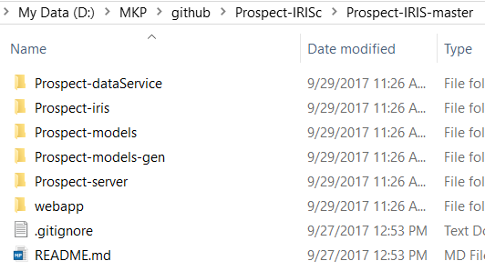

>[!NOTE]
>Please use ***Prospect-IRIS*** only if you have ***DesignStudio 201711***, with any other version the build will fail. In case you have a different version of DesignStudio then, instead of using Prospect-IRIS project you should create an ***IRIS Data Service Project***, remove whatever is coming by default and follow the other instructions present on this page.

## Design Studio environment

*	Open Design Studio and provide the workspace name
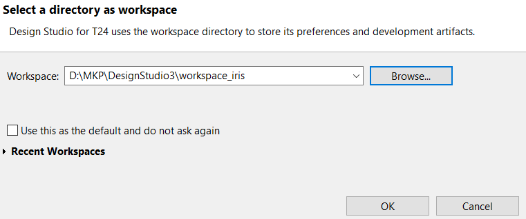

*	Go to **File** - **Import** - than choose **Existing Maven Projects**
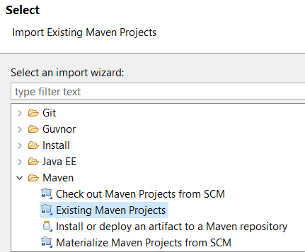

*	Now select the root directory as the path where your Prospec-IRIS folder was created and press **Finish**
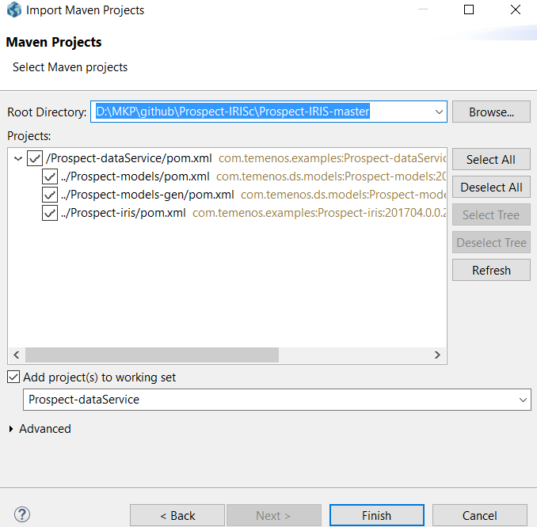

*	Wait until the project is completely updated.

>[!NOTE]
>Don't forget to save each change (CTRL+S)

*	After updating all 4 projects, click right on Package explorer and choose **Maven** > **Update Project**.
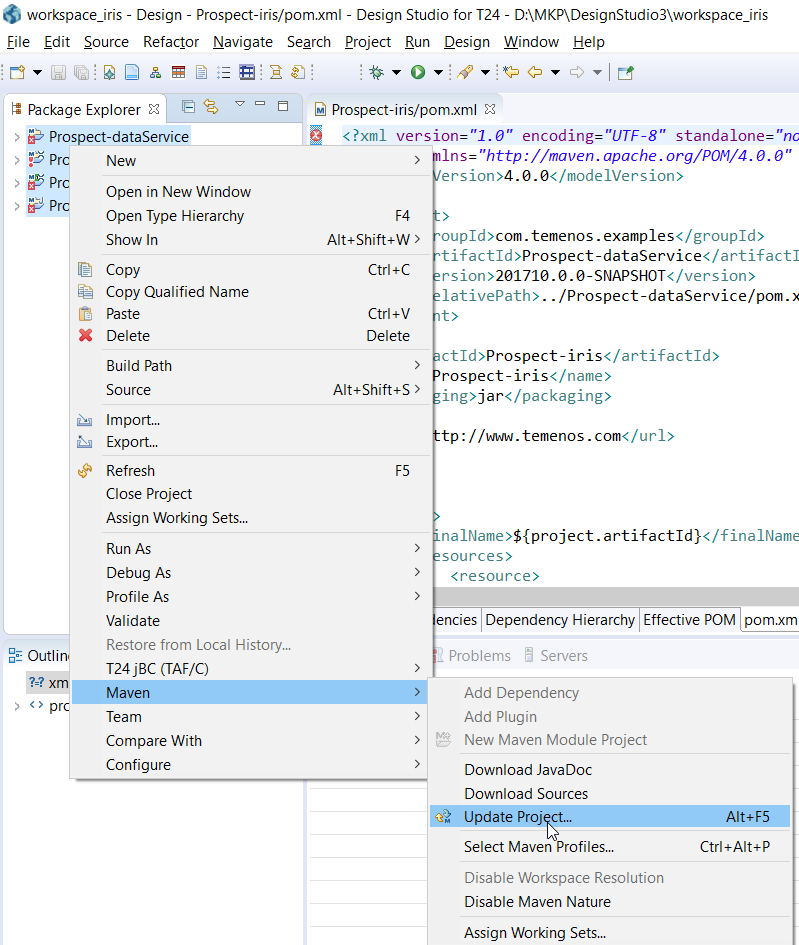

*	In the new window, uncheck Offline button and choose **Force Update of Snapshots/ Releases**
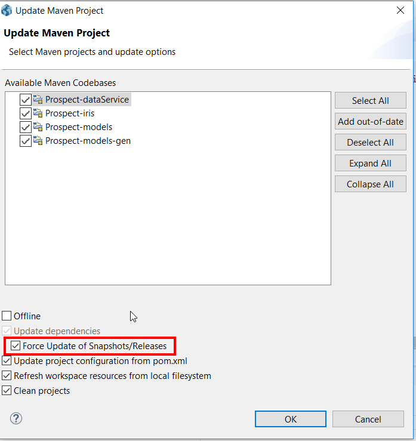

## Import Prospect-server

**Prospect server is responsible to communicate with Temenos Sandbox**

*	Go to **File** > **Import** > then select **Existing Projects into Workspace**
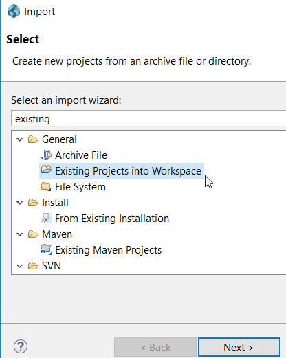

*	Click **Next** and then select the root directory (Insert the path where your Prospect server folder is located). Then click **finish**
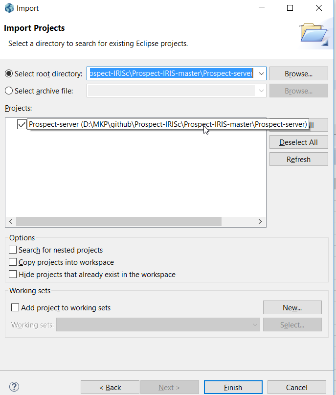

*	Prospect-server will appear updated now under Package Explorer, along with the other existing projects.

## Build the Prospect-IRIS project

*	Go to **Prospect-dataService**, right click on **Package.launch** and choose **Run as package**
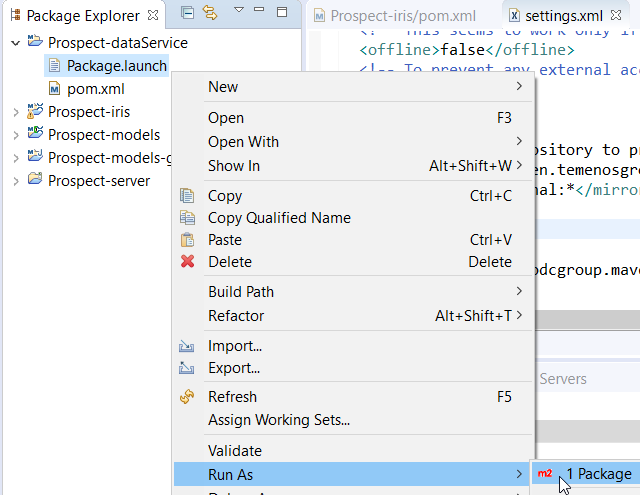

*	Wait for the build to be completed. In the Console tab, you should get [INFO] BUILD SUCCESS 

*	**Prospect-iris.war** file will be generated that can be taken and deployed
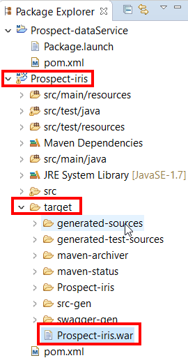

## Connect Prospect with the Sandbox

In order to establish the connection with Temenos Sandbox:

 - Expand the *-server project and double click the server.properties file.

 - Enter the user name, password, host name and port number. You can get these details from your Temenos Sandbox.
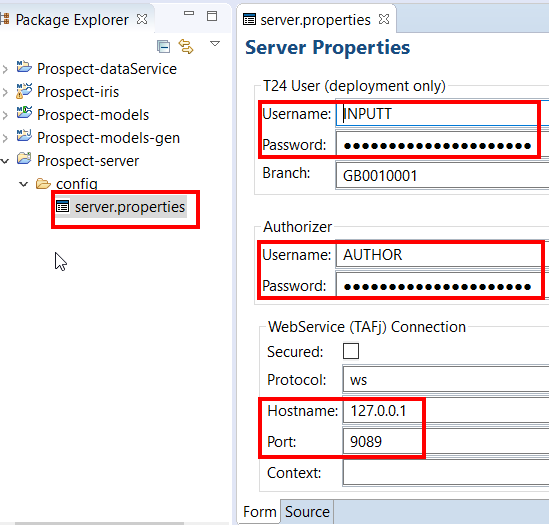

 - Start the server: click the **Servers** tab, right-click **T24 Connection** and click **Start** (or **Restart**)
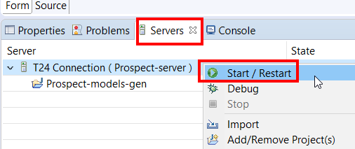

 - State will change into **Active**

## Import enquiries or versions

*	On the top menu, click **File** > **Import**

*	A new window appears. Here, expand Design Studio, click **Import T24 Enquiries** and then click **Next**
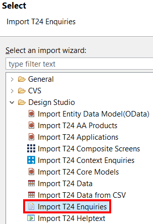

*	Select the enquiry you want to add to your project.
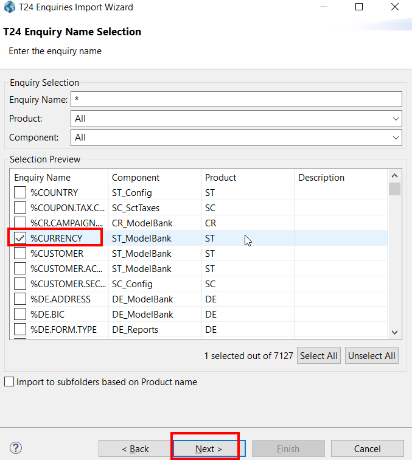

*	Save this enquiry in the enquiry folder of the *-models project. Click **Finish**
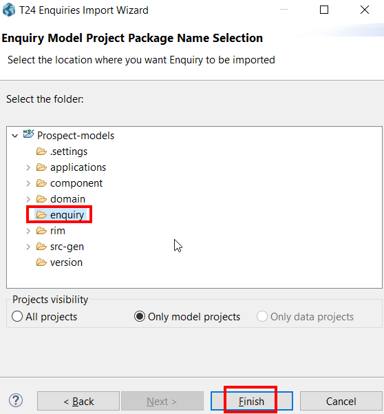

*	A success message is displayed. Click OK to close this message.

*	The enquiry is your *-models project.
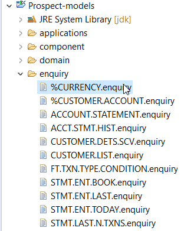

## Create a [RIM](rim.md) file

To create a RIM file:

 - Right-click the imported enquiry.

 - In the context menu, click **Design Studio** and then click **Generate Code**.

 - Result: The enqCURRENCY-LIST.rim file has been generated in the following directory:
*-models\rim\gen\T24\enqCURRENCY-LIST.rim
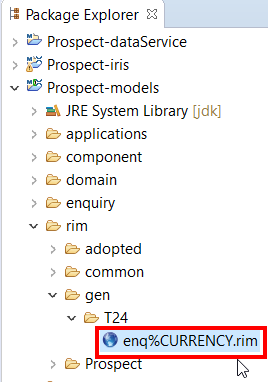

## Add the enquiry to the [Service Document](service_document.md)

*	The last step in creating your API is to add the RIM definition to the service document. The service document is in the following directory:
*-models project\rim\project_name\project_name.rim
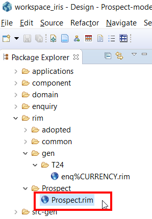

*	Double click the rim file with your project name, for example Prospect.rim. The contents of the file are displayed in the right pane.
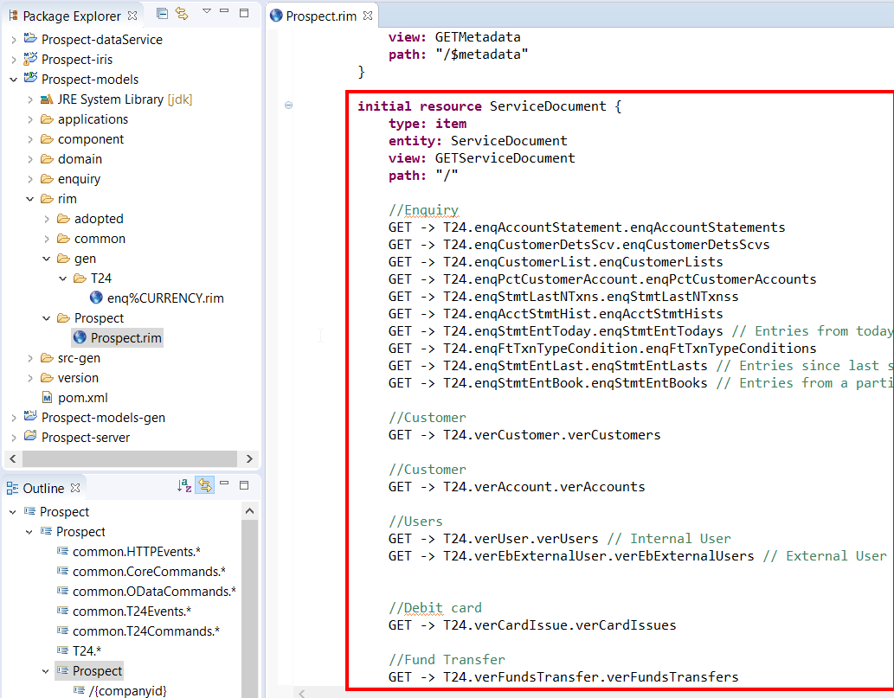

*	Add the newly created RIM reference in the Service Document resource. Make sure you follow the correct sequence: **Domain Name** > **RIM Name** > **Resource Name (Collection)**

	Example:

	T24.enqPctCurrency.enqPctCurrency
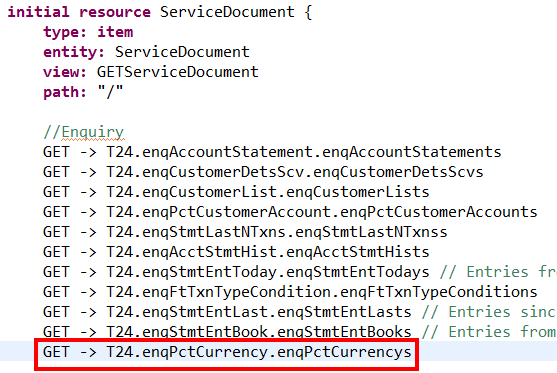

##	Verifying the new link in the [Service Document](service_document.md)

*	Make sure that you are able to navigate from the Service Document to the newly added rim file. To test the link, control-click the new resource definition. You should be able to go the **enqPctCurrency** resource.
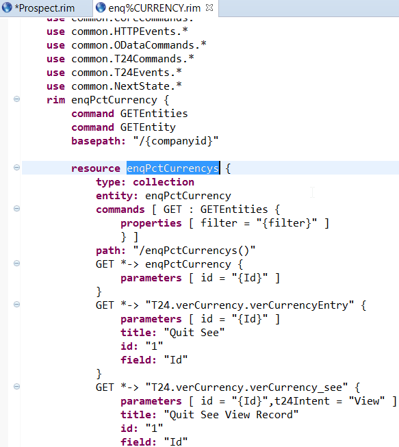

*	Rebuild your data service. Go to **Prospect-dataService** > **Package.launch** > **Run As** > **Package**
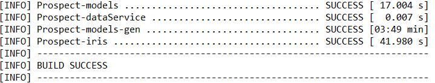

