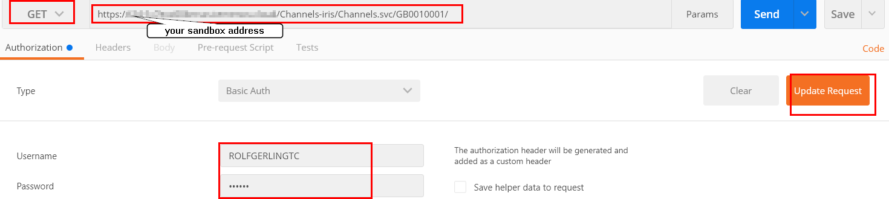
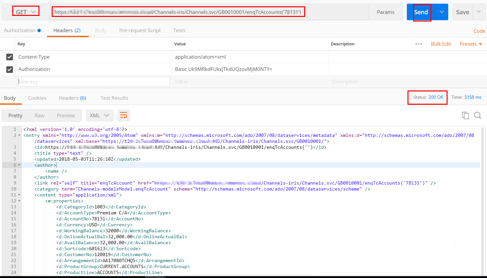

# How to access Channels APIs using ReST client

Temenos Channels data service built on top of IRIS. IRIS is an open source runtime framework for Interaction, Reporting & Information Services.

## Prerequisites

- Temenos Sandbox

- Credentials (username and password)

- Google Chrome browser – Download from [here](https://www.google.co.uk/chrome/browser/desktop/ "Chrome")

- POSTMAN chrome extension 
  - Either search POSTMAN ReST client on Google OR
  - click this [link](https://chrome.google.com/webstore/detail/postman/fhbjgbiflinjbdggehcddcbncdddomop?hl=en "Postman") 

## Access Data service

 - Enter the URI of your data service 
 - Provide the authorization details. 
   - You need to select basic authentication, enter the username and password and click on Update request

 

 - Set **Accept** header to **application/atom+xml**
  - If you want to get json format, then set **application/hal+json**
 - Set method type to **GET** 
 - Set URL: `https://your sandbox address/Channels-iris/Channels.svc/GB0010001/` 
 - Click **SEND**. You must get status 200 OK
 - The available Channels APIs list can be found **here**
 - See example bellow - accessing API `enqTcNofAccounts` for a specific account
 - If everything is OK, you will get status 200 OK and the response in XML format 

