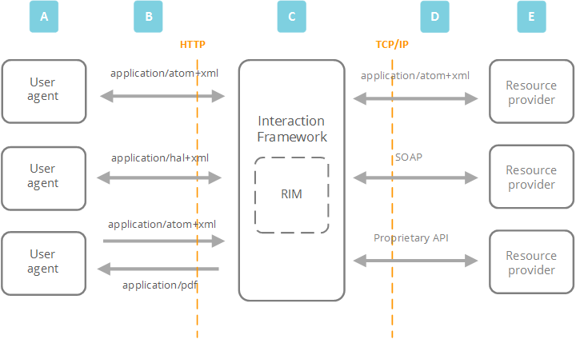

The Interaction Framework is designed to make creating and using web services - the messages that are sent over the Internet to retrieve resources - as easy as possible for developers.

The framework is built according to **RESTful** constraints, the architectural style of the web, and uses **OData**, the web standard for communication, to make talking to the framework straightforward for user agents.

# REST

REpresentational State Transfer (REST) is the architectural style behind how the web works. It consists of a set of architectural constraints applied to a hypermedia system. A hypermedia system provides navigational information to the system's REST interfaces dynamically by including hypertext links with its responses to messages.

> [!Note]
> **REST was first defined by Roy Fielding in his 2000 PhD paper. To learn more, see https://en.wikipedia.org/wiki/Roy_Fielding**

## RESTful constraints
The Interaction Framework is RESTful because it conforms to the following constraints.

### Client-Server
The Client-Server constraint enforces a distributed architecture, where the roles for each part of the architecture are clear. 

A service - like the Interaction Framework - has to provide one or more capabilities, such as a way to access resources. When a user agent asks the Interaction Framework for a resource the framework either has to carry out or reject the request before sending a response.|

### Stateless	
Communication between the user agent and the Interaction Framework has to be stateless.

The requests sent by the user agent must include everything the Interaction Framework needs to carry out the request. And when the Interaction Framework has dealt with the request, it returns all the session data to the user agent.

Making the user agent responsible for state data frees up memory in the framework, making it easier to deal with large numbers of concurrent requests.

### Cache	
The Cache constraint means that responses from the Interaction framework must be labelled as either cacheable or non-cacheable. And requests from user agents go through a cache component, which allows the framework to reuse some previous responses. This leads to a faster, more efficient system.

### Interface	
The Interface constraint means that the Interaction Framework and the user agents share a single technical interface, to make communication easier. The interface is applied through resource identifiers, and the methods and media types of HTTP.

### Layered System	
The Layered System constraint means that a RESTful service is made up of layers, none of which can 'see past' the other. Layers can be swapped in or out without harm to the other layers.

The Interaction Framework is a layer inserted in a transparent, consistent way between the user agents and the resource providers. And because the framework doesn't need to know what other services the user agents are using, it reduces the level of dependency - or 'tight coupling' - between the user agent and the service.

# HATEOAS
The Interaction Framework uses a Hypertext As The Engine Of Application State (HATEOAS) based REST architecture. That means that the user agent finds their way through the framework API using hypertext links.

# OData
OData is an OASIS open data protocol that allows for the exchange of data between user agents and resource providers. The protocol is HTTP based - so it supports the GET, POST, PUT and DELETE methods described in the REST section - and was designed with REST in mind.

User agents consume the OData produced by server-side applications, like the Interaction Framework. And server-side applications expose the data to the user agent through web services.

# Communicating with the framework

**_Key to diagram_**
	
**A**

The user agents are all REST clients - they are built to consume the OData that the RESTful Interaction Framework produces.Whether the user agent is a web browser, a mobile phone or a specialist interface, they share the same HTTP technical interface and obey REST constraints.

	
**B**

The user agent sends a request for a resource to the Interaction Framework. The message uses the generic URI syntax and HTTP methods that the framework's OData layer also uses.

	
**C**

The Interaction Framework uses the Resource Interaction Model (RIM) language to define what resources are available to the request and help relay commands to the resource provider (or providers).

	
**D**

The resource providers and third-party services connect to the framework through TCP/IP in a way that best serves the provider - T24 uses its own proprietary T24 connector, but another resource provider could use SOAP or OData.

	
**E**

The resource providers and third-party services respond to the commands from the Interaction Framework and return the requested resources.

**F**

The framework extends generic OData commands through provider-specific commands, for example T24 commands or Solr commands.
