# Create Customer with Prospect Iris

## Headers definitions in Postman:

Make sure you have set the following headers presets:

- Http Request Headers:	
  - Accept: *'Application/atom+xml'*
    - OR
  - Accept: *'Application/hal+json'*
- Http Response Headers:
  - Content-Type: *'Application/atom+xml'*
    - OR
 - Content-Type: *'Application/hal+json'*

## Get customer collection

 - Type the following URL request in order to see the list of available customers:

     `https://your sandbox address/Prospect-iris/Prospect.svc/GB0010001/verCustomer_Inputs()`

- Make sure you have following parameters (input your sandbox username and password):

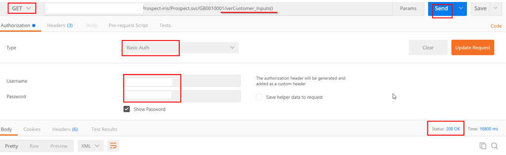

## Create new customer in memory (generate Id)

 - Type the following URL request to create a customer and press **SEND**:

     `https://your sandbox address/Prospect-iris/Prospect.svc/GB0010001/verCustomer_Inputs()/new`

 - Make sure you have the following parameters (input your sandbox username and password):

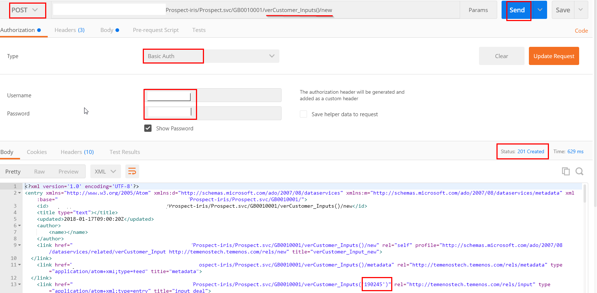

>[!Note]
> Keep in mind the customer Id number generated (*190245*)

## Validate new customer record

Follow below steps (see also image):

1. Copy the content from body XML 
2. Paste it into Body (raw)
3. In Body (raw) input mandatory data - see next point and example: "Mandatory data details"
4. Change the request into `verCustomer_Inputs(190245)/validate`
5. Press SEND

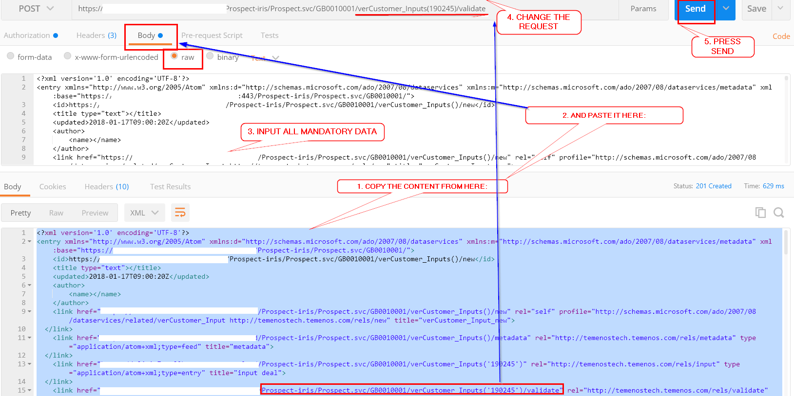

#### Mandatory data details

Into the body (raw option) input following mandatory data parameters:

**Example:**

MNEMONIC:

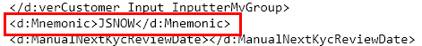
 
SHORT NAME:

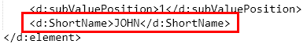
 
NAME1:

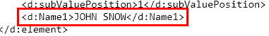
 
SECTOR:

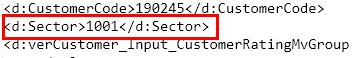
 
GENDER:

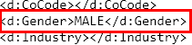
 
TITLE:

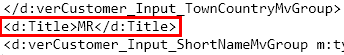
 
GIVENNAMES:

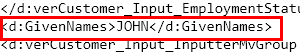
 
## Create new customer record in database

 - After sending the validate request (from above), if the result is **OK** (status 200), you need to do again a **POST**:

    `https://your sandbox address/Prospect-iris/Prospect.svc/GB0010001/verCustomer_Inputs('190245')`

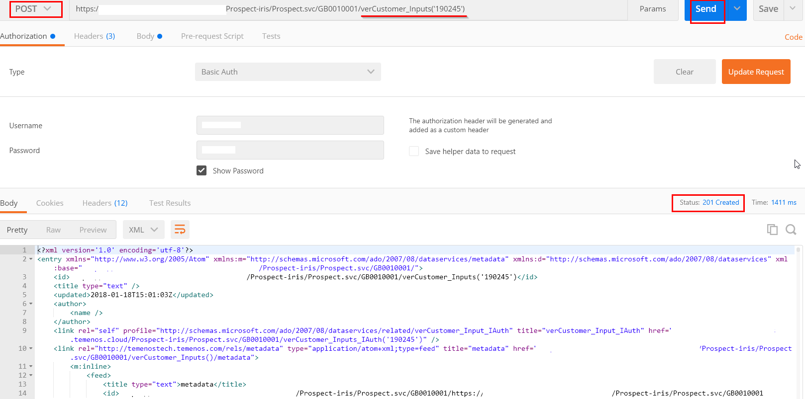

## Authorize new customer record
 
 - Go to Headers tag (on the same menu with *Cookies*) and copy the etag:

 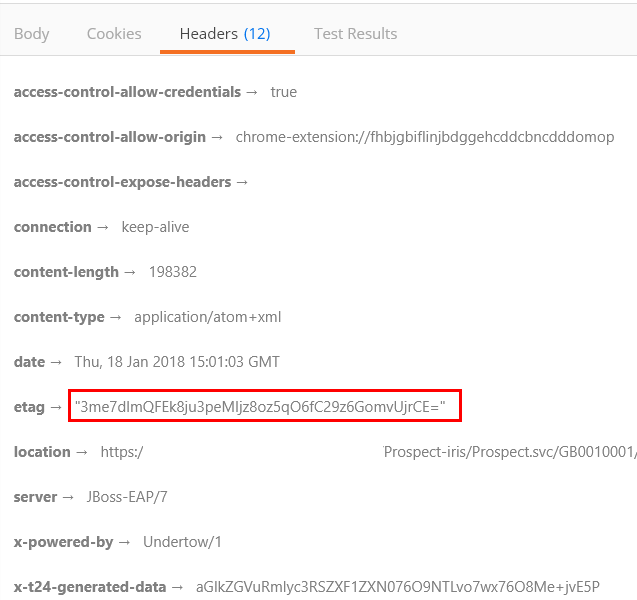

 - Into Headers, add the key ‘If-Match’ and copy paste the ‘etag’ as below. 
 - Change the request, from POST into PUT, and in order to authorize the record use the 'authorise' command.
 - In Authorization, change the Username (you need a different user to authorize the deal) 

    `https://your sandbox address/Prospect-iris/Prospect.svc/GB0010001/verCustomer_Inputs('190245')/authorise`

 - Status should be 200 **OK**

 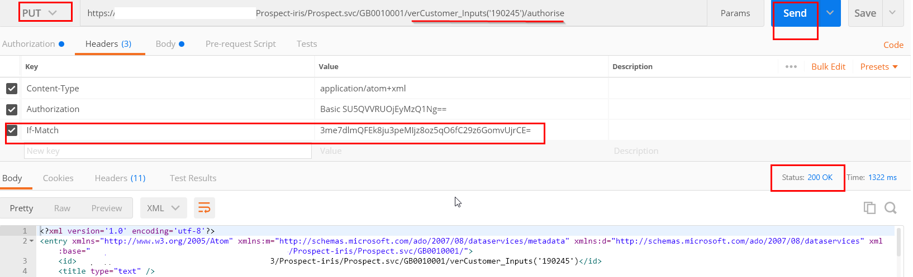

## Check created customer record
 
 - To check the record created in the database, go to BrowserWeb:

    `https://your sandbox address/BrowserWeb/servlet/BrowserServlet`

 - Type CUSTOMER in the menu bar, press enter and in the new screen insert the customer ID created:
 
 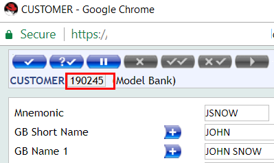

