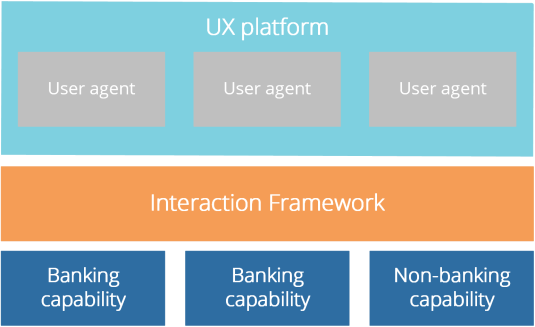
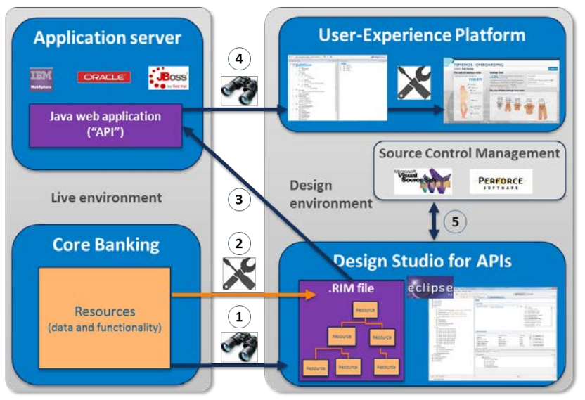
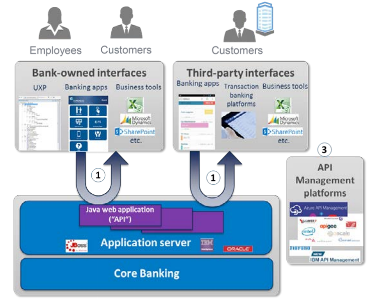

<!--- re-commited for modified images --->

# Interaction

Open up your banking platform to accelerate the pace of innovation around your services. Temenos' Interaction offering accelerates the pace of innovation around banks' services, by enabling them to easily expose their services to innovation partners and to any user-interface (UI). It also lets the bank create innovative combined services and efficiently manage UIs across multiple channels/devices/roles/languages.

# RESTful Architecture

The Interaction Framework helps bring users and financial resources together through a flexible - and RESTful - architecture.

Putting an interaction layer between the user agents and the resources they want to use removes the need for tight coupling. That makes it easier for financial institutions to manage the relationships between agents and resources, and allows user agents and resources to specialize at what they do best.

> [!Note]
> **A framework that is as open to change as you are.**

# Benefits
The Interaction Framework brings you the following benefits:

*	**Single pane of glass**
It enables user agents to be written for specific banking roles across multiple installed products.

*	**Consistent user experience**
It enables the user experience to be independent of the way the bank has chosen to implement its business systems.

*	**Configurable APIs**
It enables the bank to configure the APIs it provides and the interaction models they support.

*	**Support for standard clients**
It enables the bank to provide multiple models of banking for interaction and so support standard user agents.

*	**Helps you compete on mobile platforms**
It enables your financial organisation to configure support for specific mobile platforms, such as ApplePay.

# How it works

## Design-time

## Run-time: an open banking platform

