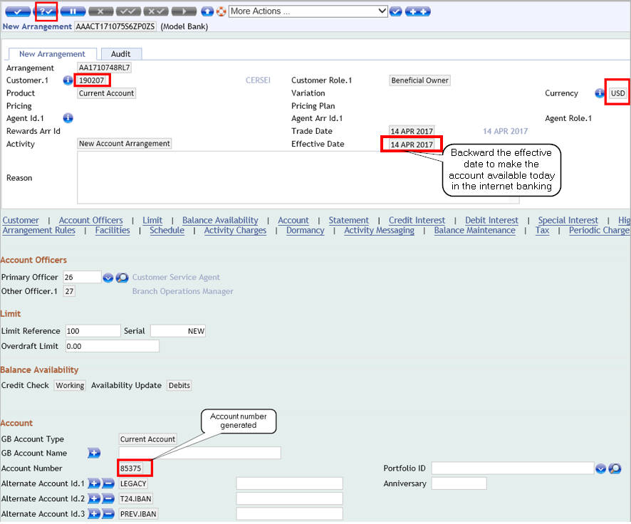

# Accounts
You can create different type of accounts in T24 like current accounts, saving accounts.

## Current Account
To create a **Current Account** for your new customer:
 - Login to T24 BrowserWeb
 - Go to **User Menu** > **Product Catalog** 
 - Under Product Groups select **Accounts** > **Current Accounts** and then select the account type required:

 - In the new window, insert the **Customer Id**, the currency of the new account and backward the effective date with one business day by clicking the calendar button. (**Note**: this change of date is required if you want the customer's account to be available in the same day into the internet banking application. **If left as default, the account will be visible only next day**). 
 - Press **Validate** button
 - The screen will extend (a newly created arrangement is displayed) and you can see several default attributions. You can add more or change these configurations based on your requirements
 - The new **Account Number** appears under 'Account' section

 - User is advised to take note of the **Customer ID** and **Arrangement ID** to use them during the upcoming configuration 
- **Commit** the deal
- A **warning** message is displayed regarding the Account Opening Agreement > Choose '**RECEIVED**' and press again the **Commit** button
- In case the arrangement currency is different from charge currency, an override message will pop-up > Click **Accept Overrides** > Transaction is complete.

To **authorise** the record (you must authorise the record before it can be live into the database):
 - Log out and log in again with a different user (the second user id you have received in your *Welcome* email)
 - In the command line type AA.ARRANGEMENT.ACTIVITY A *AAACT171074H9N7MSQ* (**AA.ARRANGEMENT.ACTIVITY A** *+ the arrangement id*)
 - Press **enter** and then authorize the transaction (double tick button) 
 - Transaction is complete.

> [!Note]
> You can create different account types with different currencies by using the same steps as above.

## Savings Account

The steps to create a savings account are similar to the ones for a current account creation, the main difference is that you choose **Savings Accounts** instead of **Current Account**.

> [!Note]
> Please follow [<ins>**this user guide**</ins>](teller.md) to see how you can do a cash deposit to a newly created account. 
