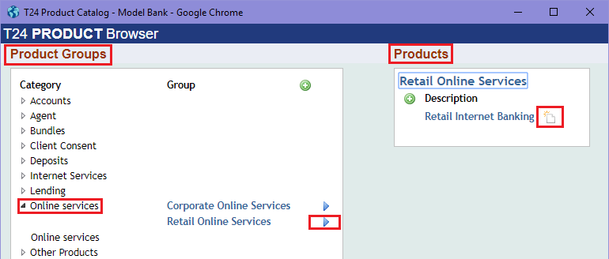
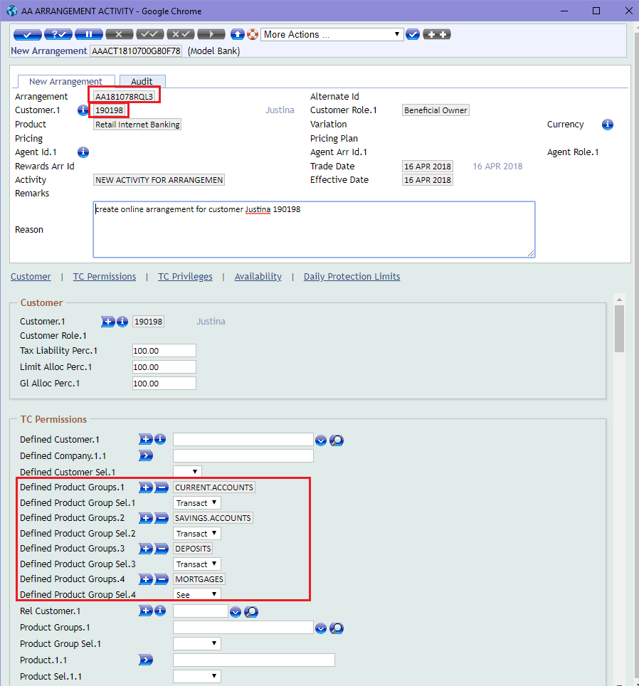
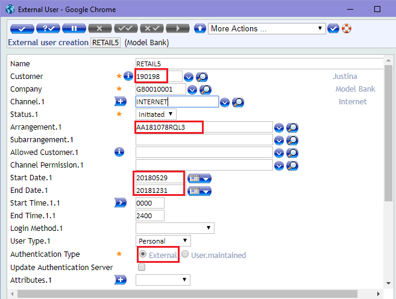
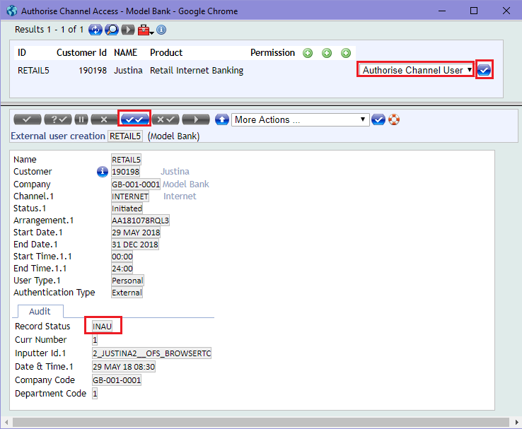

#External User

> [!Note]
>  Each External User is related to:
>  -  a **customer** (i.e., the person who enters the system through an External User)
>  -  an **internet service arrangement**

The external user creation process involves the following steps: 

 - Create a Customer in T24
 - Create accounts for this new Customer
 - Create and authorise an Internet Service Arrangement
 - Create and authorise the External User
 - Activate External User

## Create a Customer in T24
Please follow [<ins>**this user guide**</ins>](customer.md) to know how to create one.

## Create Accounts
Please follow [<ins>**this user guide**</ins>](accounts.md) to know how to create one.

## Create and authorise an Internet Service Arrangement
An Internet Service Arrangement is an instance of a certain product that is linked to a specific customer. 
This arrangement is a personalized instance of a Internet Banking product that defines what the user gets to view when they access the system. When creating the arrangement, some default settings are included.

To **create** the Internet Service Arrangement:

 - Go to **User Menu** > **Product Catalog**
 - From Category list (under Product Groups) select > **Online Services** > **Retail Online Services** > **Retail Internet Banking**, which will create a new arrangement:

 

- A new window is displayed > Insert the** Customer Id** (for the client you want to provide Internet access) and click **Validate** button > An internet service arrangement is created with default settings
   - **Note down the arrangement Id**

To **authorise** the Internet Service Arrangement (you must authorise the record before it can be live into the database):

 - Log out and log in again with a different user (the second user id you have received in your *Welcome* email)
 - In the command line type *AA.ARRANGEMENT.ACTIVITY A* *AAACT1810700G80F78* **(AA.ARRANGEMENT.ACTIVITY A** *+ the arrangement id***)**
 - Press **enter** and then **authorize** the transaction (double tick button) 
 - Transaction is complete.

## Create the External User
 - Under **Admin Menu** > click **External User Administration** > **Create/ Manage Online Banking Access** > **Create External User**
- In the new screen displayed, type the following:
  - External User Creation (*RETAIL5*): *type a name that the customer will use to login*
  - Channel is defaulted with specific value (*INTERNET* - to be used for access to Internet banking; *TCMOBILE* to be used for access to Mobile banking)
  - Arrangement (*AA181078RQL3*): *the generated value while creating an Internet Service Arrangement*
  - Start Date (*29 MAY 2018*): *use calendar and choose today's date*
  - End Date (*31 DEC 2018*): *use calendar and choose user's availability date*
  - Authentication Type (*External*): *make sure 'External' is checked*

- To **authorise** the created external user record (you must authorise the record before it can be live into the database):
 - Logout and login with a different user
 - Go to **Admin Menu** > **External User Administration** > **Authorise Online Banking Access** > **Authorise Channel User** and click on the authorise button
 - At this moment Record status appears as 'INAU' = unauthorised > Commit the record.

## Activate External User 

 - You can log back with previous user
 - Go to **Admin Menu** > **External User Administration** > **Create/Manage Online Banking Access** > **Manage External Users**        
 - a search screen is displayed > enter ***Customer Id*** or ***ExternalUser Id*** and click **Find** button
 - from scroll button on the right, select **Modify Channel User** > press **Enter** button
 - change **status** from '*Initiated*' into '*Active*'
 - **Commit** the deal
 - **Authorize** the External User as mentioned above 
 - External user is activated
 - You can now insert User ID and password *123456* to [<ins>login to Retail application</ins>](login-retail.md).