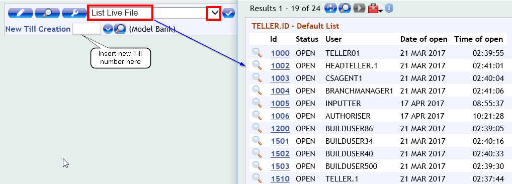
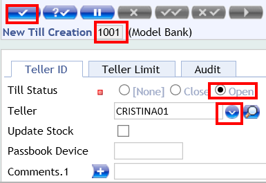
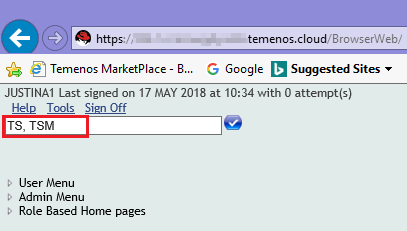
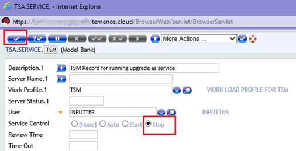
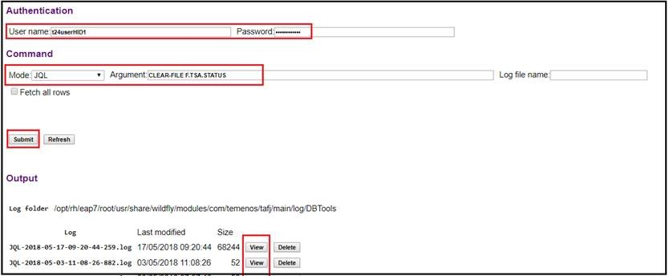

## Publishing your MarketPlace product

  <button class="btn btn-info btn-md btn-block" type="button" data-toggle="collapse" data-target="#collapseMarketplace" aria-expanded="false" aria-controls="collapseMarketplace">

<i class="fa fa-arrow-right">&nbsp;
What is MarketPlace?
  </button>

  

      

      

      Developed as a self-service, online digital store, MarketPlace is a platform that connects fintech providers with some of the worlds largest financial institutions focused on sourcing innovation. MarketPlace presents an unprecedented business opportunity to distribute integrated third-party products and services to Temenos customers.

  <button class="btn btn-info btn-md btn-block" type="button" data-toggle="collapse" data-target="#collapseWhatisMarketPlaceProduct" aria-expanded="false" aria-controls="collapseWhatisMarketPlaceProduct">

<i class="fa fa-arrow-right">&nbsp;
What is a MarketPlace Product?
  </button>

  

      

      

MarketPlace Product is a page describing your application. All MarketPlace Providers have the ability to create a page on the MarketPlace to advertise their product to Temenos customers. See below answers about content and product pages types.

  <button class="btn btn-info btn-md btn-block" type="button" data-toggle="collapse" data-target="#CollapseWhatContentToDisplay" aria-expanded="false" aria-controls="CollapseWhatContentToDisplay">

<i class="fa fa-arrow-right">&nbsp;
What content can I display on my MarketPlace Product page?
  </button>

  

      

      

Your product page should deliver a high-quality overview of your organisation and a demo experience that will get potential customers hooked and wanting more. The MarketPlace is capable of delivering video, whitepapers and other sales collateral, but crucially can offer users a walk-through of your product via a Downloadable or WebApp product type free trial demo. 

  <button class="btn btn-info btn-md btn-block" type="button" data-toggle="collapse" data-target="#collapseProductPageTypes" aria-expanded="false" aria-controls="collapseProductPageTypes">

<i class="fa fa-arrow-right">&nbsp;
Product page types
  </button>

  

      

      

There are two main product page types available;

  1. The **Web App** will deliver a URL, via a short-cut created in the customers 'My Apps' page
  2. The **Download** product type will immediately offer a downloadable file (.zip)
 
 The **Web App** has two variant modes; 
 
      a. The Web App instantly delivers a user to a URL of your choice via a MyApps shortcut. This product page type allows automated distribution of your demo and therefore has the lowest associated admin overhead, although you need to make sure the front-end is ready to receive customers and that any demo use-cases are documented either on MarketPlace or your web front-end. 

      b. The Web App (Manual set up) delivers the same shortcut as above, but this is only accessible following your *manual* approval.

  <button class="btn btn-info btn-md btn-block" type="button" data-toggle="collapse" data-target="#collapseIntType" aria-expanded="false" aria-controls="collapseIntType">

<i class="fa fa-arrow-right">&nbsp;
Whats my Product integration type?
  </button>

  

      

      

Temenos will not publish 'Referral Only' product pages, so please select **Full Integration**.

  <button class="btn btn-info btn-md btn-block" type="button" data-toggle="collapse" data-target="#collapseUsageModel" aria-expanded="false" aria-controls="collapseUsageModel">

<i class="fa fa-arrow-right">&nbsp;
Whats my usage model?
  </button>

  

      

      

We recommend selecting **Multiple Users** to ensure your product can have multiple consumers from the same prospect organisation.

  <button class="btn btn-info btn-md btn-block" type="button" data-toggle="collapse" data-target="#collapseRevenueModel" aria-expanded="false" aria-controls="collapseRevenueModel">

<i class="fa fa-arrow-right">&nbsp;
Whats my revenue model?
  </button>

  

      

      

As our Enterprise level sales are completed off-line, we currently recommend selecting 'Free' for this section.

  <button class="btn btn-info btn-md btn-block" type="button" data-toggle="collapse" data-target="#collapseWhatsinaMarketPlaceDemo" aria-expanded="false" aria-controls="collapseWhatsinaMarketPlaceDemo">

<i class="fa fa-arrow-right">&nbsp;
What should I show in my MarketPlace Product Demo?
  </button>

  

      

      

As a MarketPlace Developer, you have access to the MarketPlace Provider Sandbox to show how your product engages with T24 and begin the customer onboarding experience. The best demonstrations present no-risk novelty in a familiar setting, which can be easily converted into a sale once the customer is comfortable using your product. 
 
 **Tell** the customer that you understand their needs. You know what problems your customers need to fix and you know how your product can help. The Features and Benefits section of your MarketPlace product page can explain what makes your product rise above the competition. Why not add a public YouTube or Vimeo video link, press articles and current customer icons to help strengthen your case?  
 
 **Show** a vision of the future, where your product is integrated with theirs. Connect a MarketPlace Provider Sandbox linked web-frontend or downloadable plug-in, to allow a user to familiarise themselves with your product during the free trial demo. Why not speak to your sales team to see which demo use-cases result in 'aha' moments for their prospective customers?
 
 **Do** let the customer experience the product, your way. You can customise the demo with your best use cases to ensure the right experience is delivered.  Different trial lengths are available, but a 30-day trial allows a customer to get used to using your product, increasing the odds of long-term adoption once the trial expires.  

  <button class="btn btn-info btn-md btn-block" type="button" data-toggle="collapse" data-target="#collapsewhatconnectstosandbox" aria-expanded="false" aria-controls="collapsewhatconnectstosandbox">

<i class="fa fa-arrow-right">&nbsp;
What should I connect to the MarketPlace Provider Sandbox?
  </button>

  

      

      

We recommend a web-frontend that allows a user to experience your product while leveraging T24 model bank data. 
 - Describe your use-case(s) on the MarketPlace product page
 - Connect your web-frontend to the MarketPlace Provider Sandbox
 - Connect the product to the MarketPlace product page
 - Run through any required integration tests so you can capture demo user data
 - Publish the product page and follow-up on activated trials

  <button class="btn btn-info btn-md btn-block" type="button" data-toggle="collapse" data-target="#collapseCreateProdPage" aria-expanded="false" aria-controls="collapseCreateProdPage">

<i class="fa fa-arrow-right">&nbsp;
How do I create my MarketPlace product page?
  </button>

  

      

      

You need to be set-up as a  Developer on your organisational profile. To check if you have Developer rights, login to the [Temenos MarketPlace](https://temenos.byappdirect.com/login?110326251), click  **Manage**, **Account**, **Users**. 

  <button class="btn btn-info btn-md btn-block" type="button" data-toggle="collapse" data-target="#collapseProdURL" aria-expanded="false" aria-controls="collapseProdURL">

<i class="fa fa-arrow-right">&nbsp;
What is my Product Page URL?
  </button>

  

      

      

Product pages under construction will have a different URL once published.  It is advisable to wait until the product page is fully live, before executing any promotion. 

## T24 General Questions

  <button class="btn btn-info btn-md btn-block" type="button" data-toggle="collapse" data-target="#collapseAccountlist" aria-expanded="false" aria-controls="collapseAccountlist">

<i class="fa fa-arrow-right">&nbsp;
How do I get the T24 account list?
  </button>

  

      

      

  - Login to T24 BrowserWeb
  - Go to USER menu > Account > Open Current Account
  - In this screen, go up to **More Actions** button and select "List Live File" from drop down button
  - Press Go button > entire account list with live records is displayed

  <button class="btn btn-info btn-md btn-block" type="button" data-toggle="collapse" data-target="#collapseTill" aria-expanded="false" aria-controls="collapseTill">

<i class="fa fa-arrow-right">&nbsp;
How to open a Till?
  </button>

  

      

      

 
    - Go to User Menu > Retail Operation > Account Transactions > Teller > Head Teller Operations > Till Administration > Create New Till
 
    - Check first the list of open tills and make sure you choose a different ID than the ones listed here.
 
 
<left></left>
 
    - Insert a 4 digit number for the new teller in New Till Creation box and then press enter.
 
    - In the new screen, Till Status should be checked as **open** and Teller should be **your user Id**, which you can select from the dropdown list.
 
 
<left></left>
 
    -  Press commit button > Your till is now **open** and you are able to deposit funds for your customer.

  <button class="btn btn-info btn-md btn-block" type="button" data-toggle="collapse" data-target="#collapseXMLfile" aria-expanded="false" aria-controls="collapseXMLfile">

<i class="fa fa-arrow-right">&nbsp;
How to get the XML file generated?
  </button>

  

      

      
**1. Login to BrowserWeb and put the TSM service to STOP**

 
    a. Type TS, TSM
 
 
<left></left>
 
    b. Select STOP and press commit button
 
 
<left></left>
 

 

      

      
**2. Delete the F.TSA.STATUS table using DBTools**

 
    a. Please login to DBTools and clear the content of TSA.STATUS table by typing the JQL command: <b>“CLEAR-FILE F.TSA.STATUS”</b>
 
 
<left></left>
 

  

      

      
**3. Go back to BrowserWeb and put the TSM to START**

 
    a. Type TS, TSM
 
 
    b. Select START and press Commit button
 
 

  

      

      
**4. Now go to TAFJEE and start the TSM**

 
    a. From your organization, click on MONITOR APPLICATION, then click on Execute Servlet and them start TSM as showed below:
 
 
<left></left>
 

