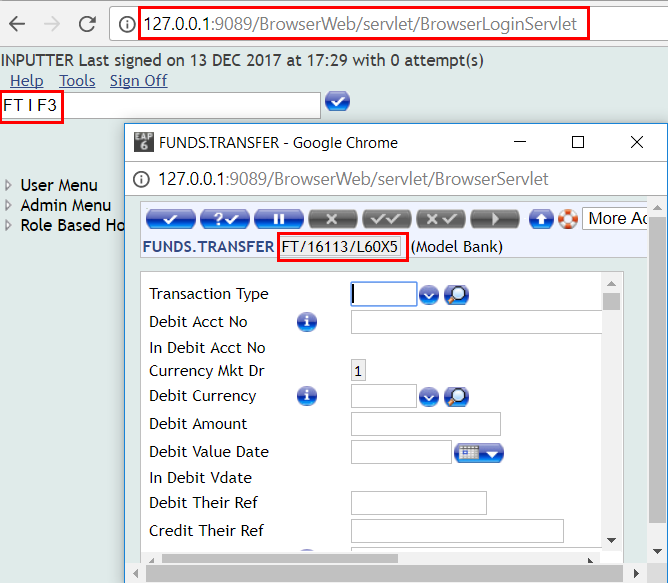
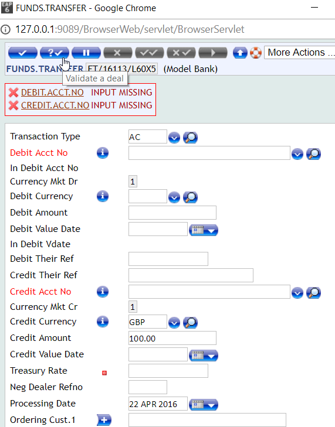
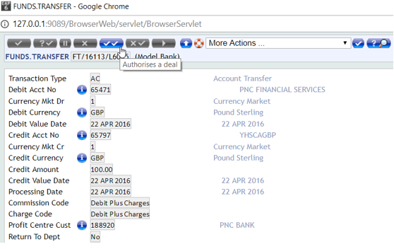

# Funds Transfer

Funds Transfer is used to effect payments from one account to another account either internally or externally and is related to [CUSTOMER](customer.md) and [ACCOUNT](accounts.md) applications.
 
# Initiate a Fund Transfer

 - Type **FT I F3** or **FUNDS.TRANSFER I F3**. (*FT is shortname of FUNDS.TRANSFER*)

 - Enter the required details of Fund Transfer and click on **Validate** button:

 
 - If you don’t provide the required (mandatory) information, then an error message will display on the window.
 - If all the information is correct, then you’ll get successful message of Funds Transfer with transaction reference number. Transaction reference number is necessary to authorise the Fund Transfer.
 (Response example: *Txn Complete: FT16113L60X5 17:58:08 13 DEC 2017 FUNDS.TRANSFER I*)

> [!Note]
> You can avoid authorising a transaction by using **comma** version of Funds Transfer.
e.g. use FT, I F3 or FUNDS.TRANSFER, I F3 instead of FT I F3 or FUNDS.TRANSFER I F3

# Authorise the Funds Transfer

 - Login to T24 with a different user to authorise the above Funds Transfer. Inputter is not allowed to authorise any transaction. In T24 you can configure how many authorisers are required for a transaction.
 - Enter this command in command window FT A FT16113L60X5 or FUNDS.TRANSFER A FT16113L60X5

Click on the Authorise a deal button

 
 - You will see a success message for successful transaction (*Txn Complete: FT16113L60X5 18:12:51 13 DEC 2017 FUNDS.TRANSFER A*)
 
 - Now this transaction is LIVE in T24