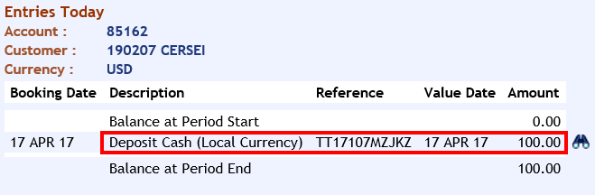

# Cash Deposits

In order to **deposit** funds to a new account, you can choose to do a Cash deposit operation through Teller application. Please keep in mind that you will need to have an opened Till in order to be able to deposit funds.

 - Login to T24 BrowserWeb
 - Go to **User Menu** > **Retail Operation** > **Account Transactions** > **Teller** > **Teller Operations** > **Teller Cash** > **Cash Deposit Local**
(***Note**: if you want to credit an account which has a different currency than local one, choose Cash Deposit Foreign*)

 - Insert the **Deposit Amount**  and the **Credit Account**
 - Under **Cash denom**ination table, make sure you choose correct number of units related to the amount inserted
 - Press **Commit** button> Transaction is completed.

 - You can now check the customer's account balance:
   - Go to **User Menu** > **Account** > **Account Entries** > **Entries for Today** 
   - Insert the **Account Number** and click **Find** button

 

