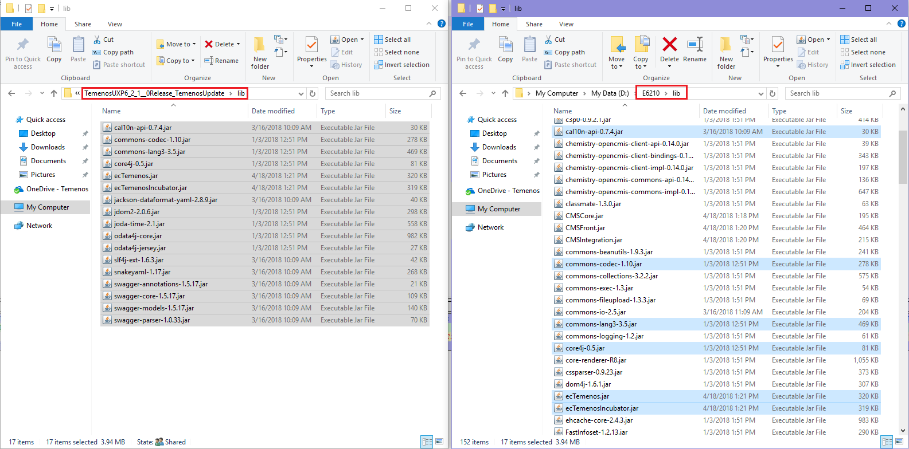
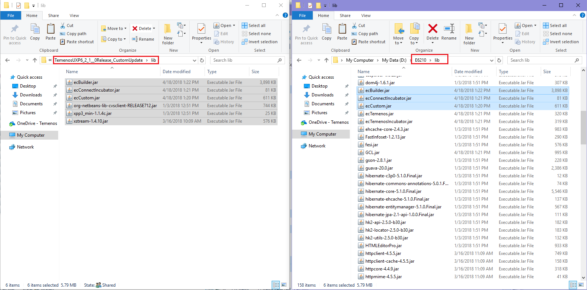
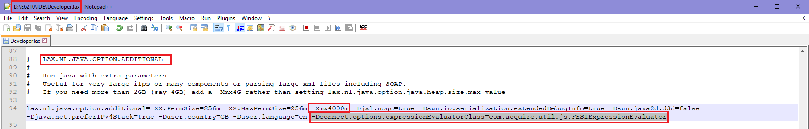
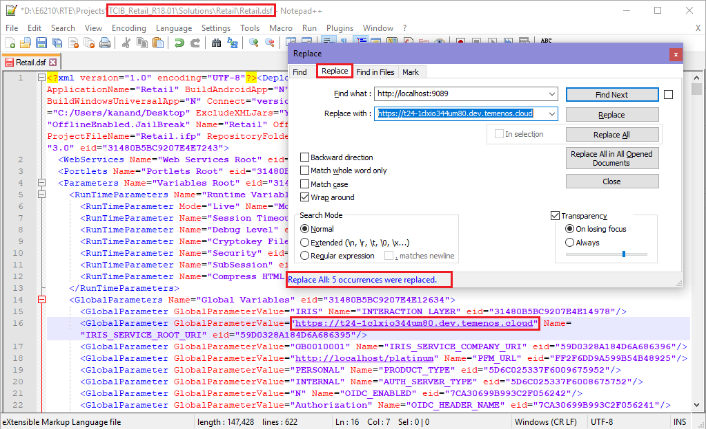
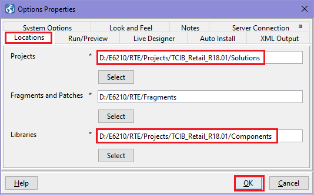
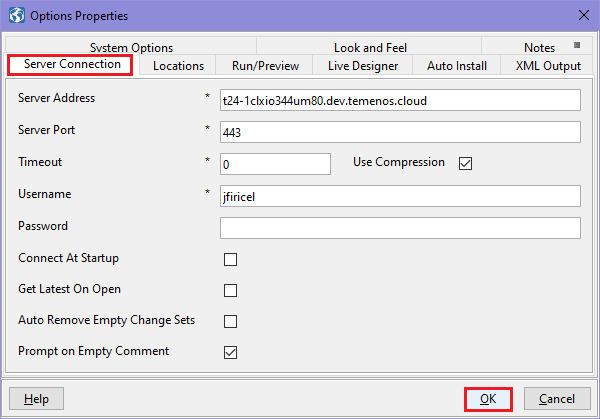

# Install User Experience Platform

* Please download from your ***MyApps*** section the ***Temenos User Experience Platform*** product. 
* Create a folder where *Temenos UXP* should be installed on your computer.
    >[!Note]
    >:bulb: In order to avoid Windows problems, please use short paths.

	* **Example**: For the purpose of this document and a better understanding, a folder called E6210 is created directly on D partition.
  

* **Unzip** Temenos UXP folder and **launch** UXP installation by double clicking on appropriate installation file.
	* *Example: TemenosUXP6_2_1__0_x64Windows.exe*
  
* **UXP installation** starts (*InstallAnywhere is preparing to install...*)
	* Click next to pass through installation steps. 
	* On License Agreement, accept Terms and Agreements.
	* On Install Set, you can also check *'Hybrid Master'* and *'Hybrid Android Slave'* if you need it (in this case, Install Set will automatically change to 'Custom')
	* On Install Folder, **do not leave default path**. Instead, **select** the folder you created before for UXP installation (*Example: E6210*)
	* Choose UXP shortcut location. (*Example: "In a new Program Group"*)
	* Choose a JDK version (select appropriate path where Java Development Kit is installed)
		* Set the address and the port:
			* Hybrid Master address: *localhost*
			* Hybrid Master port: *9022*
	* See all information in pre-installation summary and press ***install*** button.
	* Wait for installation to be completed. 

    >[!Note]
    > Please send license email request, attaching InstallKey.txt present in IDE folder, to <ins>marketplace@temenos.com</ins>.
    > You will receive one license file, which must be placed in the same folder (IDE).

* Install ***TemenosUpdate.zip*** file
	* a. Unzip the ***TemenosUXP6_2_1__0Release_TemenosUpdate.zip*** archive.
	* b. Copy the **jars** from the above archive into the **lib** folder of Temenos UXP (*in current case E6210 - in your case, the folder you created to install Temenos UXP*).
	 
	* 
	  
	* c. Update **Developer.lax** file (*from IDE folder*) in order to add the jars copied in above step. Click right on *developer.lax* file, go to "LAX.CLASS.PATH=" and add at the end the new jars as follows:
	
			;../lib/cal10n-api-0.7.4.jar;../lib/commons-codec-1.10.jar;../lib/commons-lang3-3.5.jar;../lib/core4j-0.5.jar;../lib/ecTemenos.jar;../lib/ecTemenosIncubator.jar;../lib/jackson-dataformat-yaml-2.8.9.jar;../lib/jdom2-2.0.6.jar;../lib/joda-time-2.1.jar;../lib/odata4j-core.jar;../lib/odata4j-jersey.jar;../lib/slf4j-ext-1.6.3.jar;../lib/snakeyaml-1.17.jar;../lib/swagger-annotations-1.5.17.jar;../lib/swagger-core-1.5.17.jar;../lib/swagger-models-1.5.17.jar;../lib/swagger-parser-1.0.33.jar

    >[!Note]
    > Based on the version you're using, you might have other jars to copy.

* Install ***CustomUpdate.zip*** file
	* a. Unzip the ***TemenosUXP6_2_1__0Release_CustomUpdate.zip*** archive.
	* b. Copy the **jars** from the above archive into the **lib** folder of Temenos UXP.
	 
	* 
	  
	* c. Update **Developer.lax** file (*from IDE folder*) in order to add the jars copied in above step. See information from previous step.
	
			;../lib/ecBuilder.jar;../lib/ecConnectIncubator.jar;../lib/ecCustom.jar;../lib/org-netbeans-lib-cvsclient.jar;../lib/xpp3_min-1.1.4c.jar;../lib/xstream-1.4.9.jar

    >[!Note]
    > Based on the version you're using, you might have other jars to copy.

* Update the java extra parameters in *Developer.lax* file (*from IDE folder*):
	* LAX.NL.JAVA.OPTION.ADDITIONAL
		* Please add below line:
			* -Dconnect.options.expressionEvaluatorClass=com.acquire.util.js.FESIExpressionEvaluator
		* In case out of memory issues are encoutered ensure you increase the memory value as per your needs. 
			* 

# Import Retail package in UXP
* Please download from your ***MyApps*** section the ***Temenos UXP Retail Developer Package*** product. 
* ***Unzip*** the Retail_Developer_Package_xx.zip package, unzip the TCIB2.0_Retail_Developer_Release_xx.zip file and then copy the TCIB folder somewhere on your machine. (*Example: Your Folder > RTE > Projects*)
* Go and update ***Retail.dsf*** file (which is found in *\TCIB\Solutions\Retail\* location) in order to replace "*http://localhost:9089*" with your own correspondent url. 
	* *(There are 5 places to be replaced.)*
	* 
  
* Open the ***Developer.exe*** file (*from IDE folder*)
	* Go to ***File*** > ***Open***
	* Select the location of ***Retail.ipf*** file (it should be something like *\TCIB\Solutions\Retail\*)
	* A warning will appear > Accept language setup
	* Open ***Process Builder***:
		* On top bar, click on *"No Perspective"* and select *"Process Builder"* (this will open UXP editors)
	* Set ***file location*** and ***server connection***
		* On top bar, go to ***Tools*** > ***Options***
		* Select the appropriate file locations:
		* 
		* Select the appropriate server details:
			* Server Address: *your own url*
			* Server Port: *your port* 
			* 
  
* ***Close*** and open again the ***Developer.exe*** file (*from IDE folder*).

    >[!Note]
    > The TCMB installation should be done in the same manner explained above.
