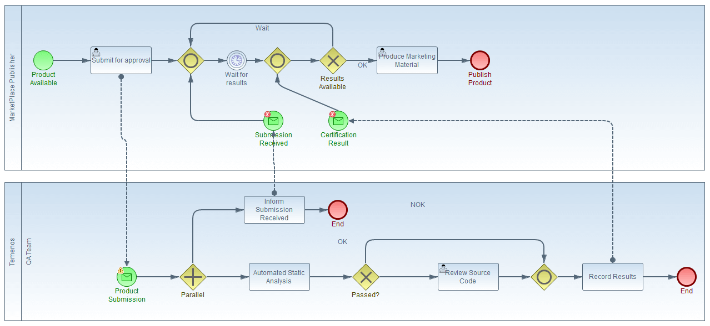

# Product Certification
The submission of a Product is governed by the Temenos Marketplace Certification and Provider Agreement, this document is intended to assist with gaining certification for a product and does not amend or vary the terms of the Temenos Marketplace Certification and Provider Agreement.

# Submission and review process
Temenos only publishes products and solutions developed by its Temenos members onto the Temenos MarketPlace (the “Products”) which Temenos has certified in accordance with these Guidelines. The aim is to certify that the Product can be demonstrated with the Temenos core banking system ‘sandbox’ and is suitable for the publication.
### Certification Flow

# Certification tiers
During the course of your submission to the Temenos MarketPlace, you will be asked to choose a certification tier based on the Product or software service to be certified. You will need choose tier 1 - 4 in the certification and provider order form - covering subscription based software services (SaaS), Widgets, Business Apps, Fintech products or Enterprise product. 

At Temenos, we tailor the certification process to the type of Product submitted to make allowances for the functional and non-functional characteristics of each Product type. Temenos requests all Temenos MarketPlace providers to review their Product against the following guidance to help choose the correct Product type and determine any applicable Certification fees. The Temenos MarketPlace does not accept, publish or certify non-software based services.

## Tier 1
###	Software as a Service

**A Software as a Service**

item is a software offering that runs standalone from the Temenos platform.  This item is not reviewed against any of the non-functional criteria i.e. Security, performance, data sharing, or supported interfaces.

**Widgets**

A ‘widget’ is a user interface component that interacts with the User experience platform design and runtime environment.  The Product conforms to the widget interface and packaging.  See Supported interfaces -> User Experience Platform Widget
#####	*Some examples of this kind of products:*

*	Login widget
*	Feed widget
*	Social media widget 

## Tier 2
**Business Apps**

A ‘business app’ includes simple web applications accessed over http via a web browser, mobile phone applications, add-on apps for professional users, productised APIs and integration flows, and in general terms any software product designed for a single purpose that do not require any other resources besides the Temenos Sandbox. 

#####	*Some examples of this kind of products*:

*	Chatbot 
*	Accessing of banking API - i.e.
*	Customer Information
	*	Account Balance
	*	Funds Transfer
*	BrowserWeb Toolbar

##	Tier 3
**Fintech product**

A ‘fintech product’ integrates with the Temenos platform through messages and APIs to provide a comprehensive solution to financial services institutions.  This integration will often utilise more than one endpoint or message type and in general terms will require resources in addition to those provided by the Temenos Sandbox.
#####	*Some examples of this kind of products*:
*	Banking API developed or modified by provider and needs to deploy in Temenos Sandbox.
*	Events & Message Driven Beans packages needs to deploy in Temenos Sandbox.

##	Tier 4
**Enterprise product**

An ‘enterprise product’ integrates with the Temenos platform through Versions, Enquiries, or other Temenos Core Banking configuration to provide a comprehensive solution to financial services institutions.  This integration will often utilise design studio packages and customise the Temenos Sandbox.

#####	*Some examples of this kind of products*:
*	Plugins that deploy new Temenos APIs.
*	Add-ons such as an those that modify the class path
*	Design Studio packages installation in Temenos Sandbox.

# Preparing your Product for review

During the review, process the Products are put through a series of manual and automated checks. Temenos advises all Temenos MarketPlace product providers to review their Products against the following criteria before submission.

| Criteria				| Notes |
|--- 					|--- 	|
| Software Licensing	| The Products MUST include a license notice and MUST NOT make any attempt to circumvent Temenos software licensing restrictions – see Assignment and reporting of the MarketPlace Provider Product ID section		|
| Open Source Software	| Products that make use of open source or freeware libraries MUST adhere to all applicable license restrictions.|
|Security and standards	| The Products SHOULD be secure against common vulnerabilities and SHOULD adopt appropriate Software Standards – see Software Coding Standards section. The Product must not contain any malware or viruses.|
|Performance			| Products SHOULD adopt an architecture that ensures the solution will scale – see Temenos Performance Recommendations section|
|Upgradable		| The Products MUST only use supported Temenos interfaces – see supported interfaces section|
|Content		| The Products MUST NOT include any profanities or otherwise offensive or illegal content. The Product must not suggest or infer that Temenos is the source of supplier of the Product. The Product must not use protected third party content such as trademarks, copyrights or patents, without express written approval.	|
|Data collection| The Products MUST NOT be used to collect or share any user data to the software publisher – see Data sharing section|
|Documentation	| The Products SHOULD include appropriate implementation and configuration guides.|

# Certification results
Temenos will generally return a result to the MarketPlace provider within 15 working days and no longer than 90 days.

A product could of course fail the review and whilst we aim to work with you to see your product approved and explain the reasons, we reserve the right to reject submissions if the product is not fit for publication. Once approved, the product marketing plan can be executed together and Temenos will be responsible for the final publishing action of the Product and supporting marketing material to the Temenos MarketPlace.

The MarketPlace provider can then submit edits and modifications to the marketing material to be reviewed and re-published by Temenos.

