# Where will your product be featured?

To showcase your product or service as effectively as possible, you should visualise your MarketPlace product page as an extension of your existing product marketing.

Your product will be highly visible to our customers and prospects as it will appear on a number of public pages:

## Homepage:

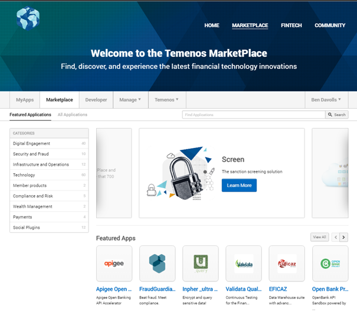

## The "All Applications" listing page:

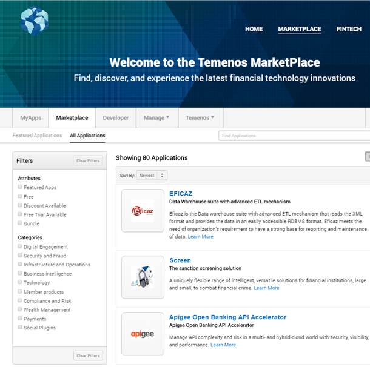

## On its own product profile page:

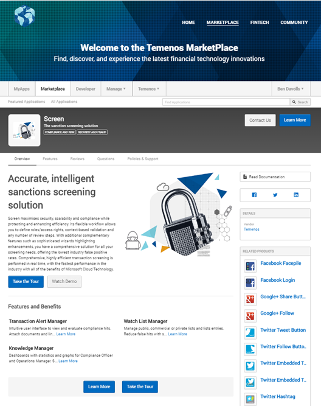

# Building a Product Page

## Received your welcome email?

To start developing your own product page, you will need to have been granted Developer access by the MarketPlace Team. This is carried out within 24hrs of the contract being signed, with the named contact receiving a welcome email containing a selection of useful tools and links.

## Log into MarketPlace:

Log in to [Temenos MarketPlace](https://temenos.byappdirect.com/login?110326251) by either clicking the link in the email or with the username (email address) and password you selected when you signed up.

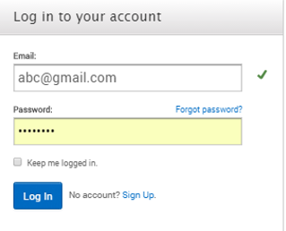

## Creating your first product:

**Process:**

1. Create your product on the MarketPlace 
2. Configure your product page (adding features, benefits and other sales collateral) 
3. When 100% complete, click the Publish button and send it to the MarketPlace team for review. 
4. Await the results and coordinate your go to market activities with Temenos 
5. Your product page is live on the MarketPlace

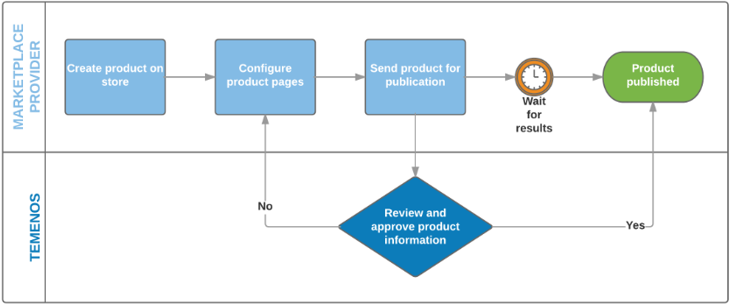

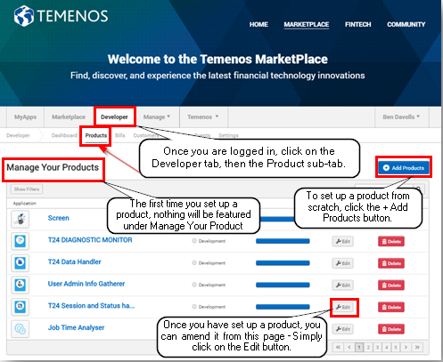

Clicking on the **+ Add Products** button will take you to the **Create New Product** screen.

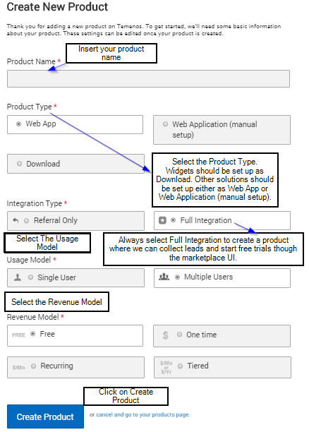

## Defining your product

What type of user experience does your product or service offer?

Do you offer an individually licensed downloadable Temenos core plug-in, or public access to an on-line dashboard containing model data? Your product page can handle multiple product types.

### Product Page Types:

There are two types of product page available.

1. The Web App will point a user to a web link, via a shortcut created in the customer 'My Apps' page.
2. The Download Product Type will immediately offer a downloadable file, which a user can run when on their local machine.

The 'Web App (manual set up)' product also offers access to a web link, but access is given via a manual process you administer. We recommend using a 'Web App (manual set up)' product page if you are planning to launch with a simple product page for lead generation activities, as the 'Free Trial' functionality can be switched off at publication stage.

### Integration Type:

The Integration type effects how customers can interact with your product on the page. Temenos will not publish 'Referral Only' product pages, so we recommend selecting the Full Integration.

> [!Note]
> With a 'Web App (manual set up)' product page, selecting 'Full Integration' will create a series of Integration Tests you will need to complete to move your product page from 0 - 100% completion - we will explain these below in the Integration Test section.

### Usage Model:

More than one MarketPlace customer request a trial of your product from the same organisation, with a Single User licence the first customer will need to re-assign the licence to the next product owner (customer). We recommend selecting Multiple Users to ensure your product can have multiple consumers at the same organisation.

### Revenue Model:

MarketPlace offers a range of Revenue Models to choose from. We recommend selecting 'Free' as both our Enterprise level sales are completed offline and to keep the product page build as simple as possible.

## Adding Collateral:

### Web App/Web App (manual set up) products:

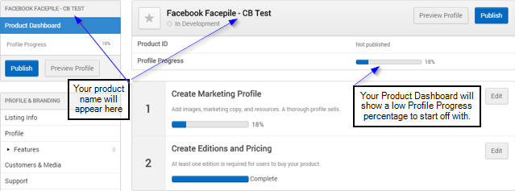

There are 2 configuration component steps (see image above):

1.	Create Marketing Profile
2.	Create Editions and Pricing

To get the Product Page ready for publishing, you need to populate the various sections and sub-sections indicated in the box on the left-hand side of your product dashboard. These are split on 3 main sections:

1.	Profile & Branding
2.	Editions and Pricing
3.	Settings

> [!Note]
>  You may be wondering why Step 2 **(Create Editions and Pricing)** is complete. This is because we selected 'Free' as the Revenue Model in when creating the Product Page. This can be updated through self-service configuration at any stage.

> [!Warning]
>  Before getting started, please note after every change made to your product profile, you will need to navigate to the bottom of the page to select **Save** or **Save and Preview** to have your changes reflected.

### Profile & Branding:

**a)	Listing info:**

The following screenshot gives you an overview of where the information you add to the Manage Listing Info page will appear on your product page and on the homepage/all applications pages so that you have a better understanding of the various sections.

### **Homepage/all applications pages:**

> [!Note]
> For each number indicated, please check below "How to complete the Product Listing Info page?"

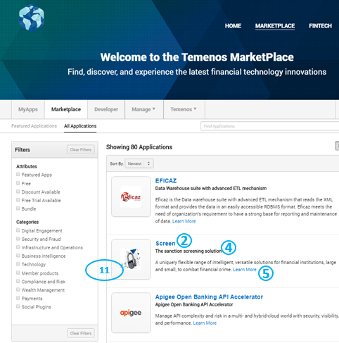

### **Product page (Overview and Policies & Support tab):**

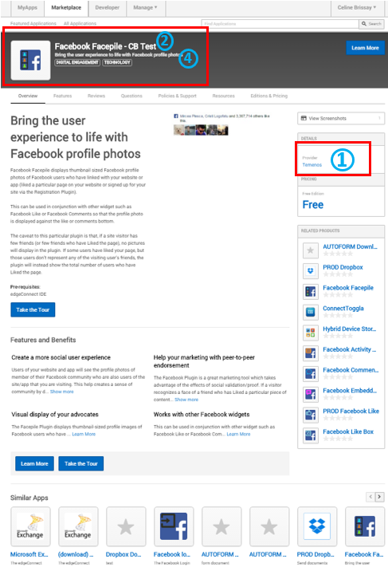

 
 

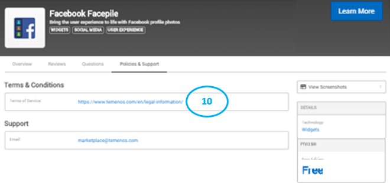

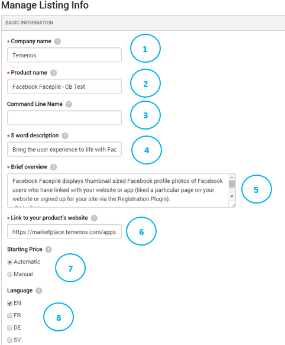

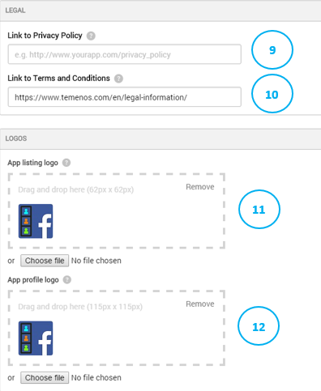

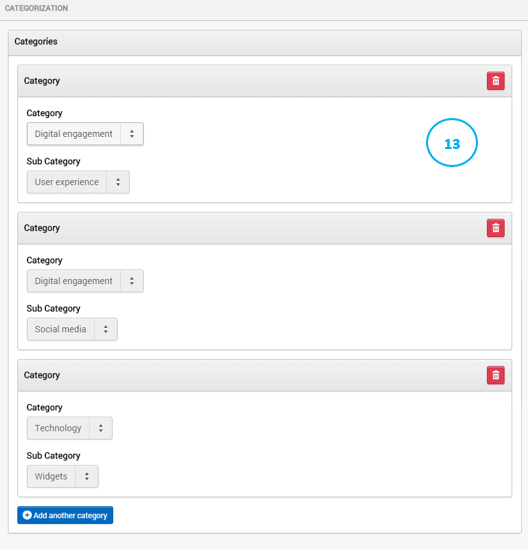

 

#### **How to complete the Product Listing Info page?**

From the **Product Dashboard**, click on the **Listing Info** tab on the left-hand side.

Please note that not all fields are mandatory but the more information you provide, the easier it is for banks and financial institutions to understand your solutions and decide to purchase it. The mandatory fields are indicated by a red asterix *.

**1. Company name** – Name of the product/application’s company. The Company name is displayed as the ‘Provider’ of the application, as seen in the ‘Details’ section of the product profile page. 

**2. Product name** – Name of the product/application being sold, which will be displayed on the application listing page and the product profile page.

**3. Command line Name** - A command line friendly name that can be associated with your product. This command line is not visible in the UI but is visible via product APIs. It can be the same as your 5 word description/tagline but it will be displayed on the product profile page only.

**4. 5 word description** - A brief description/tagline of your product which is made visible on the application listing page of the marketplace. This does not have a word count restriction but a 50 character limit. We suggest you make this a call to action e.g. “Engage with your customers through video”.

**5. Brief overview** - A short description of your product (~250 Characters or two sentences) that will be displayed below the 5 word description on the applications listing page. The “Learn More” link will take the user to the Product Profile page.

**6. Link to your product’s website** – This is the link customers will be taken to when they click “Buy” from the Temenos MarketPlace.

**7. Starting Price** - Configure what price will be displayed on the /listing page of the marketplace.
  - If ‘Automatic’ is selected, the price of the Edition that is marked “Show as Primary Pricing Plan” will be selected.
  - If ‘Manual’ is selected, you will need to enter the Recurring Price per unit/user/etc. as well as the frequency of this cost in the additional fields that will appear. 

**8. Language** - The default language for the product profile. 

**9. Link to Privacy Policy** - URL for the product’s privacy policy. Displayed on the ‘Policies & Support’ tab of the product profile page. If enabled, this will be what the customer must read and agree to before purchasing.

**10. Link to Terms & Conditions** - URL for the product’s Terms & Conditions. Displayed on the ‘Policies & Support’ tab of the product profile page. If enabled, this will be what the customer must read and agree to before purchasing.

**11. App Listing Logo** – The product logo will be displayed next to the Product Name, 5 word description and Brief overview on the applications listing page.

**12. App Profile Page** – The product logo will be displayed next to the Product Name and Command line name on the product profile page.

**13. Category** – There are currently 5 categories you can select (and subsequent sub-categories) - Business intelligence; Digital engagement; Infrastructure and operations; Security and fraud; Technology – which will be used by financial institutions to restrict their search.

You can add multiple categories to your product by clicking on the + Add another category button. We suggest you set two categories – Technology -> [your type of product] and the most appropriate other category (e.g. Digital Engagement -> User experience).

If you need a new category or sub-category created, your Channel Administrator can do so in a few simple steps:
  - Click Manage > Channel
  - Click Products from the navigation
  - Click Product Groups on the left hand navigation
  - From the Product Groups page, you can add Categories and Attributes as options for your developers and Channel Admin's to select

If you have any questions, please let us know: marketplace@temenos.com.

> [!Warning]
> Please make sure that you click on **Save** to save your listing info details.

**b)	Profile:**

The following screenshot gives you an overview of where the information you add to the Profile page will appear on your product page so that you have a better understanding of the various sections.

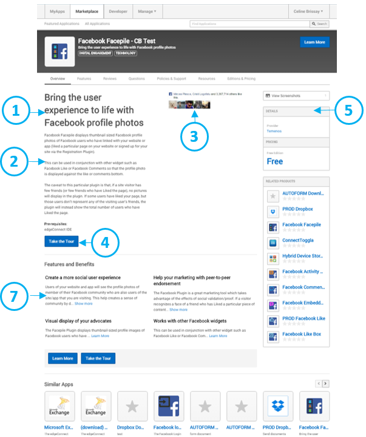

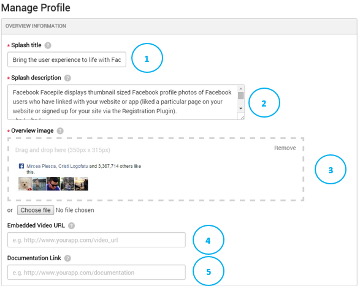

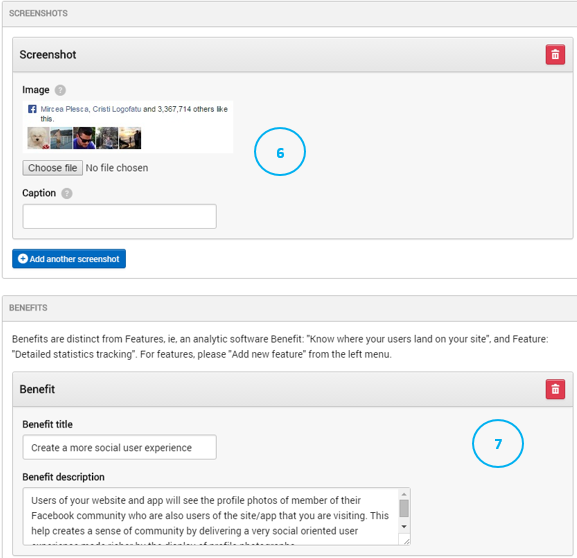

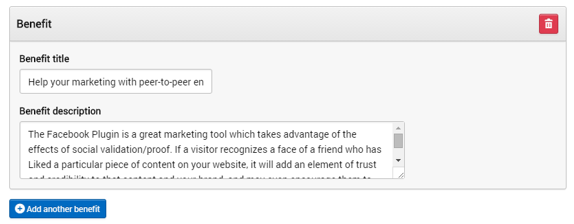

#### **How to complete the Profile page?**

**1. Splash Title** - Similar to the 5-word Description field on the listing page, this field is designed to be a compact sentence that sells the product.

**2. Splash Description** - Short paragraph used to explain what the product is.

**3. Overview Image** - This is the largest image on the Product’s homepage (350x315px). It can be an image representing the concept of the product or a screenshot of the product itself.

**4. Embedded Video URL** - A Vimeo or Youtube URL that will open an embedded player when a marketplace user clicks on “Watch Demo”.

**5. Documentation Link** - If a URL is added, the “Read Documentation” link will appear on the right hand side of the product page and forward the customer to the URL.

**6. Screenshot** – It allows you to upload screenshots of the product that will be viewable by clicking the “View Screenshots” link on the right hand side of the product profile. If no screenshots are uploaded, the link will not appear.

**7. Benefits** - These will appear on the Product Profile’s homepage and appear at the top of the Features & Benefits section.

Benefits differ from features in that benefits should highlight how this product will affect the customer.
Example: A security program could highlight a benefit for their program as 247 security without slowing down your computer. A feature would be their proprietary Active Threat Detection technology.

**You need to indicate a short title and a brief description of each benefit.**

You can add several benefits to your product by clicking on the **+ Add another benefit** button.

**8. Features** - See Product Profile - Features Page.

Please make sure that you click on **Save** to save your profile details.

### **Features**

The following screenshot gives you an overview of where the information you add to the **Features** page will appear on your product page so that you have a better understanding of the various sections. Some information about the features of your product will appear on the **Overview** tab of your product page. More detailed information will appear on the dedicated **Features** tab of your product page. 

**Product page (Overview):**

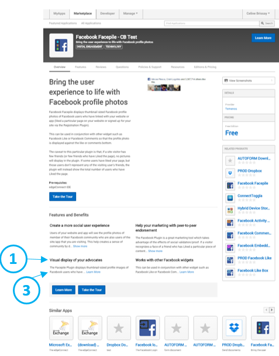

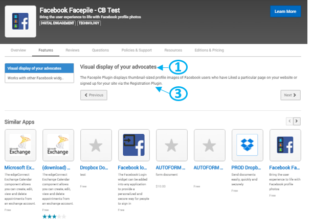

> [!Note]
> If no features are added, the Features tab will not appear on the product page. Adding Features is optional, but recommended.

> [!Caution]
> When creating new feature, selecting “Save and Preview” does not save feature and pushes to blank page. Select ‘Save and Add Another’ to save feature. Under review by AppDirect Product Team.

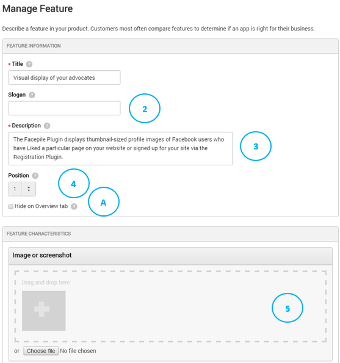

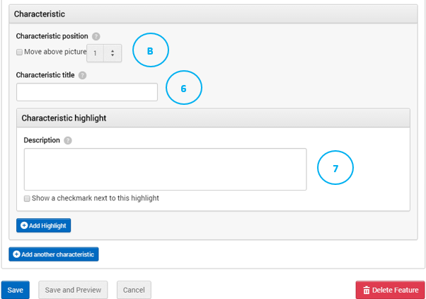

#### **How to complete the Feature page?**

**1. Title** - Serves as the title for your feature and as a navigation and search item. The title should describe the feature completely without any supporting text, i.e. "Invoice Creation"

**2. Slogan** - Provides a high level catchy description of your feature.

**3. Description** - Appears under the feature slogan in the feature page and provides a deeper description of your feature.

On the Overview tab of your product page, users will only be able to see the beginning of the description. A **Learn More** link will allow them to see the full description of the Features tab. 

**4. Position** - Allows you to order your features in the left navigation bar. 

  - A. **Hide on Overview tab** - Allows you to either include or exclude features in the "Features & Benefits" section of the overview page.

**5. Image or screenshot** – Enables you to give a more precise view of a particular feature.

  - B. **Characteristic position** - Allows you to order how your characteristics appear.

**6. Characteristic title** – Lets you describe a characteristic of your feature.

**7. Characteristic highlight** - Allows you to share highlights on a feature characteristic.

You can add several characteristics to your product by clicking on the **+ Add another characteristic** button.

Please make sure that you click on **Save** to save each feature details.

If at any point, you want to get rid of one of the features, simply click on **Delete Feature**.

**c)	Customers & Media:**

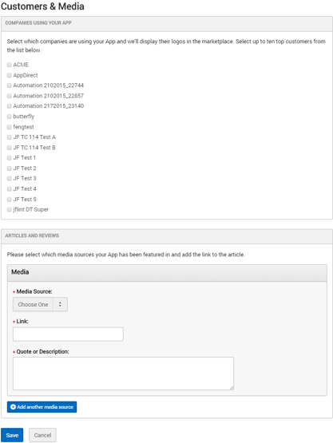

#### **How to complete the Customers and Media page?**

> [!Note]
> **Please let the Temenos GTM Team know any Customers you would like to feature in this section by sending a HQ logo and the FI name to your Temenos Account Manager.**

**1. Companies Using Your App** - Add your customers’ logos (up to 10) in the product profile. 

**2. Articles & Reviews** - Include links to articles or reviews of your product that have appeared in top publications. 
You can add several articles and reviews to your product by clicking on the **+ Add another media source** button.

Please make sure that you click on **Save** to save your customers and media page details.

**d)	Support:**

The following screenshot gives you an overview of where the information you add to the Support page will appear on your product page so that you have a better understanding of the various sections.

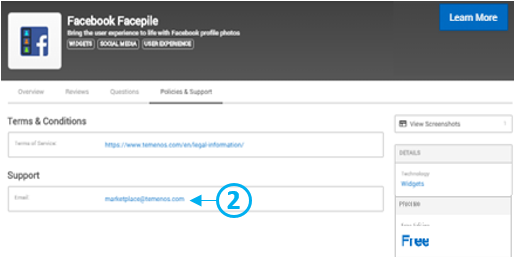

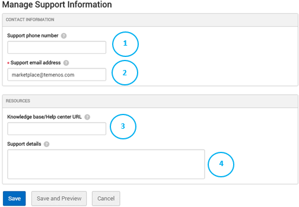

#### **How to complete the Manage Support Information page?**

The support information will appear on the Policies & Support tab of your product page.

**1. Support phone number** – You can provide a phone number that a customer can use to reach you for support needs.

**2. Support email address** – You need to provide an email address that a customer can use to reach you for support needs.

**3. Knowledge base/Help center URL** – You can provide a knowledge base URL that a customer can use to find answers for their support questions.

**4. Support details**- You can provide any other details around support for your application such as support hours.

Please make sure that you click on **Save** to save your support information details.

**e)	Resources:**

Upload training or informational resources to be made available to the end-customer through the Product Profile Resources tab.

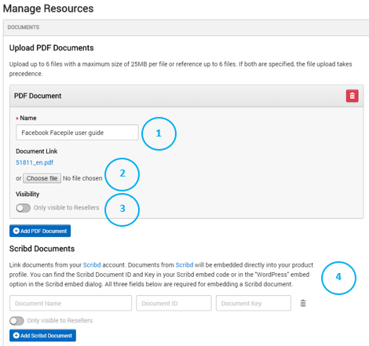

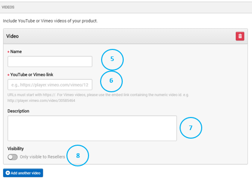

#### **How to complete the Resources page?**

**1. Name** – Name of the PDF document you are presenting.

**2. Document Link** – You can either upload your PDF on to the store or include a link to where the PDF is hosted.

**3. Visibility** – PDF only visible to resellers.

You can add several PDF documents of your product by clicking on the **+ Add PDF Document** button. 

Please note that you can upload your company profile as a PDF document in this section.

**4. Scribd Documents** – Link documents from your Scribd account. Documents from Scribd will be embedded directly into your product profile. You can find the Scribd Document ID and Key in your Scribd embed code or in the "WordPress" embed option in the Scribd embed dialog. All three fields below are required for embedding a Scribd document. 

You can add several Scribd documents of your product by clicking on the **+ Add Scribd Document** button.

**5. Name** – Name of the YouTube or Vimeo video of your product.

**6. YouTube or Vimeo link** – Link of the YouTube or Vimeo video of your product.

**7. Description** – Brief description of the YouTube or Vimeo video of your product.

**8. Visibility** - Video only visible to resellers.

You can add several videos of your product by clicking on the **+ Add another video** button.

Please make sure that you click on **Save** to save your resources information details.

2)	Editions and Pricing:

Please liaise with Temenos over this section - marketplace@temenos.com.

3)	Settings:

Please liaise with Temenos over this section - marketplace@temenos.com.

**ii)	Download products:**

Once you’ve clicked on Create Product to create your Download product, you will be brought straight away to the to the Manage Listing Info page.

(1)	Listing Info:

The following screenshot gives you an overview of where the information you add to the Manage Listing Info page will appear on your product page and on the homepage/all applications pages so that you have a better understanding of the various sections.

### Homepage/all applications pages:

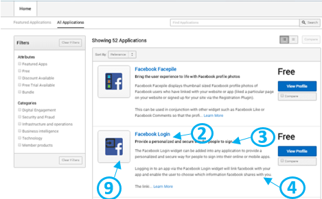

### Product page:

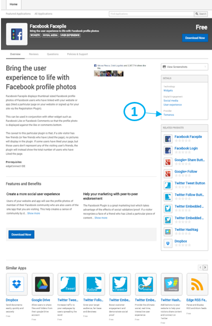

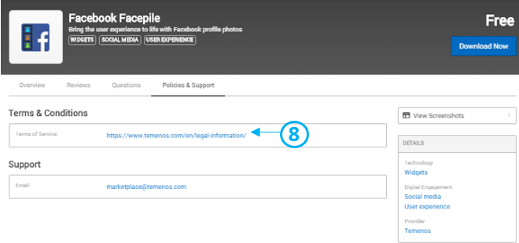

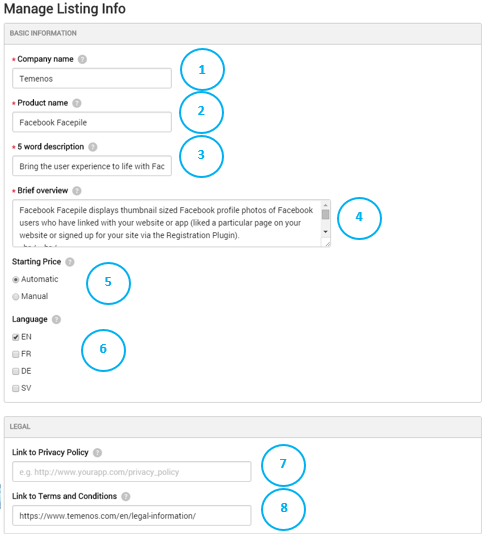

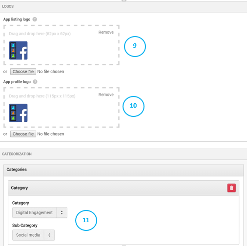

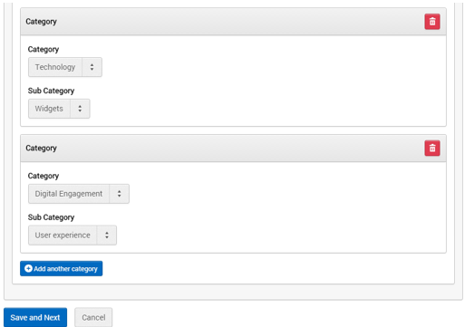

#### **How to complete the Manage Listing Info page?**

Please note that not all fields are mandatory but the more information you provide, the easier it is for banks and financial institutions to understand your solutions and decide to purchase it. The mandatory fields are indicated by a red asterix *.

**1. Company name** – Name of the product/application’s company. The Company name is displayed as the ‘Provider’ of the application, as seen in the ‘Details’ section of the product profile page. 

**2. Product name** – This is the name of the product/application being sold, which will be displayed on the application listing page and the product profile page.

**3. 5 word description** - A brief description/tagline of your product which is made visible on the application listing page of the marketplace. This does not have a word count restriction but a 50 character limit. We suggest you make this a call to action e.g. “Engage with your customers through video” 

**4. Brief overview** - A short description of your product (~250 Characters or two sentences) that will be displayed below the 5 word description on the applications listing page. The “Learn More” link will take the user to the Product Profile page.

**5. Starting Price** - Configure what price will be displayed on the /listing page of the marketplace.
  - If ‘Automatic’ is selected, the price of the Edition that is marked “Show as Primary Pricing Plan” will be selected.
  - If ‘Manual’ is selected, you will need to enter the Recurring Price per unit/user/etc. as well as the frequency of this cost in the additional fields that will appear. 

**6. Language** - The default language for the product profile. 

**7. Link to Privacy Policy** - URL for the product’s privacy policy. Displayed on the ‘Policies & Support’ tab of the product profile page. If enabled, this will be what the customer must read and agree to before purchasing.

**8. Link to Terms & Conditions** - URL for the product’s Terms & Conditions. Displayed on the ‘Policies & Support’ tab of the product profile page. If enabled, this will be what the customer must read and agree to before purchasing.

**9. App Listing Logo** – The product logo will be displayed next to the Product Name, 5 word description and Brief overview on the applications listing page.

**10. App Profile Page** – The product logo will be displayed next to the Product Name and Command line name on the product profile page.

**11. Category** – There are currently 5 categories you can select (and subsequent sub-categories) - Business intelligence; Digital engagement; Infrastructure and operations; Security and fraud; Technology – which will be used by financial institutions to restrict their search.

You can add multiple categories to your product by clicking on the **+ Add another category** button.

We suggest you set two categories – Technology -> [your type of product] and the most appropriate other category (e.g. Digital Engagement -> User experience).

If you need a new category or sub-category created, your Channel Administrator can do so in a few simple steps:
  - Click Manage>Channel
  - Click Products from the navigation
  - Click Product Groups on the left hand navigation
  - From the Product Groups page, you can add Categories and Attributes as options for your developers and Channel Admin's to select

If you have any questions, please let us know: marketplace@temenos.com.

Please make sure that you click on **Save and Next** to save your listing info details. This will take you to the Upload page.

### Upload:

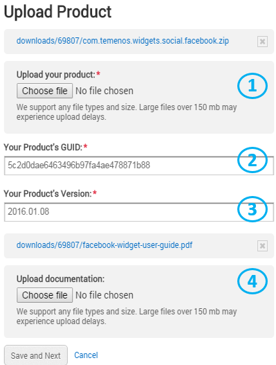

### **How to complete the Upload Product page?**

**1. Upload your product** – This is the file of your product. It can be any file size or type. Please note that files over 150mb may experience upload delays. 

**2. Your Product’s GUID** – GUID (or UUID) is an acronym for 'Globally Unique Identifier' (or 'Universally Unique Identifier'). It is a 128-bit integer number used to identify resources. Temenos MarketPlace will provide this for you, along with the certified product.

**3. Your Product Version** – This is a way to identify which version of your product is on Temenos MarketPlace. The version can be a simple number or a date.

**4. Upload documentation** - This is the file of your product documentation. It can be any file size or type. Please note that files over 150mb may experience upload delays.

Please make sure that you click on **Save and Next** to save your listing info details. This will take you to the Profile page.

### Profile:

The following screenshot gives you an overview of where the information you add to the **Profile** page will appear on your product page so that you have a better understanding of the various sections.

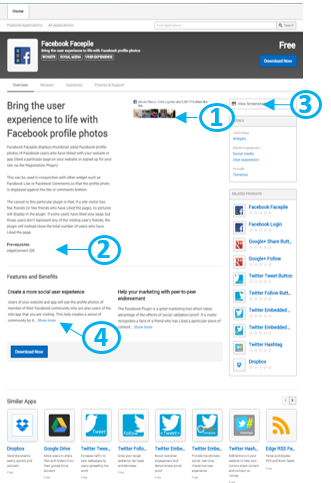

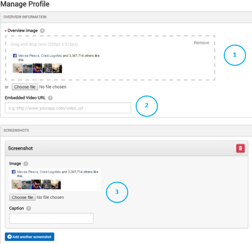

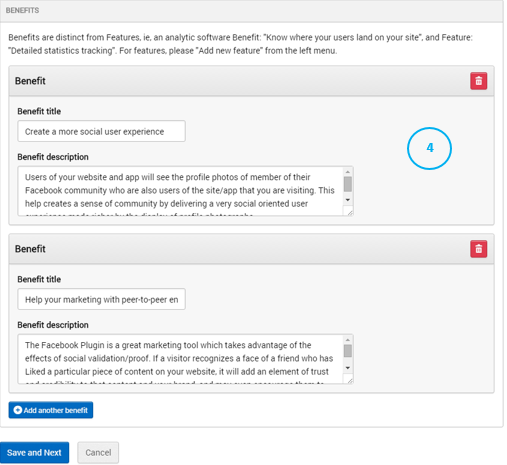

### **How to complete the Profile page?**

**1. Overview Image** - This is the largest image on the Product’s page (350x315px). It can be an image representing the concept of the product or a screenshot of the product itself.

**2. Embedded Video URL** - A Vimeo or Youtube URL that will open an embedded player when a marketplace user clicks on “Watch Demo”. 

**3. Screenshot** – This allows you to upload screenshots of the product that will be viewable by clicking the “View Screenshots” link on the right hand side of the product profile. If no screenshots are uploaded, the link will not appear.

You can add a caption for each screenshot.

**4. Benefits** - These will appear on the Product Profile’s homepage and appear at the top of the Features & Benefits section.

Benefits differ from features in that benefits should highlight how this product will affect the customer.
Example: A security program could highlight a benefit for their program as 24/7 security without slowing down your computer. A feature would be their proprietary Active Threat Detection technology.

You need to indicate a short title and a brief description of each benefit.
You can add several benefits to your product by clicking on the **+ Add another benefit** button.

Please make sure that you click on **Save and Next** to save your profile details. This will take you to the Support page.

### Support:

The following screenshot gives you an overview of where the information you add to the Support page will appear on your product page so that you have a better understanding of the various sections.

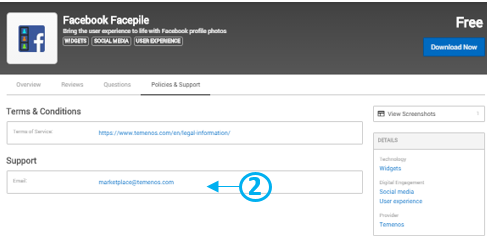

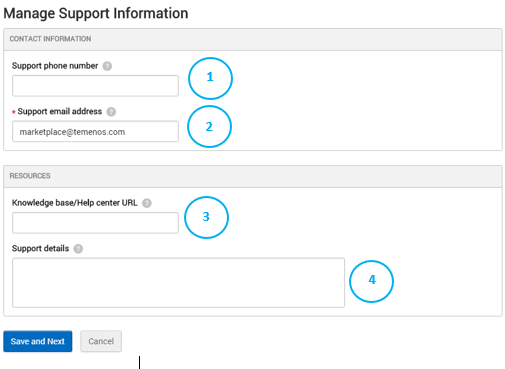

### **How to complete the Manage Support Information page?**

**1. Support phone number** – Provide a phone number that a customer can use to reach you for support needs.

**2. Support email address** – Provide an email address that a customer can use to reach you for support needs.

**3. Knowledge base/Help center URL** – Provide a knowledge base URL that a customer can use to find answers for their support questions.

**4. Support details**- Provide any other details around support for your application such as support hours.

Please make sure that you click on **Save and Next** to save your support information details. This will take you to the Pricing page.

### Pricing:

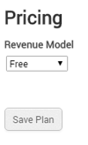

### **How to complete the Pricing page?**

Please liaise with Temenos over this section - marketplace@temenos.com.

**1. Revenue model** – Select the revenue model for your product: Free, One time or Recurring.

If you select **Free**, simply click on **Save Plan** to save your pricing details.

If you select **One Time** or **Recurring**, you will need to insert further information - i.e. whether you are offering a free trial or not (and if you do, how long is the trial for), what is the price.

Please make sure that you click on **Save Plan** to save your pricing details.

## Getting your products published:

Once you have created and configured your product, whether Download, Web App or Web App (manual setting), click on **Publish** on the left-hand side of your product page.

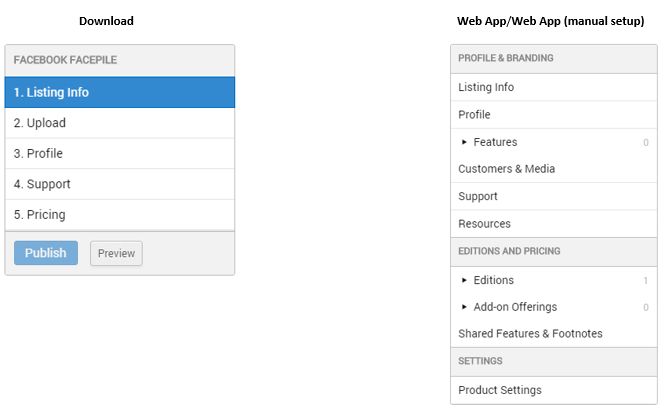

We will receive notification that you have set up your product on Temenos MarketPlace. Once we have checked it, we will publish it and it will be live on the store.