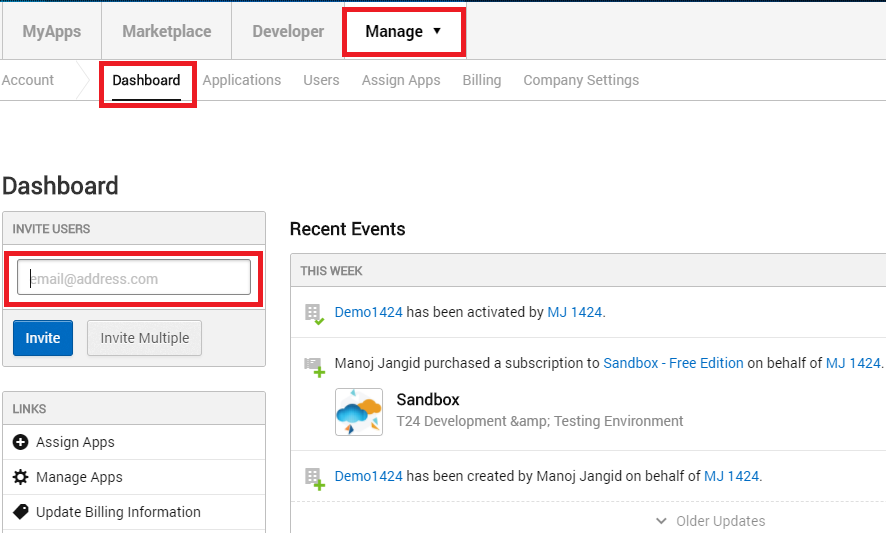
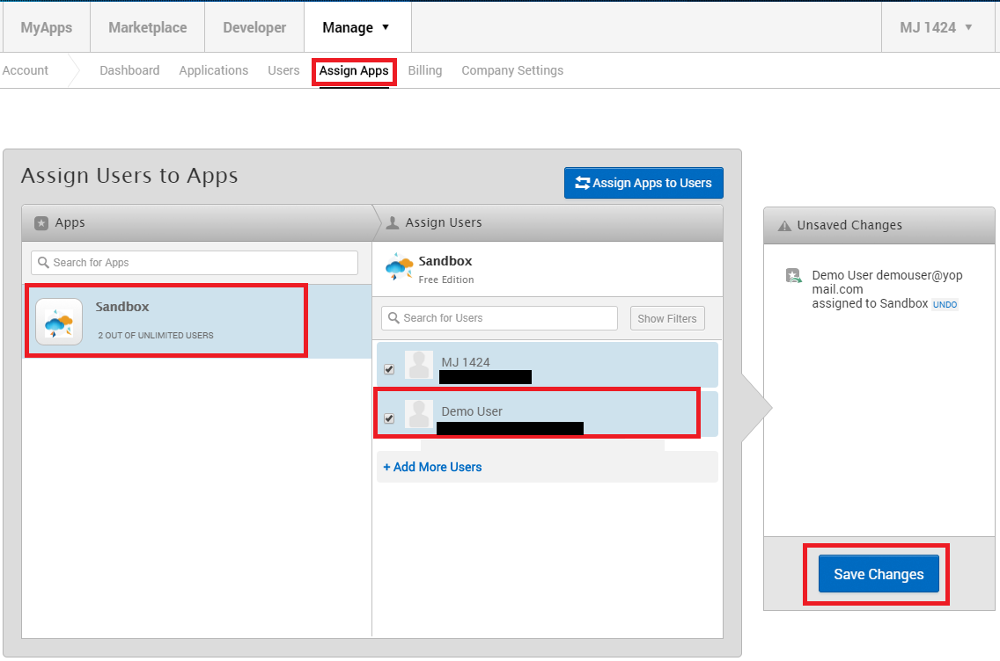

# Sandbox access to other users
Multiple user can also work on the Temenos Marketplace Membership products, here is the procedure to invite other user into your company and grant the access of the Membership products.

##	Invite user(s)

Invite users to give access to [***Temenos Sandbox***](sandbox.md)

1. Login to [Temenos MarketPlace](https://marketplace.temenos.com/) with your credentials

2. Click on **Manage** → **Account**.

3. Click on **Dashboard** according to below screen shot and type the user’s email address and click on invite.

	

4. Invitation will sent to the user on the behalf of you.

## Assign Products

Assigning Membership products to other user will give full access on the Temenos Sandbox and this will be Shared Sandbox to all users you assigned.

1. Login to [Temenos MarketPlace](https://marketplace.temenos.com/) with your credentials

2. Click on **Manage** → **Account**.

3. Click on **Assign Apps** according to below screen shot and select the product you want to assign.

4. After selecting the product you will see list of the users, select the user you want to assign the product and click on **Save Changes** button. 

	

4. After click on the **Save Changes** user will able to see the product(s) in his **My Apps** section

