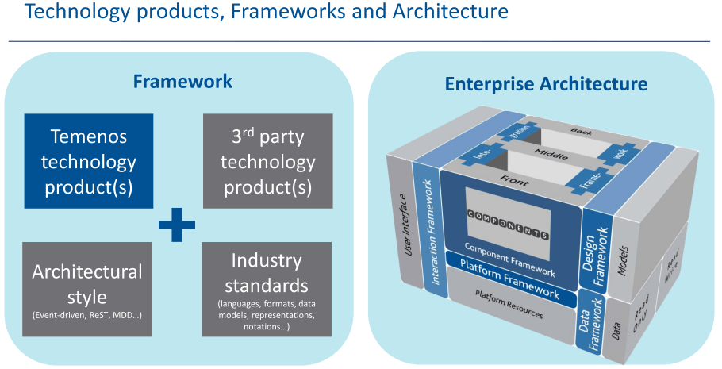

# Platform product company
Temenos products are designed to run on a single platform, either together or in multiple instances. The platform supports multiple entities in a single instance, multiple tenancy, and multiple instances.

As we acquire or develop new products, they are integrated onto the platform using a four stage approach: integration; interaction; platform; and component.

Temenos is committed to model driven design and development for all its products. We have design studios for Temenos Connect, Temenos T24 and Triple’A Plus.

# Architecture

Banking software is vital for a bank to perform its functions, remain competitive and to deliver products and services to its customers.

Financial institutions rely on software not only to manufacture and service but also distribute the products and services they themselves sell to their customers. Therefore their software must be extensible, upgradeable and of high performance.

This can only be achieved if the banking software has a strong architecture that can evolve as the banks, the technology and the marketplace evolves. The Temenos architecture is built for extensibility, upgradeability and performance.

It is founded on six enterprise frameworks:

----------

1.	[**Integration**](../integration/index.md) – Agility enables a real time enterprise and enables the information system to change seamlessly with the bank’s organisation.

2.	[**Interaction**](../interaction/index.md) – Usability enables Temenos and others to write user applications that go across Temenos products and others to meet the needs of different users.

3.	**Platform** – Flexibility enables Temenos products to run on IBM, Oracle, Microsoft and Open platforms as well as the cloud, allowing banks to choose how to run our banking software.

4.	**Component** – Maintainability enables online update and incremental upgrade. It also supports the full software development lifecycle.

5.	**Data** – Performance enables Temenos to have extensible schemas while scaling to tens of thousands of transactions a second in online and bulk processing.

6.	[**Design**](../design/index.md) – Productivity enables model driven development for channels, front office and middle/back office processing.

For further information, [check out this short](..\pdf\architecture_overview.pdf) introduction to our sandbox. Alternatively, watch this video from John Schlesinger, Temenos Chief Enterprise Architect.

> [!VIDEO https://www.youtube.com/embed/pW6eZgfBxSg]
>
>

