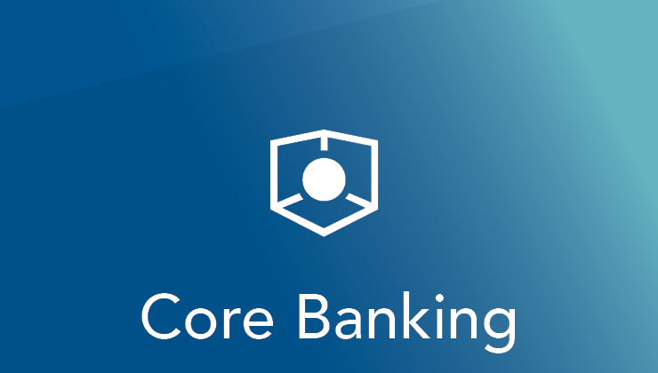
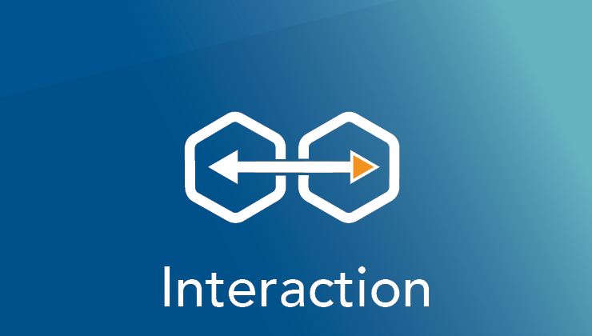
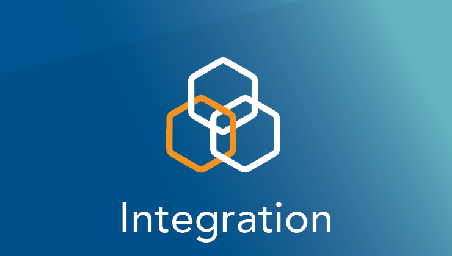
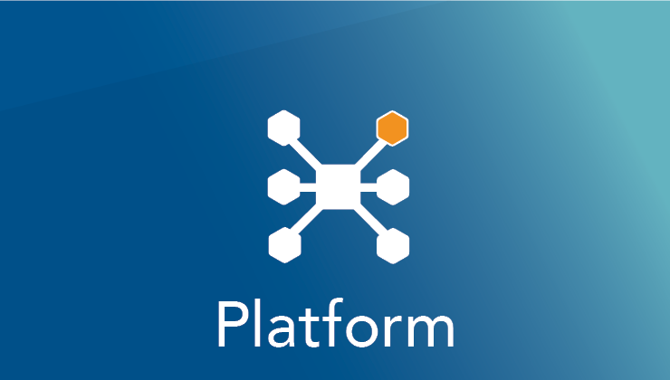
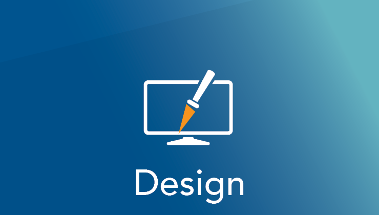

        
<a href="../banking/introduction.md">
<h5 class="card-title">Start with Core Banking</h5>
</a>

Everything starts with core. The Temenos Core Banking solution is an open, integrated and real-time platform.

        
    

<a href="../banking/channels.md">
<h5 class="card-title">Start with Channels</h5>
</a>

Extend your customers reachability by delivering products and services for any business line.

        
    

<a href="../interaction/index.md">
<h5 class="card-title">Start with Interaction</h5>
</a>

Bringing users and financial resources together through a flexible and RESTful architecture.

        
    

<a href="../integration/index.md">
<h5 class="card-title">Start with Integration</h5>
</a>

Be more agile, competitive, profitable, scalable and reliable with near-real-time event-based integration.

        
    

<a href="../design/uxp/index.md">
<h5 class="card-title">Start with UX Platform</h5>
</a>

Temenos UXP is a graphical development tool which enables you to build browser based business solutions.

        
    

<a href="../design/index.md">
<h5 class="card-title">Start with Design Studio</h5>
</a>

Integrated graphical environment that enables business and IT professionals to design elements for T24.

